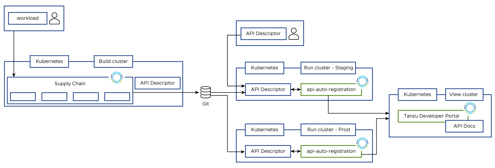

# Key Concepts for API Auto Registration

This topic explains key concepts you use with API Auto Registration.

## <a id='architecture'></a>API Auto Registration Architecture

Users can leverage the potential of Tanzu Application Platform and its API Auto Registration component by using a distributed environment like the one in this diagram:



## <a id='api-descriptor'></a>APIDescriptor Custom Resource Explained

To use API Auto Registration, you must create a custom resource of type `APIDescriptor`.
The information from this custom resource is then used to construct an API entity in Tanzu Application Platform GUI.

This custom resource exposes the following text boxes:

```yaml
apiVersion: apis.apps.tanzu.vmware.com/v1alpha1
kind: APIDescriptor
metadata:
  name:                  # name of your APIDescriptor
  namespace:             # optional namespace of your APIDescriptor
spec:
  type:                  # type of the API spec. oneOf(openapi, grpc, asyncapi, graphql)
  description:           # description for the API exposed
  system:                # system that the API is part of
  owner:                 # person/team that owns the API
  location:
    path:                # sub-path where the API spec is available
    baseURL:             # base URL object where the API spec is available. oneOf(url, ref)
      url:               # static absolute base URL
      ref:               # object ref to oneOf(HTTPProxy, Knative Service, Ingress)
        apiVersion:
        kind:
        name:
        namespace:
```

Many of the earlier text boxes cause specific behavior in Tanzu Application Platform GUI.

- The system and owner are copied to the API entity. You might have to separately create and add the [System](https://backstage.io/docs/features/software-catalog/descriptor-format#kind-system) and [Group](https://backstage.io/docs/features/software-catalog/descriptor-format#kind-group) kind to the catalog.
- The namespace where the APIDescriptor CR is applied is used as the namespace for API entity in Tanzu Application Platform GUI. This causes the API entity's name, system, and owner to all be under that namespace.
- To explicitly use a system or owner in a different namespace, you can specify that in the `system: my-namespace/my-other-system` or `owner: my-namespace/my-other-team` text boxes.
- If the system or owner you are trying to link doesn't have a namespace specified, you can qualify them with the `default` namespace. For example, `system: default/my-default-system`

## <a id='absolute-url'></a>With an Absolute URL

To create an APIDescriptor with a static `baseURL.url`, you must apply the following YAML to your cluster.

```yaml
apiVersion: apis.apps.tanzu.vmware.com/v1alpha1
kind: APIDescriptor
metadata:
  name: sample-absolute-url
spec:
  type: openapi
  description: A set of API endpoints to manage the resources within the petclinic app.
  system: spring-petclinic
  owner: team-petclinic
  location:
    path: "/v3/api-docs.yaml"
    baseURL:
      url: https://myservice.com
```

## <a id='with-ref'></a>With an Object Ref

You can use an object reference instead of hard coding the URL. This can point to a HTTPProxy, Knative Service, or Ingress.

### <a id='with-httpproxy-ref'></a>With an HTTPPRoxy Object Ref

Below is an example YAML that points to an HTTPProxy from which the controller extracts the `.spec.virtualhost.fqdn` as the baseURL.

```yaml
apiVersion: apis.apps.tanzu.vmware.com/v1alpha1
kind: APIDescriptor
metadata:
  name: sample-contour-ref
spec:
  type: openapi
  description: A set of API endpoints to manage the resources within the petclinic app.
  system: spring-petclinic
  owner: team-petclinic
  location:
    path: "/test/openapi"
    baseURL:
      ref:
        apiVersion: projectcontour.io/v1
        kind: HTTPProxy
        name: my-httpproxy
        namespace: my-namespace # optional
```

### <a id='with-knative-ref'></a>With a Knative Service Object Ref

To use a Knative Service instead, here is an example from which your controller reads the `status.url` as the baseURL.

```yaml
# all other fields similar to the above example
    baseURL:
      ref:
        apiVersion: serving.knative.dev/v1
        kind: Service
        name: my-knative-service
        namespace: my-namespace # optional
```

### <a id='with-ingress-ref'></a>With an Ingress Object Ref

To use an Ingress instead, here is an example from which your controller reads the URL from the jsonPath specified. When jsonPath is left empty, your controller reads the `"{.spec.rules[0].host}"` as the URL.

```yaml
# all other fields similar to the above example
    baseURL:
      ref:
        apiVersion: networking.k8s.io/v1
        kind: Ingress
        name: my-ingress
        jsonPath: "{.spec.rules[1].host}"
        namespace: my-namespace # optional
```

### <a id='status-fields'></a>APIDescriptor Status Fields

When processing an APIDescriptor several fields are added to the `status`. One of these is `conditons`, which provide information useful for troubleshooting. The conditions are explained in the [Troubleshooting Guide](../api-auto-registration/troubleshooting.hbs.md).

In addition to `conditions` the `status` contains a couple of other useful fields. Below you will a listing of these fields along with a brief explanation of what they contain.

```yaml
status:
  registeredEntityURL:   # Url of the corresponding API Entity in TAP GUI
  registeredTapUID:      # Unique identifier for the corresponding API Entity in TAP GUI
  resolvedAPISpec:       # Full API Spec as retrieved by Api Auto Registration
```
