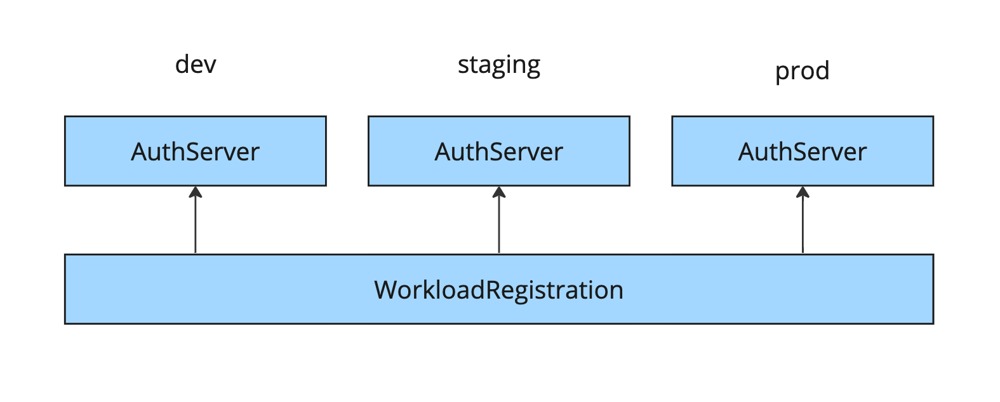
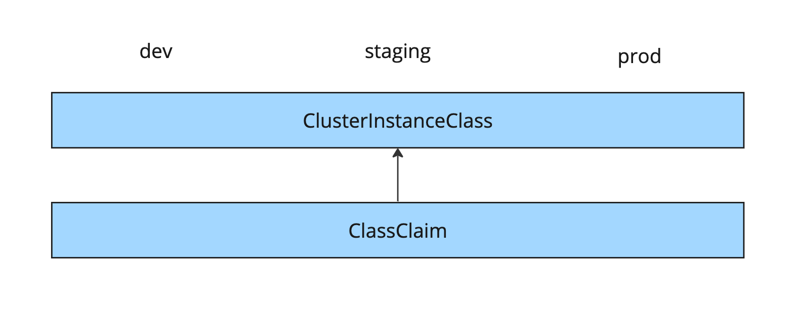

# Levels of consumption for Application Single Sign-On 

This topic tells you about the three levels of consuming Application Single Sign-On 
(commonly called AppSSO) services and explains the when and why for selecting a specific level over another.

VMware recommends using `ClassClaim` to consume an Application Single Sign-On service.
However there might be situations where the lower level `WorkloadRegistration` or
`ClientRegistration` are a better fit.

At its core, the process of consuming Application Single Sign-On involves obtaining 
client credentials for an authorization server and loading them into a running workload. 
This process consists of the following steps:

1. Define your environment-independent OAuth2 client configurations, for example, client
   authentication method, scopes and so on.

1. Define your OAuth2 client's redirect URIs.

1. Specify the authorization server that you want credentials for.

1. Create a resource that expresses your configuration.

1. Mount the client credentials into a workload.

Each of the following levels gradually takes away some of these steps
by distributing them across APIs. As a result, each persona becomes responsible 
only for the tasks within their domain:

- **Platform operators** manage the installations of Tanzu Application Platform 
  and Application Single Sign-On.
- **Service operators** curate and manage Application Single Sign-On services.
- **Application operators** consume Application Single Sign-On services from their workloads.

## <a id="level-1"></a> Level 1: ClientRegistration

The lowest-level and most-general client API AppSSO has to offer is
`ClientRegistration`. It can hold all relevant OAuth2 client configurations.
However, it requires fully-qualified redirect URIs and it targets its host
`AuthServer` by label selector.

Here's a hypothetical, fully-configured `ClientRegistration`:

```yaml
---
apiVersion: sso.apps.tanzu.vmware.com/v1alpha1
kind: ClientRegistration
metadata:
  name: my-clientregistration
  namespace: my-namespace
spec:
  authServerSelector:
    matchLabels:
      sso.apps.tanzu.vmware.com/env: staging
      sso.apps.tanzu.vmware.com/ldap: ""
  redirectURIs:
    - https://profile.shop.staging.example.com/login
    - https://profile.shop.example.com/login
    - http://profile.shop.dev.example.com/login
  scopes:
    - name: openid
    - name: email
    - name: profile
    - name: roles
    - name: coffee.make
      description: bestows the ultimate power
  authorizationGrantTypes:
    - client_credentials
    - authorization_code
    - refresh_token
  clientAuthenticationMethod: client_secret_basic
  requireUserConsent: true
```

To be able to specify redirect URIs for an application running on TAP, you need
to be able to know its scheme and FQDN in advance. For example, you must be
able to say that your redirect URI is `https://profile.shop.example.com/login`.
However, the different parts of such a redirect URI are controlled by multiple
personas; the _platform operator_ and the _application operator_.

Usually, the _platform operator_ controls how FQDNs are templated and whether
TLS is used. In the case of our redirect URI they control everything in
`https://profile.shop.example.com`, i.e. they configure TLS, the template for
domain names and the top-level ingress domain. Furthermore, they will configure
things differently on different environments. That means on another environment
`https://profile.shop.staging.example.com` could be the right thing to set.

The _application operator_ on the other hand is in control of the application's
code and its paths. In case of our redirect URI they control `/login`. This
path is unlikely to change and will be the same regardless of the target
environment.

As a result, for a given environment the _application operator_ might not know
the FQDN and scheme. They would have to ask their _platform operator_. On the
other hand, the _platform operator_ would like to change settings without being
coupled to every _application operators_' configuration.

Furthermore, a `ClientRegistration` needs to uniquely identify an `AuthServer`
by label selector. _Service operators_ are in charge of `AuthServer`. The
labels for a resource don't have to be stable across environments. In this
case, yet again, it complicates things for the _application operator_. That is
because label selectors are more advanced concept and they don't necessarily
know the labels of their desired `AuthServers`. Maybe _application operators_
shouldn't even be able to see `AuthServers` since it is the purview of _service
operators_.

All of this makes it hard for _application operators_ to use the same
`ClientRegistration` across different environments.


[//]: # (^ diagram is produced from https://miro.com/app/board/uXjVMFgNkDk=/)

In summary, `ClientRegistration` is flexible but complex and not easily
portable across environments. It mixes the concerns of personas.

## <a id="level-2"></a> Level 2 - WorkloadRegistration

A higher-level abstraction over `ClientRegistration` is `WorkloadRegistration`.
It is similar to `ClientRegistration` except for one major difference: it
templates redirect URIs.

Instead of providing full redirect URIs, a `WorkloadRegistration` receives
absolute redirect paths. The template for redirect URIs will be configured by
the _platform operator_ when they install TAP (including AppSSO). They will
configure this template to match the template for workload domains.

Here's a hypothetical `WorkloadRegistration`. It is similar to the
`ClientRegistration` we saw above, but only specifies redirect paths. In its
truncated `status` you can see how its redirect URIs are templated.

```yaml
---
apiVersion: sso.apps.tanzu.vmware.com/v1alpha1
kind: WorkloadRegistration
metadata:
  name: my-workloadregistration
  namespace: my-namespace
spec:
  authServerSelector:
    matchLabels:
      sso.apps.tanzu.vmware.com/env: staging
      sso.apps.tanzu.vmware.com/ldap: ""
  redirectPaths:
    - /login
  workloadRef:
    name: my-workload
    namespace: my-namespace
  scopes:
    - name: openid
    - name: email
    - name: profile
    - name: roles
    - name: coffee.make
      description: bestows the ultimate power
  authorizationGrantTypes:
    - client_credentials
    - authorization_code
    - refresh_token
  clientAuthenticationMethod: client_secret_basic
  requireUserConsent: true
status:
  workloadDomainTemplate: "\{{.Name}}.\{{.Namespace}}.\{{.Domain}}"
  redirectURIs:
    - https://my-workload.my-namespace.example.com/login
```

The additional `spec.workloadRef` is provided so that redirect URIs can be
templated. This provides the values for the template.

Templating redirect URIs template decouples the _application operator_ from the
_platform operator_. Now the _application operator_ only has to provide
absolute redirect paths and these are stable across environments. The _platform
operator_ on the other hand can configure domain templates, ingress domains and
TLS as they see fit and rest assured that settings are updated without
interruption.

However, `WorkloadRegistration` still requires matching an `AuthServer` by
label selector. That means _application operators_ and _service operators_ are
still coupled.



[//]: # (^ diagram is produced from https://miro.com/app/board/uXjVMFgNkDk=/)

In summary, `WorkloadRegistration` is less flexible but when redirect URIs can
be templated it is portable across environments. However, it still mixes the
concerns of personas.

## <a id="level-3"></a> Level 3 - ClassClaim (recommended)

The final level is to obtain client credentials by claiming them from an AppSSO
service. While the previous levels interacted directly with `AuthServer`
resources, this level abstract this part away with [Services Toolkit's
APIs](../../services-toolkit/about.hbs.md). This breaks the last remaining
coupling of personas; the one between _application operators_ and _service
operators_.

AppSSO's `ClusterWorkloadRegistrationClass` can be paired with an `AuthServer`
to provide it as a claimable service offering. These two APIs are designed for
the _service operator_ to manage the complete life-cycle of an AppSSO service
offering.

A `ClusterWorkloadRegistrationClass` exposes an `AuthServer` as a claimable
service by creating a Services Toolkit `ClusterInstanceClass` for it and by
defining a blueprint `WorkloadRegistration`. This blueprint allows the _service
operator_ to record the correct label selector for the `AuthServer`. As a
result, it eliminates this concern for _application operators_.

Credentials for a service are requested through Services Toolkit's
general-purpose `ClassClaim` API. A `ClassClaim` identifies a
`ClusterInstanceClass` and it carries parameters which further describe the
request. In the case of an AppSSO service the parameters are essentially the
trimmed `spec` of a `WorkloadRegistration`.

With the `tanzu services` CLI, _application operators_ can discover and consume
services in a self-service style. Commonly, this is how _service operators_
provide all the services required for application teams to run their
applications. This includes databases, queues, in-memory stores and, of course,
single sign-on by AppSSO.

Here's a hypothetical `ClassClaim` for an AppSSO service called `sso`:

```yaml
---
apiVersion: services.apps.tanzu.vmware.com/v1alpha1
kind: ClassClaim
metadata:
  name: my-client-credentials
  namespace: my-namespace
spec:
  classRef:
    name: sso
  parameters:
    workloadRef:
      name: sample-workload
    redirectPaths:
      - /login
    scopes:
      - name: openid
      - name: email
      - name: profile
      - name: roles
      - name: coffee.make
        description: bestows the ultimate power
    authorizationGrantTypes:
      - client_credentials
      - authorization_code
      - refresh_token
    clientAuthenticationMethod: client_secret_basic
    requireUserConsent: true
```

This last level completely decouples all three personas by providing them with
APIs to fulfill their jobs.



[//]: # (^ diagram is produced from https://miro.com/app/board/uXjVMFgNkDk=/)

In summary, `ClassClaim` is less flexible but when redirect URIs can be
templated it is portable across environments. Furthermore, it completely
decouples the concerns of personas. Additionally, it's only a single resource
for _application operators_ to manage.

## <a id="summary"></a> Summary

When you are an _application operator_ and your workload and its supporting
resources are propagating through different environments, then `ClassClaim`
gives you the highest degree of portability as long as redirect URIs for your
workload can be templated. Consuming an AppSSO service only requires a single
resource, a `ClassClaim`, in this case.

When your workload's redirect URIs can be templated but you want control over
the template, then `WorkloadRegistration` provides the flexibility you need. It
does, however, come at the cost of matching an `AuthServer` with a label
selector. Depending on your setup consuming AppSSO requires multiple resource,
a `WorkloadRegistration` and a `ResourceClaim`, in this case.

When your workload's redirect URIs cannot be templated and portability is not a
concern, then `ClientRegistration` provides the flexibility you need. It does,
however, come at the cost of matching an `AuthServer` with a label selector.
Depending on your setup consuming AppSSO requires multiple resource, a
`ClientRegistration` and a `ResourceClaim`, in this case.

In conclusion, use `ClassClaim` when possible.
