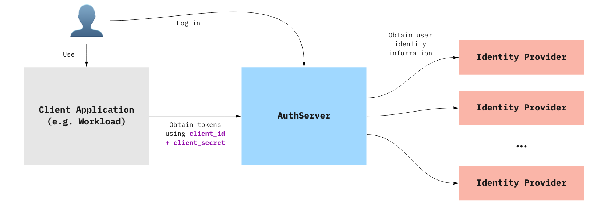

# Deploy an application

---

👉 This article assumes that you have completed the previous step in this Getting Started
guide. If not, please refer to instructions in [Provision a client registration](client-registration.md).

---

In this tutorial, you are going to:

1. Deploy a minimal Kubernetes application that uses the credentials created through
   the [ClientRegistration](client-registration.md) and be protected through SSO.



## Deploy a minimal application

You are going to deploy a two-container pod, as a test application.

---

✋ Note that we used `HTTPProxy.spec.virtualhost.fqdn` = `test-app.example.com`, but you should customize the URL to
match the domain of your TAP cluster. This URL should match what was set up in `ClientRegistration.spec.redirectURIs[0]`
in the [Previous section](client-registration.md)

---

```yaml
---
apiVersion: apps/v1
kind: Deployment
metadata:
  name: test-application
  namespace: default
spec:
  replicas: 1
  selector:
    matchLabels:
      name: test-application
  template:
    metadata:
      labels:
        name: test-application
    spec:
      containers:
        - image: bitnami/oauth2-proxy:7.3.0
          name: proxy
          ports:
            - containerPort: 4180
              name: proxy-port
              protocol: TCP
          env:
            - name: ISSUER_URI
              valueFrom:
                secretKeyRef:
                  name: my-client-registration
                  key: issuer-uri
            - name: CLIENT_ID
              valueFrom:
                secretKeyRef:
                  name: my-client-registration
                  key: client-id
            - name: CLIENT_SECRET
              valueFrom:
                secretKeyRef:
                  name: my-client-registration
                  key: client-secret
          command: [ "oauth2-proxy" ]
          args:
            - --oidc-issuer-url=$(ISSUER_URI)
            - --client-id=$(CLIENT_ID)
            - --insecure-oidc-skip-issuer-verification=true
            - --client-secret=$(CLIENT_SECRET)
            - --cookie-secret=0000000000000000
            - --cookie-secure=false
            - --http-address=http://:4180
            - --provider=oidc
            - --scope=openid email profile roles
            - --email-domain=*
            - --insecure-oidc-allow-unverified-email=true
            - --oidc-groups-claim=roles
            - --upstream=http://127.0.0.1:8000
            - --redirect-url=http://test-app.example.com/oauth2/callback
            - --skip-provider-button=true
            - --pass-authorization-header=true
            - --prefer-email-to-user=true
        - image: python:3.9
          name: application
          resources:
            limits:
              cpu: 100m
              memory: 100Mi
          command: [ "python" ]
          args:
            - -c
            - |
              from http.server import HTTPServer, BaseHTTPRequestHandler
              import base64
              import json

              class Handler(BaseHTTPRequestHandler):
                  def do_GET(self):
                      if self.path == "/token":
                          self.token()
                          return
                      else:
                          self.greet()
                          return

                  def greet(self):
                      username = self.headers.get("x-forwarded-user")
                      self.send_response(200)
                      self.send_header("Content-type", "text/html")
                      self.end_headers()
                      page = f"""
                      <h1>It Works!</h1>
                      <p>You are logged in as <b>{username}</b></p>
                      """
                      self.wfile.write(page.encode("utf-8"))

                  def token(self):
                      token = self.headers.get("Authorization").split("Bearer ")[-1]
                      payload = token.split(".")[1]
                      decoded = base64.b64decode(bytes(payload, "utf-8") + b'==').decode("utf-8")
                      self.send_response(200)
                      self.send_header("Content-type", "application/json")
                      self.end_headers()
                      self.wfile.write(decoded.encode("utf-8"))

              server_address = ('', 8000)
              httpd = HTTPServer(server_address, Handler)
              httpd.serve_forever()

---
apiVersion: v1
kind: Service
metadata:
  name: test-application
  namespace: default
spec:
  ports:
    - port: 80
      targetPort: 4180
  selector:
    name: test-application

---
apiVersion: projectcontour.io/v1
kind: HTTPProxy
metadata:
  name: test-application
  namespace: default
spec:
  virtualhost:
    fqdn: test-app.example.com
  routes:
    - conditions:
        - prefix: /
      services:
        - name: test-application
          port: 80
```

Now you can navigate to `http://test-app.example.com/`. It may ask you to log into the
AuthServer you haven't already. You can also navigate to `http://test-app.example.com/token` if you wish to see the
contents of the ID token.

## 💡 Deployment manifest explained

The application was deployed as a two-container pod: one for the app, and one for handling login.

- The main container is called `application`, and runs a bare-bones Python HTTP server, that reads from
  the `Authorization` header from incoming requests and returns the decoded `id_token`.
- The second container, called `proxy`, is a sidecar container, an "Ambassador". It receives traffic for the Pod,
  performs OpenID authentication using [OAuth2 Proxy](https://oauth2-proxy.github.io/oauth2-proxy/), and proxies
  requests to the `application` with some added headers containing identity information.

Along with this deployment, there is a `Service` + `HTTPProxy`, to expose the application to the outside world.

## 💡 Notes on OAuth2-Proxy

The setup of the above [OAuth2 Proxy](https://oauth2-proxy.github.io/oauth2-proxy/) is minimal, and is not considered
suitable for production use. To configure it for production, please refer to the official documentation.

Note that OAuth2 Proxy requires some claims to be present in the `id_token`, notably the `email` claim and the
non-standard `groups` claim. The `groups` claim maps to AppSSO's `roles` claim. Therefore, for this proxy to work with
AppSSO, users _MUST_ have an e-mail defined, and at least one entry in `roles`. If the proxy container logs an error
stating `Error redeeming code during OAuth2 callback: could not get claim "groups" [...]`, make sure that the user
has `roles` provided in the `identityProvider`.
