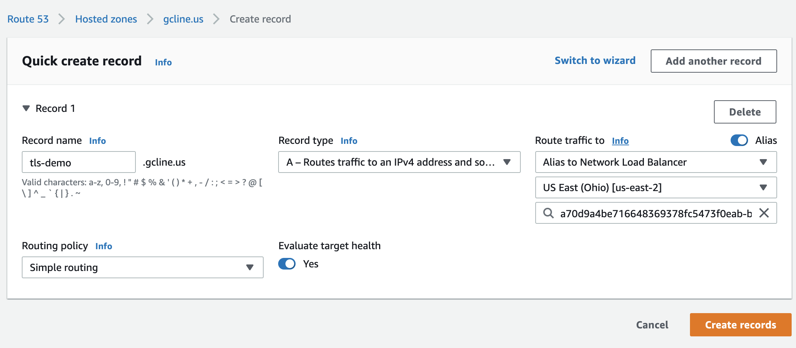

# Configure Contour to support TLS termination at an AWS Network LoadBalancer

This topic tells you how to configure Contour to accept traffic from an AWS 
Network Load Balancer (NLB) that terminates TLS traffic.

>**Important** This guide only applies to the Contour package from 
Tanzu Application Platform v1.7.0 and onwards.

## <a id="prereqs"></a>Prerequisites

The following are required before proceeding with the configuration: 

- An EKS cluster.
- The Contour package installed on the cluster, either as part of Tanzu Application 
Platform or from the [standalone component installation](install.hbs.md).
- Access to Route53 and AWS Certificate Manager.
- A domain registered in Route53. This topic refers to this domain as `DOMAIN`.

## <a id="procedure"></a>Procedure

The following steps correspond to the steps in the [Contour open source documentation](https://projectcontour.io/docs/1.25/guides/deploy-aws-tls-nlb/#configure). Instead of creating or updating resources manually, this topic tells you how to configure the `tap-values.yaml` file.

1. Create a public TLS certificate for `DOMAIN` by using AWS Certificate Manager (ACM). 

    This is streamlined when Route 53 manages `DOMAIN`.

    Note down the `ARN` of the created certificate, which is required in the following steps.

1. Edit the Contour package install values.

    - If using a `tap-values.yml` file, update the Contour section with the following:

        ```yaml
        contour:
          ...
          envoy:
            service:
            loadBalancerTLSTermination: true
            annotations: |
              service.beta.kubernetes.io/aws-load-balancer-type: external
                service.beta.kubernetes.io/aws-load-balancer-nlb-target-type: ip
                service.beta.kubernetes.io/aws-load-balancer-scheme: internet-facing
                service.beta.kubernetes.io/aws-load-balancer-ssl-cert: ARN
                service.beta.kubernetes.io/aws-load-balancer-ssl-ports: "443"
        ```

        Where `ARN` is the ARN noted down from the previous step.

    - If installing the Contour package standalone, update your values file with the `envoy.service` section.

1. Update your Tanzu Application Platform install:
 
    ```console
    tanzu package installed update tap -n tap-install -f tap-values.yml -p tap.tanzu.vmware.com -v VERSION
    ```

    Where `VERSION` is the version of Tanzu Application Platform in use, which must be in the form of `X.X.X`.

1. Configure the domain name system (DNS).

    1. Get the External IP of the Envoy service:

        ```console
        kubectl get svc envoy -n NAMESPACE
        ```

        Where `NAMESPACE` is the namespace where Contour is installed. The default value is `tanzu-system-ingress` unless configured otherwise.

	      The result resembles the following:

        ```console
        NAME    TYPE           CLUSTER-IP      EXTERNAL-IP                                                                     PORT(S)            AGE
         envoy   LoadBalancer   10.100.24.154   a7ea2bbde8a164036a7e4c1ed5700cdf-154fb911d990bb1f.elb.us-east-2.amazonaws.com   443:31606/TCP      40d
        ```

    1. Setup a DNS entry:
 
        Create a DNS record pointing from `DOMAIN` to the NLB Domain, which is the External IP value from the previous step.

	      If not using AWS Route53, you must create a CNAME entry in your DNS provider. Otherwise, with AWS Route53, you can create an "A" record type, and alias it to the Network Loadbalancer.

        In the "route traffic to" section, you must set:

        - "Alias to Network Loadbalancer".
        - The appropriate region for your NLB.
        - The name of your NLB domain from the previous step.

        It resembles the following:

        


## <a id="verify"></a>Verification

You can verify this conifguration by applying a simple test app and the corresponding HTTPProxy resource.

The FQDN on the HTTPProxy resource must match the `DOMAIN` you used earlier.
