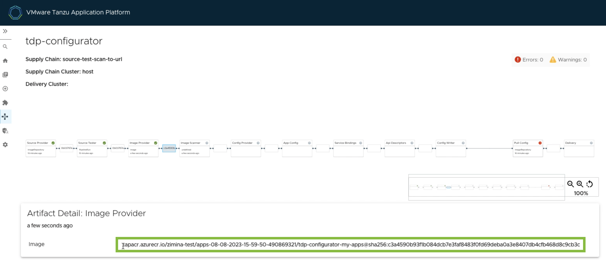
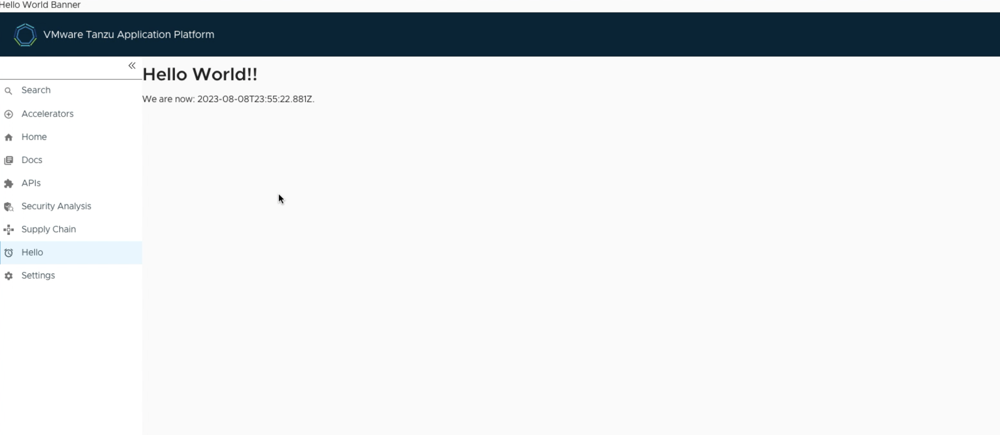

# Integrate a plugin into your Tanzu Developer Portal

This topic guides you through integrating the hello-world plugin into your Tanzu Developer Portal by using the configurator tool. The hello-world plugin has been created a demonstration of the configurator tool's capabilities.

For general information on the Tanzu Developer Portal configurator and its basic concepts, please refer to [Tanzu Developer Portal Configurator](../tap-gui/configurator/about.hbs.md)

## <a id="prereqs"></a>Prerequisites

Before you start, you must have:

- Tanzu Application Platform cluster with the full profile
- Tanzu Developer Portal Configurator bundle available (`tpb.tanzu.vmware.com`). 

To verify it is present, run the following command: 
```console
tanzu package available list --namespace tap-install | grep tpb.tanzu.vmware.com
```
- Instance of the canonical Tanzu Developer Portal.

To get the fully-qualified domain name for the portal, run the following command:
```console
kubectl get httpproxy tap-gui -n tap-gui
```
> **Note:** by default, Tanzu Developer Portal uses a self-signed certificate and may result in a security error in the browser. To address this error, please refer to [Configure a TLS certificate by using an existing certificate](../tap-gui/tls/enable-tls-existing-cert.hbs.md).

- At least one configured developer namespace
- At least one operational Supply Chain

To confirm the last two prerequisites, it is recommended to deploy a demo workload as described in [Deploy an app on Tanzu Application Platform](./deploy-first-app.hbs.md). 


## <a id="you-will"></a>What you will do

- Create a customized Tanzu Developer Portal containing the hello-world plugin
- Observe the customized Tanzu Developer Portal instance

## <a id="customize-dev-portal"></a>Customize your Tanzu Developer Portal by adding the hello-world plugin

Complete the following steps to integrate the hello-world plugin into your Tanzu Developer Portal.

### Procedure

1. Create the **tpb-config.yaml** file specifying the list of additional plugins that you want to integrate. In this example, we only need to specify the hello-world plugin that has both frontend and backend parts:

    ```yaml
    app:
      plugins:
        - name: '@tpb/plugin-hello-world'
          version: '^1.6.0-release-1.6.x.1'
    backend:
      plugins:
        - name: '@tpb/plugin-hello-world-backend'
          version: '^1.6.0-release-1.6.x.1'
    ```
> **Note:** If the plugin's version is not specified, it is likely that the workload that uses the config file as input will fail.

2. Encode the file in base64, to later embed `tpb-config.yaml` in the workload definition file, by
   running:

   ```console
   base64 -i tdp-config.yaml
   ```
For our example, the output is:
```console
YXBwOgogIHBsdWdpbnM6CiAgICAtIG5hbWU6ICdAdHBiL3BsdWdpbi1oZWxsby13b3JsZCcKICAgICAgdmVyc2lvbjogJ14xLjYuMC1yZWxlYXNlLTEuNi54LjEnIApiYWNrZW5kOgogIHBsdWdpbnM6CiAgICAtIG5hbWU6ICdAdHBiL3BsdWdpbi1oZWxsby13b3JsZC1iYWNrZW5kJwogICAgICB2ZXJzaW9uOiAnXjEuNi4wLXJlbGVhc2UtMS42LnguMScK
```
We will use this value later as `ENCODED-TDP-CONFIG-VALUE`.


3. Identify the location of the configurator's image

To complete this step, use the following commands:

```console
export OUTPUT_IMAGE=$(kubectl -n tap-install get package tpb.tanzu.vmware.com.0.1.2 -o "jsonpath={.spec.template.spec.fetch[0].imgpkgBundle.image}")
```
```console
imgpkg pull -b ${OUTPUT_IMAGE} -o tpb-package
```
```console
yq -r ".images[0].image" <tpb-package/.imgpkg/images.yml
```
We will use this value later as `TDP-IMAGE-LOCATION`.


4. Prepare your workload definition file. Create a file called `tdp-workload.yaml` with the following content:

```yaml
apiVersion: carto.run/v1alpha1
kind: Workload
metadata:
  name: tdp-configurator
  namespace: DEVELOPER-NAMESPACE
  labels:
    apps.tanzu.vmware.com/workload-type: web
    app.kubernetes.io/part-of: tdp-configurator
spec:
  build:
    env:
      - name: BP_NODE_RUN_SCRIPTS
        value: 'set-tpb-config,portal:pack'
      - name: TPB_CONFIG
        value: /tmp/tpb-config.yaml
      - name: TPB_CONFIG_STRING
        value: ENCODED-TDP-CONFIG-VALUE

  source:
    image: TDP-IMAGE-LOCATION
    subPath: builder
```

Where:

- `DEVELOPER-NAMESPACE` is the configured developer namespace on the cluster
- `ENCODED-TDP-CONFIG-VALUE` is the base64-encoded **tpb-config.yaml** that you encoded earlier
- `TDP-IMAGE-LOCATION` is the location of the Configurator image in the image registry from which you installed Tanzu Application Platform that you identified earlier

> **Important** Depending on which supply chain you're using or how you've configured it, you might need to add extra sections to your workload definition file to accommodate activities such as testing.

5. Deploy your workload on your Tanzu Application Platform cluster.

To complete this step, use the following Tanzu CLI command:
```console
tanzu apps workload create -f tdp-workload.yaml -n DEVELOPER-NAMESPACE
```

Where:
- `DEVELOPER-NAMESPACE` is the configured developer namespace on the cluster

Once the workload is deploy, you can observe it in the `Supply Chains` section of the Tanzu Developer Portal


Wait for the **Image Provider** step of the Supply Chain to be completed.

6. Copy the address to the customized Tanzu Developer Portal's image.

To complete this step, navidate to the box that follows the **Image Provider** step:



We will use this value as `IMAGE-REFERENCE` in the next step.

7. Create the **tdp-overlay-secret.yaml** to insert the new image into the Tanzu Developer Portal instance.

    ```yaml
    apiVersion: v1
    kind: Secret
    metadata:
      name: tpb-app-image-overlay-secret
      namespace: tap-install
    stringData:
      tpb-app-image-overlay.yaml: |
        #@ load("@ytt:overlay", "overlay")

        #! makes an assumption that tap-gui is deployed in the namespace: "tap-gui"
        #@overlay/match by=overlay.subset({"kind": "Deployment", "metadata": {"name": "server", "namespace": "tap-gui"}}), expects="1+"
        ---
        spec:
          template:
            spec:
              containers:
                #@overlay/match by=overlay.subset({"name": "backstage"}),expects="1+"
                #@overlay/match-child-defaults missing_ok=True
                - image: IMAGE-REFERENCE
                #@overlay/replace
                  args:
                  - -c
                  - |
                    export KUBERNETES_SERVICE_ACCOUNT_TOKEN="$(cat /var/run/secrets/kubernetes.io/serviceaccount/token)"
                    exec /layers/tanzu-buildpacks_node-engine-lite/node/bin/node portal/dist/packages/backend  \
                    --config=portal/app-config.yaml \
                    --config=portal/runtime-config.yaml \
                    --config=/etc/app-config/app-config.yaml
    ```

Where:

- `IMAGE-REFERENCE` is address of the customized Tanzu Developer Portal image identified in the previous step

> **Important** Any changes in the overlay of the yaml file would result in an error.

8. Deploy the secret to the Tanzu Application Platform cluster.

To complete this step, use the following command:

```console
kubectl apply -f tdp-overlay-secret.yaml
```
9. Amend the **tap-values.yaml** to include the overlay secret.

To complete this step, add the following lines to your values file:

    ```yaml
    profile: full
    tap_gui:
      ...
    package_overlays:
    - name: tap-gui
      secrets:
      - name: tpb-app-image-overlay-secret
    ```

10. Apply the new **tap-values.yaml** to your cluster. The exact steps vary depending on your installation method (GitOps, online install, or offline install).

For how to do so for an online installation, see [Install your Tanzu Application Platform package](../../install-online/profile.hbs.md#install-your-tanzu-application-platform-package).

For example, you may use the following Tanzu CLI command:

```console
tanzu package installed update tap -f tap-values.yaml -n tap-install
```

11. Once all the packages have reconciled, that would prompt the Tanzu Developer Portal pod to restart, enabling the customized portal. 

> **Note**: you may need to hard refresh your Tanzu Developer Portal in your browser. In Chrome, right-click on the page to start `Inspect` mode, then right click on the refresh button.

> **Note**: if the old Tanzu Developer Portal pod is not deleting, you will have to manually delete the old pod using the command `kubectl delete pod <pod-name> -n tap-gui` 




## <a id="next-steps"></a>Next steps

Now that you have your hello-world plugin integrated into your Tanzu Developer Portal, the next step is to explore how to [Add external plug-ins to Tanzu Developer Portal](../tap-gui/configurator/external-plugins.hbs.md).

