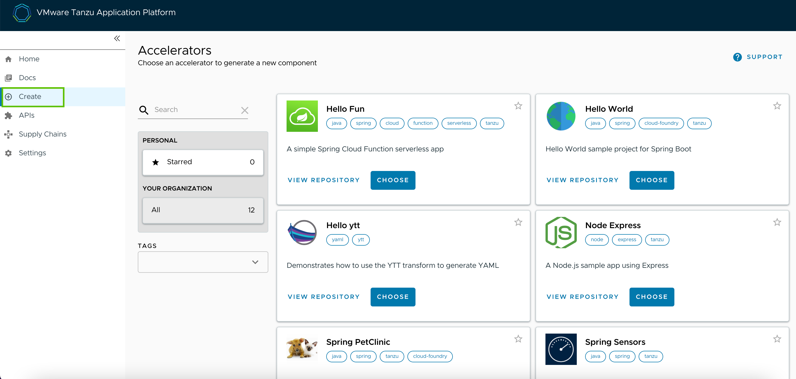

# Deploy your first application on Tanzu Application Platform

This is the first in a series of Getting started how-to guides for developers. It walks you through deploying your first application on Tanzu Application Platform by using the Tanzu Application Platform GUI.

>**Note:** This walk-through uses the Tanzu Application Platform GUI. Alternatively, you can deploy your first application on Tanzu Application Platform using the [Application Accelerator Extension for VS Code](../application-accelerator/vscode.hbs.md).

## <a id="you-will"></a>What you will do

- Generate a project from an application accelerator.
- Optionally provision a new Git repository for the project.
- Upload it to your Git repository of choice.
- Deploy the app using the Tanzu CLI.
- View the build and runtime logs for your app.
- View the Web App in your browser.
- (Optional) Add your application to Tanzu Application Platform GUI software catalog.

Before you start, complete all [Getting started prerequisites](../getting-started.md#get-started-prereqs). For background on application accelerators, see [Application Accelerator](about-application-accelerator.md).

## <a id="generate-project"></a>Generate a new project using an application accelerator

In this example, we use the `Tanzu-Java-Web-App` accelerator. We also use the Tanzu Application Platform GUI. For information about connecting to Tanzu Application Platform GUI, see
   [Accessing Tanzu Application Platform GUI](../tap-gui/accessing-tap-gui.md). 

1. From Tanzu Application Platform GUI portal, click **Create** located on the left-hand side of the
   navigation bar to see the list of available accelerators.
   
    

1. Locate the Tanzu Java Web App accelerator and click **CHOOSE**.

1. In the **Generate Accelerators** dialog box, replace the default value `dev.local` in the **prefix for container image registry** field
   with the registry in the form of `SERVER-NAME/REPO-NAME`.
   The `SERVER-NAME/REPO-NAME` must match what was specified for `registry` as part of the installation values for `ootb_supply_chain_basic`. See the Full Profile section on [Installing Tanzu Application Platform package and profiles](../install.hbs.md#full-profile). Click **NEXT**.

    

1. If your instance has optional Git repository support enabled, continue the sub-steps below. If your instance _does not_ support this, skip to step 5, "Verify the provided information".
    1. Select `Create Git repo?`
    1. Select the `Host` git repository provider from the drop down. In this example, we will select `github.com` 
    1. Populate the `Owner` and `Repository` properties
    
    1. As you are populating the form, a prompt will appear asking for permission to be allowed to provision Git repositories. Follow the prompts and continue.
    1. Click **NEXT**.

1. Verify the provided information, and click **GENERATE ACCELERATOR**.

1. After the Task Activity processes complete, click **DOWNLOAD ZIP FILE**.

1. After downloading the ZIP file, expand it in a workspace directory. If you did not create a Git repository in the steps above, follow your preferred procedure for uploading the generated project files to a Git repository for your new project.

## <a id="deploy-your-app"></a>Deploy your application through Tanzu Application Platform GUI
1. Set up environment variables by running:

    ```console
    export GIT_URL_TO_REPO=GIT-URL-TO-PROJECT-REPO
    export YOUR_NAMESPACE=YOUR-DEVELOPER-NAMESPACE
    ```

    Where:
    
    - `GIT-URL-TO-PROJECT-REPO` is the path you uploaded to earlier.
    - `YOUR-DEVELOPER-NAMESPACE` is the namespace configured earlier.

2. Deploy the Tanzu Java Web App accelerator by running the `tanzu apps workload create` command:

    ```console
    tanzu apps workload create tanzu-java-web-app \
    --git-repo ${GIT_URL_TO_REPO} \
    --git-branch main \
    --type web \
    --label app.kubernetes.io/part-of=tanzu-java-web-app \
    --yes \
    --namespace ${YOUR_NAMESPACE}
    ```

    If you bypassed step 5 or were unable to upload your accelerator to a Git repository, use the following public version to test:

    ```console
    tanzu apps workload create tanzu-java-web-app \
    --git-repo https://github.com/vmware-tanzu/application-accelerator-samples \
    --sub-path tanzu-java-web-app \
    --git-branch main \
    --type web \
    --label app.kubernetes.io/part-of=tanzu-java-web-app \
    --yes \
    --namespace YOUR-DEVELOPER-NAMESPACE
    ```

    Where `YOUR-DEVELOPER-NAMESPACE` is the namespace configured earlier.

    For more information, see [Tanzu Apps Workload Create](../cli-plugins/apps/command-reference/tanzu-apps-workload-create.md).

    > **Note:** This deployment uses an accelerator source from Git, but in later steps you use the VS Code extension
    to debug and live-update this application.

3. View the build and runtime logs for your app by running the `tail` command:

    ```console
    tanzu apps workload tail tanzu-java-web-app --since 10m --timestamp --namespace YOUR-DEVELOPER-NAMESPACE
    ```

    Where `YOUR-DEVELOPER-NAMESPACE` is the namespace configured earlier.

4. After the workload is built and running, you can view the Web App in your browser. View the URL of the Web App by running the following command, and then press **ctrl-click** on the Workload Knative Services URL at the bottom of the command output.

    ```console
    tanzu apps workload get tanzu-java-web-app --namespace YOUR-DEVELOPER-NAMESPACE
    ```

    Where `YOUR-DEVELOPER-NAMESPACE` is the namespace configured earlier.

    


## <a id="add-app-to-gui-cat"></a>Add your application to Tanzu Application Platform GUI software catalog

1. Navigate to the home page of Tanzu Application Platform GUI and click **Home**, located on the left navigation bar. Click **REGISTER ENTITY**.

    

    Alternatively, you can add a link to the `catalog-info.yaml` to the `tap-values.yaml` configuration file in the `tap_gui.app_config.catalog.locations` section. See [Installing the Tanzu Application Platform Package and Profiles](../install.md#full-profile).

1. **Register an existing component** prompts you to type a repository URL.
Type the link to the `catalog-info.yaml` file of the tanzu-java-web-app in the Git repository field. For example,
`https://github.com/USERNAME/PROJECTNAME/blob/main/catalog-info.yaml`.

1. Click **ANALYZE**.

    

2. Review the catalog entities to be added and click **IMPORT**.

    

3. Navigate back to the home page. The catalog changes and entries are visible for further inspection.

>**Note:** If your Tanzu Application Platform GUI instance does not have a [PostgreSQL](../tap-gui/database.md) database configured, the `catalog-info.yaml` location must be re-registered after the instance is restarted or upgraded.

## Next steps

- [Iterate on your new application](iterate-new-app.md)
