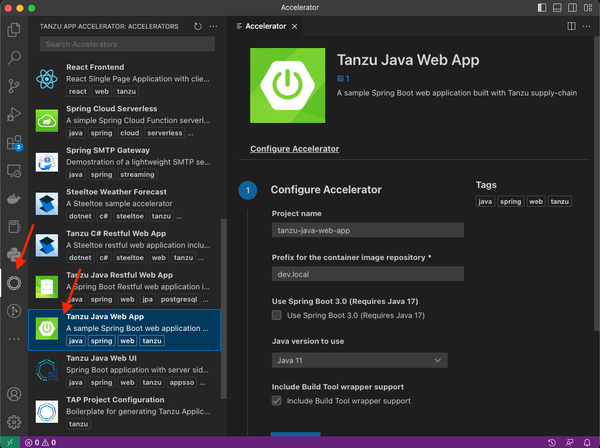
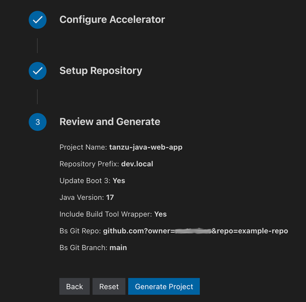
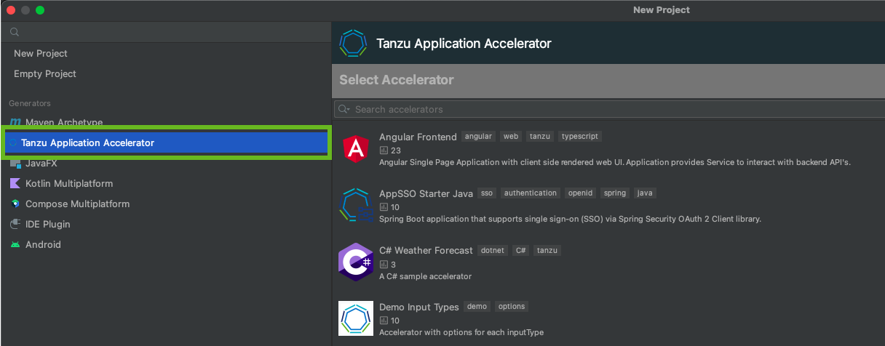
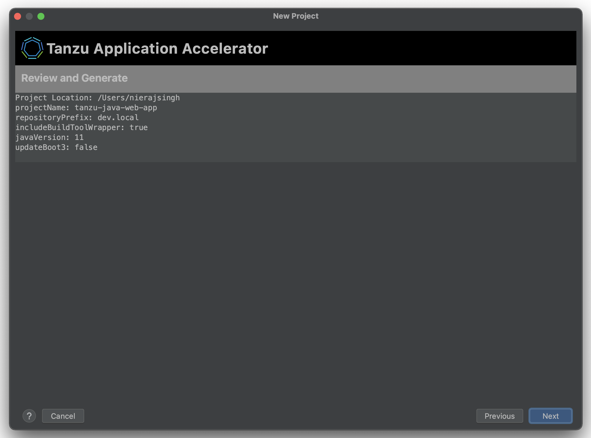

# Generate an application with Application Accelerator

This guide will step through how to generate a new project using application
accelerators and how to deploy the project onto a Tanzu Application Platform
cluster.

>**Important** Before you start, complete all [Getting Started
>prerequisites](../getting-started.md#get-started-prereqs).

## Choose a project generation interface
There are multiple interfaces that can be used to generate a project. Choose one
of the tabs below for instructions on how to generate and deploy applications
using the selected interface.

> **Note** If you have already generated a project and wish to skip this step,
> feel free to jump to [Deploying your application with Tanzu Application
> Platform](deploy-first-app.hbs.md).

Application Accelerator extension
for VS Code : ## What you will do

  - Install the Application Accelerator extension for VS Code.
  - (Optional) Provision a new GitHub repository and upload the project to the
    repository.
  - Generate a project using an application accelerator.

  ##  Install and configure the Application Accelerator extension for VS Code

  To install and configure the Application Accelerator extension for VS Code,
  see [Application Accelerator Visual Studio
  Code extension](../application-accelerator/vscode.hbs.md). 

  ## Generate a new project using an application accelerator

  1. Select an accelerator from the catalog. For this example, `Tanzu Java Web
     App` will be used.

    

  2. Configure the accelerator as defined by your project's requirements. For
     this example, the project will be configured to use Spring Boot 3 and Java
     17.

    

  3. Once configuration is finished, click "Next Step".

  4. If your organization's Tanzu Application Platform is configured for
     optional Git repository creation, follow the sub-instructions below.
     Otherwise, proceed to step 5.

    > **Note** For information on configuring optional Git repository creation and supported repositories, see [Create an Application Accelerator Git repository during project creation](../tap-gui/plugins/application-accelerator-git-repo.hbs.md).

      1. Select your git provider. In this example, `github.com` will be selected.

        

      2. Once the provider is selected, a prompt will appear to enter in an API token for your git provider. Populate the text box with your provider's API token and press the "Enter" key.    This API key requires the ability to create new repositories for an organization or user. For information on how to create an API token for git repository creation, see [GitHub's "Creating a personal access token"](https://docs.github.com/en/authentication/keeping-your-account-and-data-secure/creating-a-personal-access-token#creating-a-personal-access-token-classic) documentation.

        

      3. In the "Owner" field, enter in the name of either the GitHub organization or username to create the repository under.
      4. In the "Repository Name" field, enter in the desired name for the project repository.
      5. In the "Repository Branch" field, enter in the desired default branch name for the project repository. Typically, this would be set to `main`.
      6. Proceed to the next section by clicking "Next Step"
  5. In the "Review and Generate" step, verify that all the information provided
     is accurate. Click "Generate Project".

    

  6. A prompt will appear to choose a location for the project to be stored on
     the local file system. Choose a desired directory or create a new folder.
  7. Once the project is finished generating, a second prompt will appear to
     either open the new project in a new window. For now, select "Yes". This
     will open in a new window.
  8. Once opened, the project is ready for development.

Application Accelerator plugin for
IntelliJ : ## What you will do

  - Install the Application Accelerator plugin for IntelliJ.
  - Generate a project using an application accelerator.

  ##  Install and configure the Application Accelerator plugin for IntelliJ

  To install and configure the Application Accelerator plugin for IntelliJ,
  see [Application Accelerator plugin for
  IntelliJ](../application-accelerator/intellij.hbs.md) 

  ## Generate a new project using an application accelerator

  1. On the IntelliJ "Welcome to IntelliJ IDEA" page, click "New Project".

     

  2. Select "Tanzu Application Accelerator" from the left side.

     

  3. Select an accelerator from the catalog. For this example, `Tanzu Java Web
     App` will be used. Click "Next".

  4. Configure the accelerator as defined by your project's requirements. 

     

  5. Once configuration is finished, click "Next".

  6. In the "Review and Generate" step, verify that all the information provided
     is accurate. Click "Next".

     

  7. Once the project is finished generating, click "Create" to open the new
     project in IntelliJ.

     
     
  8. Once opened, the project is ready for development.

Tanzu Application Platform GUI : ## What you will do

  - Generate a project from an application accelerator.
  - (Optional) Provision a new Git repository for the project.
  - Upload it to your Git repository of choice.

  Before you start, complete all [Getting started
  prerequisites](../getting-started.md#get-started-prereqs). For background on
  application accelerators, see [Application Accelerator]
  (about-application-accelerator.md). 

  ## Generate a new project using an application accelerator

  In this example, you use the `Tanzu-Java-Web-App` accelerator. You also use
  Tanzu Application Platform GUI. For information about connecting to Tanzu
  Application Platform GUI, see [Access Tanzu Application Platform
  GUI](../tap-gui/accessing-tap-gui.md).

  1. From Tanzu Application Platform GUI portal, click **Create** located on the
  left side of the navigation pane to see the list of available accelerators.

      

  2. Locate the Tanzu Java Web App accelerator and click **CHOOSE**.

  3. In the **Generate Accelerators** dialog box, replace the default value
  `dev.local` in the **prefix for container image registry** text box with the
  registry in the form of `SERVER-NAME/REPO-NAME`. The `SERVER-NAME/REPO-NAME`
  must match what was specified for `registry` as part of the installation
  values for `ootb_supply_chain_basic`. See the Full Profile section on
  [Installing   Tanzu Application Platform package and
  profiles](../install.hbs.md#full-profile). Click **NEXT**.

      

  4. If your instance has optional Git repository support enabled, continue with
     the following sub-steps. If your instance _does not_ support this, skip to
     step 5, "Verify the provided information."

    > **Note** For information on configuring optional git repository creation and supported repositories, see [Create an Application Accelerator Git repository during project creation](../tap-gui/plugins/application-accelerator-git-repo.hbs.md).

      1. Select `Create Git repo?`
      2. Select the `Host` Git repository provider from the drop-down menu. In this example, select `github.com`.
      3. Populate the `Owner` and `Repository` properties.

          

      4. As you are populating the form, a dialog box appears asking for permission to provision Git repositories. Follow the prompts and continue.
      5. Click **NEXT**.

  5. Verify the provided information, and click **GENERATE ACCELERATOR**.

  6. After the Task Activity processes complete, click **DOWNLOAD ZIP FILE**.

  7. After downloading the ZIP file, expand it in a workspace directory. If you
     did not create a Git repository in the preceding steps, follow your
     preferred procedure for uploading the generated project files to a Git
     repository for your new project.

## Next Steps
Now that a Tanzu Application Platform-ready project has been generated, [learn
how to quickly deploy the application](deploy-first-app.hbs.md) on a Tanzu
Application Platform cluster.

## Learn more about Application Accelerator

* For information on how to configure optional git repository creation, see the
  [Configuration
  section](../tap-gui/plugins/application-accelerator-git-repo.hbs.md#configuration)
  of the git repository configuration doc.
* For information on Application Accelerator configurations, see the [Configure
  Application Accelerator
  documentation](../application-accelerator/configuration.hbs.md).
* For information on installing the Application Accelerator extension for Visual
  Studio Code, see the [Application Accelerator Visual Studio Code extension
  documentation](../application-accelerator/vscode.hbs.md).
* For general accelerator troubleshooting, see [Troubleshooting Application
  Accelerator for VMware
  Tanzu](../application-accelerator/troubleshooting.hbs.md).
