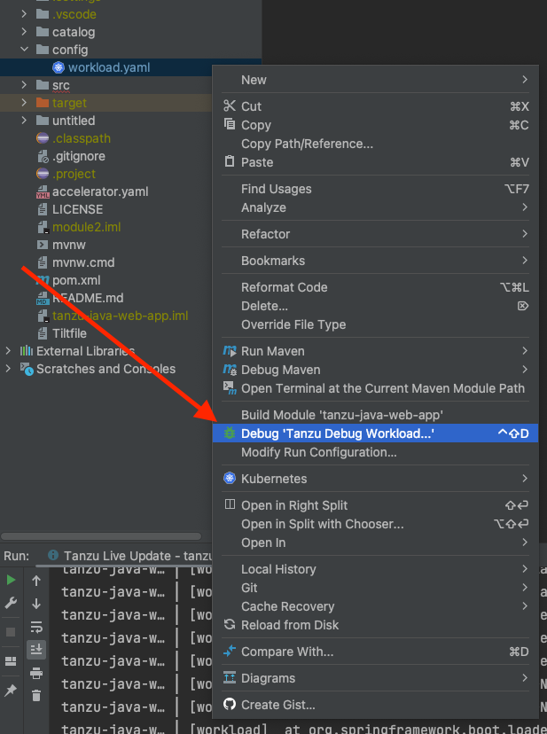

# Using the Tanzu Dev Tools Extension

##  Before Beginning

Ensure the project you want to use the extension with has the required files specified in the [Getting Started page](getting-started.md). Note that the Tanzu Developer Tools extension requires only one Tiltfile and one workload.yaml per project. The workload.yaml must be a single-document YAML file, not a multi-document YAML files.

##  Debugging on the Cluster

The Tanzu Developer Tools extension enables you to debug your application on your TAP-enabled Kubernetes cluster .

Debugging requires a **workload.yaml** file in your project. For information about creating a **workload.yaml** file, see the [Set Up section](getting-started.md#set-up-tanzu-dev-tools) on the Getting Started page.

> **Note:** Debugging on the cluster and Live Update can not be used simultaneously. If you use Live Update for the current project, you must ensure that you stop the Tanzu Live Update Run Configuration before attempting to debug on the cluster.

###  Start Debugging on the Cluster

To start debugging on the cluster:

1. Add a [breakpoint](https://www.jetbrains.com/help/idea/using-breakpoints.html) in your code.
2. Right-click the **workload.yaml** file in your project.
3. Select `Debug 'Tanzu Debug Workload...'` in the right-click menu.

    

4. Ensure the configuration parameters are set.

    
    
5. You can also manually create Tanzu Debug Configurations via the `Edit Configurations` IntelliJ UI.

###  Stop Debugging on the Cluster

Select the stop button in the Debug overlay to stop debugging on the cluster:

###  Start Live Update

- Right-click your project’s `Tiltfile` and select `Run 'Tanzu Live Update - ...'`.
- You must compile your code before the changes are synchronized to the container.

> **Note:** Only one Live Update session can be active at a time. Make sure to stop any running session before starting a new one.

