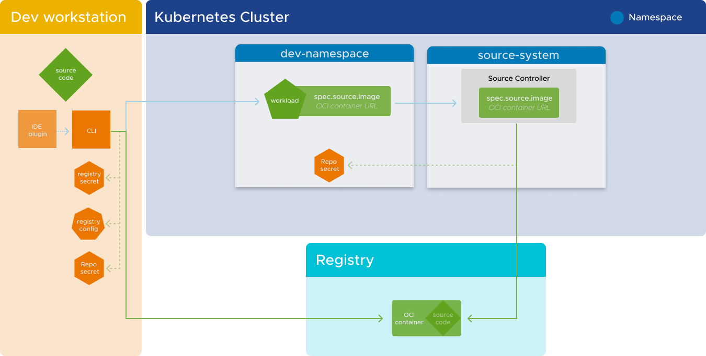

# Design of Local Source Proxy

Local Source Proxy (LSP) serves as a proxy registry server with OCI (Open Container Initiative)
compatibility. Its main purpose is to handle image push requests by forwarding them to an external
registry server, which is configured through the `tap-values.yaml` file.

Local Source Proxy takes care of authentication and authorization against the external registry
provider internally. This ensures that the external registry remains transparent to the user.

By functioning as a proxy registry server, Local Source Proxy simplifies the process of
interacting with external registry servers. Local Source Proxy provides a centralized and transparent
approach for image push requests, handling authentication and authorization seamlessly.

If you don't use Local Source Proxy, your developer workstation requires more configuration, and the
process of interacting with external registry servers is more complicated.

The Apps CLI generates requests that adhere to the OCI distribution standard to push artifacts to
Local Source Proxy instances. The Kubernetes API server handles user authentication and authorization.

Consequently this default mechanism becomes the primary way to push a developer's local source code
to the Tanzu Application Platform cluster. This renders the `--source-image` flag optional.
By leveraging Local Source Proxy, developers can seamlessly deploy their code without explicitly
specifying the source image.

However, the system remains backward-compatible to accommodate different scenarios.

The `local-source-proxy` mechanism is completely bypassed if either of the following is true:

- The `--source-image` flag is provided
- The workload has a defined source image that Local Source Proxy didn't set

This ensures compatibility with existing workflows and allows developers to continue using their
preferred methods for deployment.

By default, the `iterate`, `light`, and `full` profiles include the installation of this package.
To suppress this behavior, exclude the package by adding `local-source-proxy.apps.tanzu.vmware.com`
to the list of excluded packages.
For how to do so, see
[Exclude packages from a Tanzu Application Platform profile](../install-online/profile.hbs.md#exclude-packages).