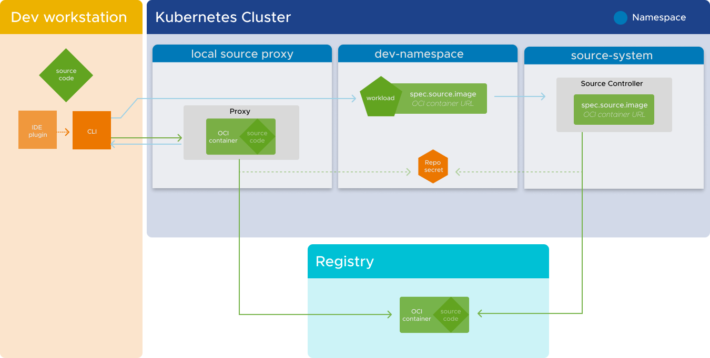

# Design of Local Source Proxy

Local Source Proxy serves as a proxy registry server with OCI (Open Container Initiative)
compatibility. Its main purpose is to handle image push requests by forwarding them to an external
registry server, which is configured through the `tap-values.yaml` file. Local Source Proxy takes
care of authentication and authorization against the external registry provider internally, ensuring
that the external registry remains transparent to the user.

To access Local Source Proxy, a Kubernetes service is set up, and it can be reached using an
internal URL within the Kubernetes cluster.

By functioning as a proxy registry server, Local Source Proxy simplifies the process of
interacting with external registry servers, providing a centralized and transparent approach for
image push requests and handling authentication and authorization seamlessly.

The Apps CLI generates requests that adhere to the OCI distribution standard in order to push
artifacts to Local Source Proxy instances. User authentication and authorization are handled by the
Kubernetes API server.

As a result, this default mechanism becomes the primary way to push a developer's local source code
to the TAP cluster, rendering the `--source-image` flag optional. By leveraging Local Source
Proxy, developers can seamlessly deploy their code without explicitly specifying the source image.

However, the system remains backward compatible to accommodate different scenarios.
If the `--source-image` flag is provided or the Workload has a source image defined that is not set
by Local Source Proxy, the `local-source-proxy` mechanism is completely bypassed. This ensures
compatibility with existing workflows and allows developers to continue utilizing their preferred
methods for deployment.

By default, the `iterate`, `light` and `full` OOTB (out-of-the-box) profiles include the
installation of this package. However, if you wish to suppress this behavior, you can exclude the
package by adding `local-source-proxy.apps.tanzu.vmware.com` to the list of excluded packages.
For how to do so, see
[Exclude packages from a Tanzu Application Platform profile](../install-online/profile.hbs.md#exclude-packages).