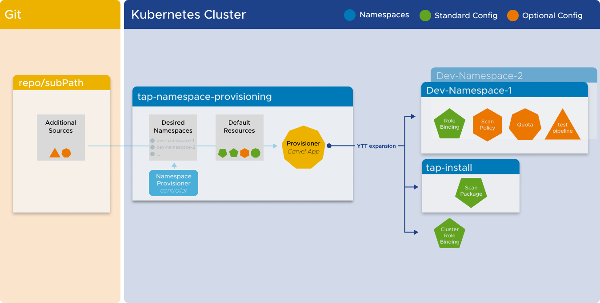
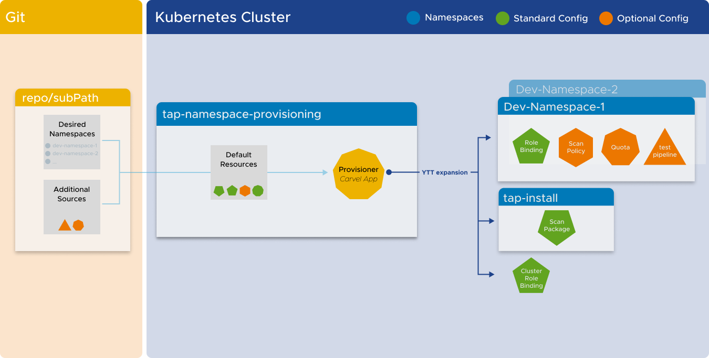
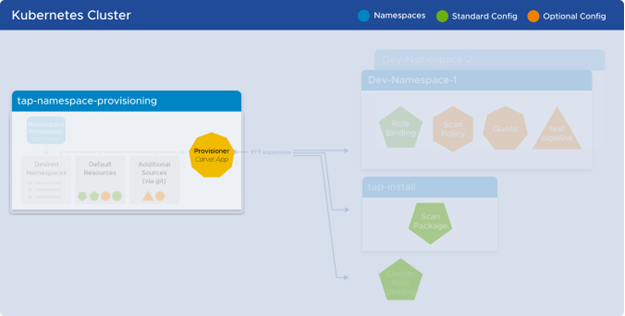

# Namespace Provisioner

Namespace Provisioner provides a secure, automated way for platform operators to provision
namespaces with the resources and namespace-level privileges required for their workloads to
function as intended. It enables operators to add additional customized namespace-scoped resources
using GitOps to meet their organization's requirements and provides continuous reconciliation using the kapp-controller to maintain the desired state of the namespace-scoped resources.

Namespace Provisioner enables operators that are new to Kubernetes to automate the provisioning of
multiple developer namespaces in a shared cluster. For organizations that have already adopted
Kubernetes, Namespace Provisioner is also compatible with existing Kubernetes tooling.

## <a id ='modes'></a>Modes

Use Namespace Provisioner with one of the following modes:

Controller mode
: Controller mode has the following characteristics:

    

    - The list of developer namespaces is managed by the Namespace Provisioner controller using a label selector `apps.tanzu.vmware.com/tap-ns=""`
    - Namespace Provisioner creates [default resources](reference.md#default-resources) that are shipped Out of the Box in all managed namespaces.
    - Namespace Provisioner creates additional Platform Operator templated resources stored in Git repository locations specified under the `additional_sources` section in Namespace Provisioner configuration. For more information, see [Customize Installation of Namespace Provisioner](customize-installation.md).

GitOps mode
: Gitops mode has the following characteristics

    

    - The list of developer namespaces is managed in a Git repository that is specified in the `gitops_install` section of the Namespace Provisioner configuration.
    - Namespace Provisioner creates [default resources](reference.md#default-resources) that are shipped Out of the Box in all managed namespaces.
    - Namespace Provisioner creates additional Platform Operator templated resources stored in Git repository locations specified under `additional_sources` in Namespace Provisioner configuration. For more information, see [Customize Installation of Namespace Provisioner](customize-installation.md).

## <a id='carvel-app'></a>Provisioner Carvel application



Namespace Provisioner consists of a [Carvel](https://carvel.dev/kapp-controller/docs/latest/app-overview/) application called `provisioner` that facilitates the creation of resources in the managed developer namespaces. The `provisioner` application uses ytt to templatize a set of resources into installations in multiple namespaces.

## <a id='desired-ns'></a>Desired namespaces

The following section describes how the list of desired developer namespaces is managed in
controller and GitOps modes.

Controller mode
: In controller mode, the list of desired namespaces used by the `provisioner` application to create resources in, is maintained in the `desired-namespaces` ConfigMap. This ConfigMap is managed by the [Namespace Provisioner controller](#nsp-controller) and it provides a declarative way to indicate which namespaces should be populated with resources. The ConfigMap consists of a list of namespace objects, with a required `name` parameter, and optional additional parameters which are used as `data.values` for customizing defined resources.

    For example,

    ```yaml
    ---
    apiVersion: v1
    kind: ConfigMap
    metadata:
        name: desired-namespaces
        namespace: tap-namespace-provisioning
        annotations:
            kapp.k14s.io/create-strategy: fallback-on-update
            namespace-provisioner.apps.tanzu.vmware.com/no-overwrite: "" #! This annotation tells the provisioner app to not override this configMap as this is your desired state.
    data:
        namespaces.yaml: |
            #@data/values
            ---
            namespaces:
            - name: dev-ns1
            # additional parameters about dev-ns1 added via label/annotations or GitOps
            - name: dev-ns2
            # additional parameters about dev-ns1 added via label/annotations or GitOps
    ```

GitOps mode
: In the GitOps mode, the list of desired namespaces used by the `provisioner` application to create resources in, is maintained in a Git repository as a ytt data values file as shown [in this sample file](https://github.com/vmware-tanzu/application-accelerator-samples/blob/main/ns-provisioner-samples/gitops-install/desired-namespaces.yaml). This file provides a declarative way to indicate which namespaces should be populated with resources. For more information, see the `Options if using GitOps` section in [Customize Install](customize-installation.md).

## <a id ='nsp-controller'></a>Namespace Provisioner controller

The Namespace Provisioner controller (controller) is installed by default and manages the content contained in
the `desired-namespaces` ConfigMap. The controller watches namespaces in the cluster and updates the
`desired-namespaces` ConfigMap with a list of all namespaces that match the namespace label selector.The defalut namespace label selector is `apps.tanzu.vmware.com/tap-ns`. For more information, see [Use a different label selector than default](customize-installation.md#con-label-selector).
