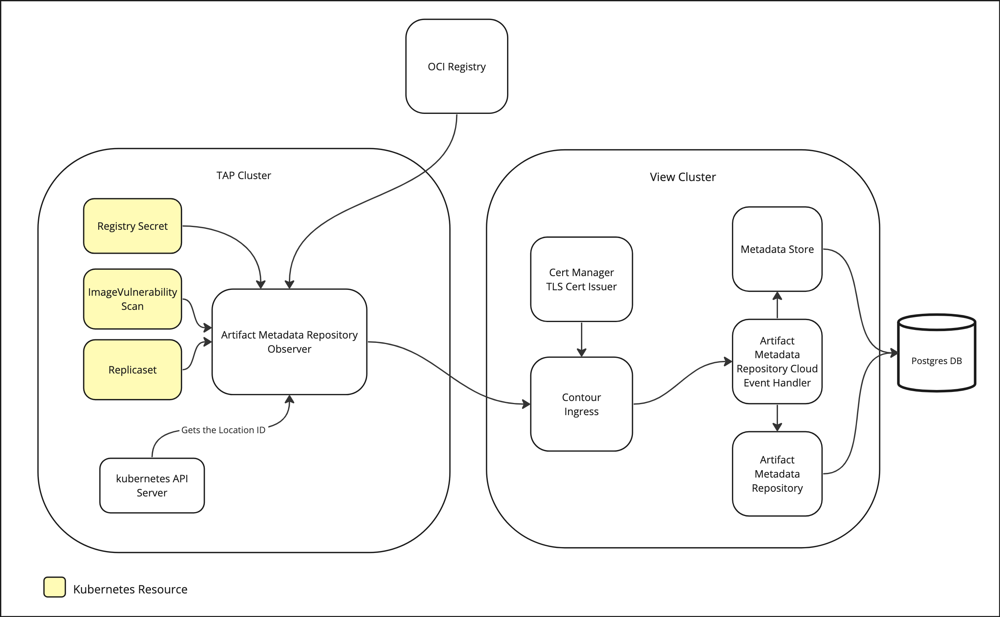

# Supply Chain Security Tools - Artifact Metadata Repository Architecture

This topic describes the architecture of Artifact Metadata Repository (AMR).

>**Important** SCST - Artifact Metadata Repository (AMR) has components with alpha and beta statuses, meaning that it is still in active development and is subject to change at any point. Users might encounter unexpected behavior. This is an opt-in component to gather early feedback from alpha and beta testers and is not installed by default with any profile.

[//]: # (^ diagram is produced from https://docs.google.com/drawings/d/1IChjcsCL8wcjQ4YG35JNWWy50TGZ1_N-osv-QTBnELg)

AMR Observer consists of managed controllers that watch resources. In Tanzu Application Platform 1.6, AMR Observer watches for ImageVulnerabilityScans and workload ReplicaSets. Workload ReplicaSets are ReplicaSets that contain one container named workload that is produced by the out of the box Supply Chains.

When changes to these resources occur, AMR Observer creates CloudEvents and send these events to Artifact Metadata Repository CloudEvent Handler. Artifact Metadata Repository CloudEvent Handler consumes these CloudEvents and make the required API calls to Metadata Store and Artifact Metadata Repository. 