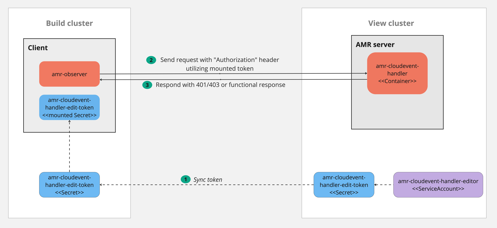

# Authentication and authorization

This topic tells you how to authenticate and authorize the Artifact Metadata Repository (AMR).

##  Overview

The following are included in authentication and authorization:

- [High-level design](#high-level-design)
- [Kubernetes service account autoconfiguration](scst-store/amr/auth-k8s-sa-autoconfiguration.md)
- [User-defined kubernetes service account configuration](scst-store/amr/auth-k8s-sa-user-defined.hbs.md)
- Configuring AMR Observer with the Cloudevent handler service account access token

##  High-level design

The Artifact Metadata Repository (AMR) deploys the following Kubernetes services which expose http endpoints: 

- Cloudevent-handler 
- GraphQL 

Both Cloudevent-handler and GraphQL are in the same cluster. In a multicluster
Tanzu Application Platform deployment, they're in the view cluster and the
clients can be from any cluster. This topic shows the client in the build
cluster in our examples.

The client sends requests to either service depending on their current task. The
cloudevent-handler ingests events from the client and stores it in a database.
The GraphQL server answers queries from the client and returns data from the
database. Other than those points, the two are treated the same in this design.
They both use the same authentication and authorization solution. This topic
simplifies the explanation by only showing the cloudevent-handler.

###  Kubernetes RBAC

The server implements support for authentication using Kubernetes RBAC. This
includes requiring the client to send a token from a Kubernetes service account
token bound to a Kubernetes role.

1. The administrator creates a service account, role/clusterrole, and role binding in the cluster where the cloudevent-handler is deployed in the View cluster. The role declares what permissions the client has: 

   * For the AMR **Observer** the supported permissions are `update`, resource `*`, group `cloudevents.amr.apps.tanzu.vmware.com`. No resourceNames are supported. That translates to “write for all resources” for the CloudEvents API.
   * For **GraphQL** service the supported permissions are `get`, resource `*` and group `graphql.amr.apps.tanzu.vmware.com`. No resourceNames are supported. That translates to “read all” from the GraphQL API.
2. The administrator copies the service account token and puts it in the client cluster where the client container can read it. For example, the client can get the token mounted as a Kubernetes secret.
3. The client sends a request to AMR, and puts the service account token in the http header `Authorization: Bearer <token>`.
4. The cloudevent-handler reads the token and conduct a **TokenReview**.
5. The cloudevent-handler does a **SubjectAccessReview** using the userinfo returned from TokenReview and the resource information as described in #1.
6. The SubjectAccessReview looks, according to the Kubernetes RBAC system, for any Role/ClusterRole associations by using bindings to find a match between the assigned roles to the specific service account and the requested resource information.

