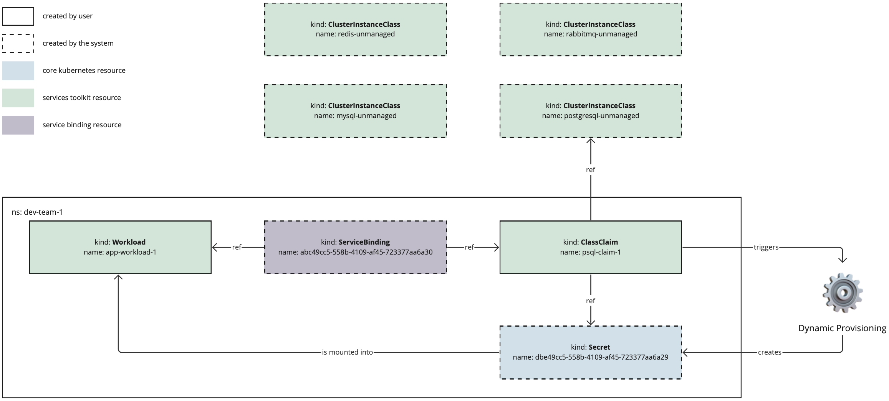

# Working with Bitnami Services

**Target user role**:       Application Operator<br />
**Complexity**:             Basic<br />
**Estimated time**:         15 minutes<br />
**Topics covered**:         Classes, Claims, Bitnami,<br />
**Learning outcomes**:      An understanding of how work with the standard Bitnami services<br />

## Intro

Tanzu Application Platform (referred to as "TAP" from hereon in) ships with 4 different services out of the box. These are MySQL, PostgreSQL, RabbitMQ and Redis, each backed by the corresponding Bitnami Helm Chart. In this tutorial you will adopt the role of Application Operator and learn how to discover, claim and bind these services to your application workloads.

## Pre-requisites

* Access to a TAP cluster (version >= 1.5.0)
* The `tanzu services` CLI plug-in (version >= 0.6.0)

## In a nutshell

Let's begin with a bird's-eye overview of the pieces we'll use during the course of this tutorial and how they all fit together.



There are a couple of key things to note in the diagram.

1. There are only a couple of pieces requiring user input - the creation of the `ClassClaim` and the creation of the `Workload` (which is configured to refer to the `ClassClaim`)
1. The lifecycle of `ClassClaim` and the lifecycle of `Workload` are separate, allowing updates to be made to one without affecting the other
1. What happens behind the Dynamic Provisioning box is opaque - this is intentional as Application Operators and Developers shouldn't need to concern themselves with the inner workings and configurations of service instances

## Discovery

Application teams can discover the range of services on offer to them by using the `tanzu service class list` command.

```console
$ tanzu service class list

  NAME                  DESCRIPTION
  mysql-unmanaged       MySQL by Bitnami
  postgresql-unmanaged  PostgreSQL by Bitnami
  rabbitmq-unmanaged    RabbitMQ by Bitnami
  redis-unmanaged       Redis by Bitnami
```

Here the output shows 4 classes. These are what are commonly refered to as, "the out of the box Bitnami services". You can see from the names and descriptions that they are all _unmanaged_ services, which implies that the resulting service instances run on cluster (i.e. they are not a managed service running in the cloud). It's possible that other classes may be listed here as well. As an Application Operator, it is up to you to review the classes on offer and to choose one that meets whatever requirements you may have.

You can learn and discover more about a given class by using the `tanzu service class get` command.

```console
$ tanzu service class get postgresql-unmanaged

NAME:           postgresql-unmanaged
DESCRIPTION:    PostgreSQL by Bitnami
READY:          true

PARAMETERS:
  KEY        DESCRIPTION                                                  TYPE     DEFAULT  REQUIRED
  storageGB  The desired storage capacity of the database, in Gigabytes.  integer  1        false
```

The output shows the name and a short description for the class, and indication of its current status, and then most interestingly of all - the parameters. The parameters represent the specific set of configuration options that are available to application teams. The `postgresql-unmanaged` class here has 1 parameter - `storageGB`. You can also see that it is not required to pass this parameter when creating a claim for the class, in which case the default value of `1` will be used.

## Claiming

Let's assume that you have an application Workload that requires a PostgreSQL database in order to function correctly. You can use the out of the box Bitnami PostgreSQL service to obtain such a database. You can use the `tanzu service class-claim create` command to create a claim for the `postgresql-unmanaged` class, then bind your application Workload to the resulting claim. In the example below, we are also choosing to override the default value of `1` for the `storageGB` parameter, setting it instead to `3`. Finally, we are choosing to create the claim in a namespace named `dev-team-1`. You can override any of the options as you see fit.

```console
$ tanzu service class-claim create psql-1 --class postgresql-unmanaged --parameter storageGB=3 -n dev-team-1

Creating claim 'psql-1' in namespace 'dev-team-1'.
Please run `tanzu services class-claims get psql-1 --namespace dev-team-1` to see the progress of create.
```

As the output states, you can then check on the status of the claim by using the `tanzu service class-claim get` command.

```console
$ tanzu service class-claim get psql-1

Name: psql-1
Namespace: dev-team-1
Claim Reference: services.apps.tanzu.vmware.com/v1alpha1:ClassClaim:psql-1
Class Reference:
  Name: postgresql-unmanaged
Parameters:
  storageGB: 3
Status:
  Ready: True
  Claimed Resource:
    Name: 7974379c-7b4d-41c3-af57-f4f1ae08c65d
    Namespace: dev-team-1
    Group:
    Version: v1
    Kind: Secret
```

It may take a moment or two before the claim reports `Ready: True`, however once it does you then have a successful claim for a PostgreSQL database configured to your needs with 3GB of storage.

## Binding

You are now free to bind this claim to one or more* of your application Workloads. This can be done by passing a reference to the claim to the `--service-ref` flag of the `tanzu apps workload create` command. The reference for the claim can be found in the output of the `tanzu service class-claim get psql-1` command under the heading "Claim Reference". The claim reference must be passed with a corresponding name following the format `--service-ref db=services.apps.tanzu.vmware.com/v1alpha1:ClassClaim:psql-1` (note the `db=` prefix to the ref - this is an arbitrary name for the reference).

\* If binding to more than one application Workload then all application Workloads must exist in the same namespace. This is a [known limitation](../how-to-guides/troubleshooting.hbs.md#stk-known-limitation-multi-workloads) that we hope to remove soon.
