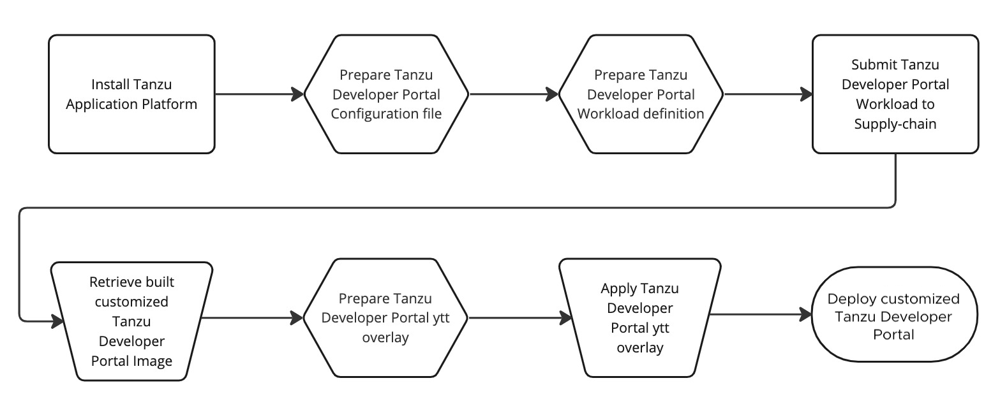
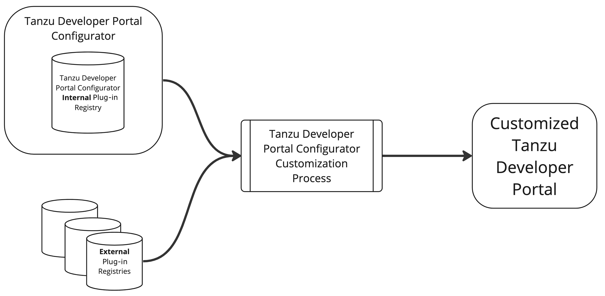

# Tanzu Developer Portal Configurator Concepts

This topic gives you conceptual overviews of how Tanzu Developer Portal Configurator works.

##  Overview of how to customize your portal

To use your customized portal with all the runtime configuration values used in your pre-built
version:

1. Install a working installation of Tanzu Application Platform with a working instance of the
   pre-built Tanzu Developer Portal.
1. Prepare your Configurator buildtime configuration file.
1. Prepare your Configurator workload definition YAML.
1. Submit your Configurator workload definition YAML to your supplychain.
1. After the image is built, retrieve your customized Tanzu Developer Portal image from your
   supplychain deliverables.
1. To run your customized portal, prepare a ytt overlay to replace the pre-built Tanzu Developer Portal
   in Tanzu Application Platform with your customized version. For more information about ytt, see the
   [Carvel documentation](https://carvel.dev/ytt/).
1. Apply the ytt overlay to your cluster.

##  Overviews of buildtime configuration and runtime configuration

The following sections describe the differences between buildtime configuration and runtime
configuration.

###  Runtime configuration

Runtime configuration refers to the values that you use to configure your existing portal image.
You provide these values in `tap-values.yaml` when you install and run your portal.
Runtime configuration values can include:

- The name of your portal
- Integrations (GitHub or GitLab keys, identity provider configuration, and so on)
- The locations of any catalogs on GitHub or GitLab
- Security credentials
- Configuration made available by any TDP plug-in wrappers

###  Buildtime configuration

Buildtime configuration refers to the values that you pass to the Configurator to generate a new portal image.
This consists of a list of TPD plug-in wrappers, as well as any default runtime configuration for the portal image.

##  Tanzu Developer Portal Configurator

The Tanzu Developer Portal Configurator is the image that contains everything necessary to build a
customized version of Tanzu Developer Portal. Configurator includes a templated version of Tanzu
Developer Portal, an internal registry of TDP plug-ins wrappers, and tools to enable the
build process to incorporate external plug-ins.

##  TDP plug-in wrappers

While Backstage uses [Backstage plug-ins](https://backstage.io/plugins/) to allow the user to customize functionality,
Tanzu Developer Portal uses TPD plug-in wrappers to accomplish the same thing.
A TPD plug-in wrapper is simply a Backstage plug-in, wrapped small amount of code to facilitate easy integration into
the Configurator and Tanzu Developer Portal.

##  Internal TDP plug-in wrappers and external TDP plug-in wrappers

Internal TDP plug-in wrappers are included inside the Tanzu Developer Portal Configurator image.
These include TPD plug-in wrappers specifically built for the Tanzu Application Platform and TPD plug-in
wrappers for core [Backstage](https://backstage.io) plug-ins.

External TDP plug-in wrappers are not in the Tanzu Developer Portal Configurator image.
They are hosted and installed from an external registry such as [npmjs.com](https://www.npmjs.com/).
They can include custom functionality or wrap existing [third-party Backstage plug-ins](https://backstage.io/plugins/).

##  TDP plug-in wrapper surfaces

TDP plug-in wrapper surfaces are the mechanism which allow TPD plug-in wrappers to modify the behavior of the portal.
When adding a Backstage plug-in to an instance of Backstage, code modifications are required.
Rather than modifying code, Tanzu Developer Portal exposes extension points where TPD plug-in wrappers can inject code.
These extension points are known as surfaces.
The pre-built version of Tanzu Developer Portal includes several surfaces to modify existing functionality including:

- Allowing new items to be added to the sidebar
- Adding new routes/URLs, such as `https://YOUR_PORTAL_URL/plugin`
- The ability to show up as a Catalog Overview tab

This pattern of exposing surfaces where TPD plug-in wrappers can inject new behavior is not limited to what is offered
in the pre-built version of Tanzu Developer Portal.
The pattern can also be applied on top of TDP plug-in wrappers themselves.
This allows for one TDP plug-in wrapper to build on top of another TDP plug-in wrapper.
