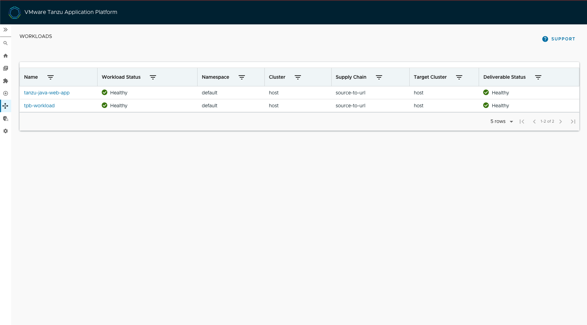
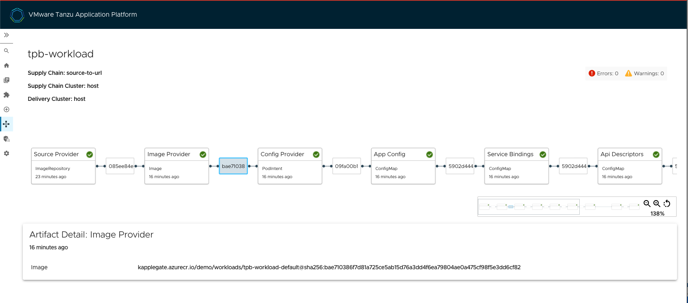

# Running your Customized Tanzu Developer Portal

At this stage, you should have completed the building of your customized Tanzu Developer Portal
(formerly named Tanzu Application Platform GUI) image in the [previous](building.hbs.md) section.

After the build has completed successfully you need to retrieve the image reference of the built
portal. You then use that and perform a [`ytt`](https://carvel.dev/ytt/) overlay to substitute that
image name for the one running the pre-built Tanzu Developer Portal on your cluster.

## <a id=identify></a>Identifying the Customized Image Reference

You'll need to identify the image that was built by the supply chain. You'll be using this image reference in your [`ytt`](https://carvel.dev/ytt/) overlay in the next step. There are multiple ways to retrieve this image name. Here we show how to retrieve that with either the CLI or the Developer Portal UI.

### Option 1: Through the Kubernetes CLI

```bash
kubectl -n DEVELOPER-NAMESPACE get images.kpack.io WORKLOAD-NAME -o jsonpath={.status.latestImage}
```

Where:

- `DEVELOPER-NAMESPACE` is the configured developer namespace on the cluster where you ran the workload.
- `WORKLOAD-NAME` is the name of the workload you used.

For example:

```bash
> kubectl -n default get images.kpack.io tpb-workload -o jsonpath={.status.latestImage}
> kapplegate.azurecr.io/demo/workloads/tpb-workload-default@sha256:bae710386f7d81a725ce5ab15d76a3dd4f6ea79804ae0a475cf98f5e3dd6cf82
```

### Option 2: Through the Tanzu Developer Portal GUI

1. Find your workload in the Supply Chain view.
   
2. Fine the Artifact Detail for the Image Provider step. You'll see the Image value located there.
   

## Preparing to overlay your customized image onto the currently running instance

### Create the [`ytt`](https://carvel.dev/ytt/) overlay secret

Create a file called `tdp-overlay-secret.yaml` with the following contents:

```yaml
apiVersion: v1
kind: Secret
metadata:
  name: tpb-app-image-overlay-secret
  namespace: tap-install
stringData:
  tpb-app-image-overlay.yaml: |
    #@ load("@ytt:overlay", "overlay")
​
    #! makes an assumption that tap-gui is deployed in the namespace: "tap-gui"
    #@overlay/match by=overlay.subset({"kind": "Deployment", "metadata": {"name": "server", "namespace": "tap-gui"}}), expects="1+"
    ---
    spec:
      template:
        spec:
          containers:
            #@overlay/match by=overlay.subset({"name": "backstage"}),expects="1+"
            #@overlay/match-child-defaults missing_ok=True
            - image: IMAGE-REFERENCE
            #@overlay/replace
              args:
              - -c
              - |
                export KUBERNETES_SERVICE_ACCOUNT_TOKEN="$(cat /var/run/secrets/kubernetes.io/serviceaccount/token)"
                exec /layers/tanzu-buildpacks_node-engine-lite/node/bin/node portal/dist/packages/backend  \
                --config=portal/app-config.yaml \
                --config=portal/runtime-config.yaml \
                --config=portal/app-config.pack.yaml \
                --config=/etc/app-config/app-config.yaml
              #@overlay/replace
              ports:
                - containerPort: 7007
              #@overlay/replace
              livenessProbe:
                httpGet:
                  port: 7007
              #@overlay/replace
              readinessProbe:
                httpGet:
                  port: 7007

    #@ load("@ytt:overlay", "overlay")
    #@overlay/match by=overlay.subset({"kind": "Service", "metadata": {"name": "server", "namespace": "tap-gui"}}), expects="1+"
    ---
    spec:
    #@overlay/replace
      ports:
      - protocol: TCP
        targetPort: 7007
        port: 7000
```
Where:

- `IMAGE-REFERENCE` is the customized image you retrived during the [previous steps](#identify)


### Apply the secret

Using the `kubectl` CLI, you can apply the above secret:

```bash
kubectl apply -f tdp-overlay-secret.yaml
```


### Add the secret to your `tap-values.yaml`

Here you'll need to modify the `tap-values.yaml` file you used to install Tanzu Application Platform. Update your values file with the following:

```yaml
profile: full
tap_gui:
  ...
package_overlays:
- name: tap-gui
  secrets:
  - name: tpb-app-image-overlay-secret
```

Depending on your installation method (GitOps or Online/Offline install) you'll need to then update your installation to use this modified values file. For example, the steps for doing this in an online installation are [here](../../install-online/profile.hbs.md#install-your-tanzu-application-platform-package).
