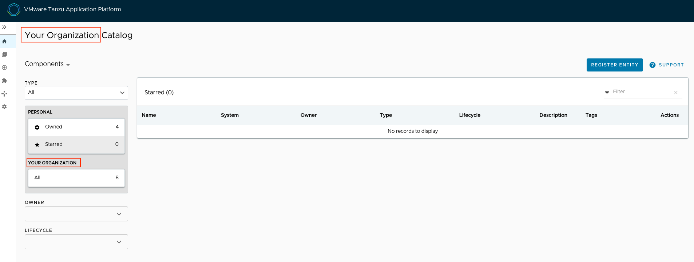
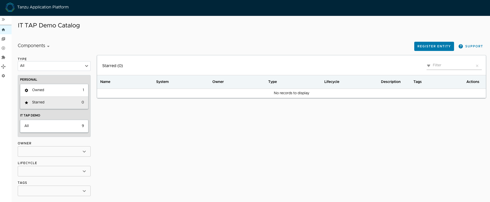

# Customize the Tanzu Application Platform GUI portal

This section describes how to customize the Tanzu Application Platform GUI portal.

## <a id="brand-customizing"></a> Customize branding

To customize the branding in your portal, you can choose the name of the portal and the logo for it.
To make these customizations:

1. Provide additional configuration parameters to the `app_config` section of `tap-values.yaml`:

    ```yaml
    tap_gui:
      app_config:
        customize:
          custom_logo: 'BASE-64-IMAGE'
          custom_name: 'PORTAL-NAME'
    ```

    Where:

    - `BASE-64-IMAGE` is the image encoded in base64. A 512-pixel by 512-pixel PNG
    image with a transparent background is optimal.
    - `PORTAL-NAME` is the name of your portal, such as `Our Custom Developer Experience Portal`.

2. Reinstall your Tanzu Application Platform GUI package by following steps in
[Upgrading Tanzu Application Platform](../../upgrading.hbs.md).

After the updated values configuration file is applied in Tanzu Application Platform GUI,
you see the customized version of your portal.

If there is an error in any of the supplied images encoded in base64 or in your choice of portal name,
Tanzu Application Platform GUI reverts to the original branding template.


## <a id="customize-catalog-page"></a> Customize the Software Catalog page

You can customize the name of your organization on the Software Catalog page of
Tanzu Application Platform GUI portal.
By default, the portal displays **Your Organization** next to **Catalog** and in the selection box.



### <a id="catalog-name-customize"></a> Customize the name of the organization

To customize the name of the organization for the software catalog in your portal:

1. Provide additional configuration parameters to the `app_config` section of your `tap-values.yaml`
file:

    ```yaml
    tap_gui:
      app_config:
        organization:
          name: 'ORG-NAME'
    ```

    Where `ORG-NAME` is the name of your organization for the software catalog, such as
    `Our Organization Name`. You don't need to add `Catalog` to the `ORG-NAME`.

1. Reinstall your Tanzu Application Platform GUI package by following the steps in
[Upgrading Tanzu Application Platform](../../upgrading.hbs.md).

After the updated values configuration file is applied in Tanzu Application Platform GUI, you see
the customized version of your portal.

If there is an error in the provided configuration parameters, Tanzu Application Platform GUI
reverts to the original organization name.



### <a id="prevent-changes"></a> Prevent changes to the software catalog

You can deactivate the **Register Entity** button to prevent a user from making changes to the
software catalog, including registering and deregistering locations.
To do so, add `readonly: true` to the `catalog` section in `tap-values.yaml`, as in this example:

```yaml
tap_gui:
  app_config:
    catalog:
      readonly: true
```

## <a id="customize-auth-page"></a> Customize the Authentication page

To customize the portal name on the **Authentication** page and the name of the browser tab
for Tanzu Application Platform GUI:

1. Provide additional configuration parameters to the `app_config` section of your `tap-values.yaml`
file:

    ```yaml
    tap_gui:
      app_config:
        app:
          title: 'CUSTOM-TAB-NAME'
    ```

    Where `CUSTOM-TAB-NAME` is the name on the Authentication page and the browser tab of your
    portal, such as `Our Organization Full Name`.

1. Reinstall your Tanzu Application Platform GUI package by following the steps in
[Upgrading Tanzu Application Platform](../../upgrading.hbs.md).

After the updated values configuration file is applied in Tanzu Application Platform GUI,
you see the customized version of your portal.

## <a id="customize-default-view"></a> Customize the default view

You can set your default route when the user is accessing your portal.
Without this customization, when the user accesses the Tanzu Application Platform GUI URL,
it displays the list of owned components of the software catalog.

To change the default view:

1. Provide additional configuration parameters to the `app_config` section of your `tap-values.yaml`
file:

    ```yaml
    tap_gui:
      app_config:
        customize:
          default_route: 'YOUR-PREFERRED-ROUTE'
    ```

    Where `YOUR-PREFERRED-ROUTE` is the path to the route that the portal uses by default.
    For example, you can type `/catalog?filters%5Bkind%5D=component&filters%5Buser%5D=all` to show
    all components of the software catalog instead of defaulting to owned components.
    As another example, you can type `/create` to show Application Accelerator when the portal starts.

    > **Caution** Tanzu Application Platform GUI redirects you to `tap-gui.INGRESS-DOMAIN/YOUR-PREFERRED-ROUTE`
    > even if there is an error in `YOUR-PREFERRED-ROUTE`.

1. Reinstall your Tanzu Application Platform GUI package by following the steps in
[Upgrading Tanzu Application Platform](../../upgrading.hbs.md).

After the updated values configuration file is applied in Tanzu Application Platform GUI,
you see the customized version of your portal.

## <a id="cust-security-banners"></a> Customize security banners

You can instruct Tanzu Application Platform GUI to create security banners on the top and bottom of
the page. To add security banners to Tanzu Application Platform GUI:

1. Provide additional configuration parameters to the `app_config` section of your `tap-values.yaml`
   file, as in the following example:

    ```yaml
    tap_gui:
      app_config:
        customize:
          banners:
            text: 'CUSTOM-TEXT'
            color: 'OPTIONAL-CUSTOM-TEXT-COLOR'
            bg: 'CUSTOM-BACKGROUND-COLOR'
            link: 'OPTIONAL-LINK'
    ```

    Where:

    - `CUSTOM-TEXT` is the text that is displayed in the banner. Keep this text short to
      accommodate various screen sizes.
    - `OPTIONAL-CUSTOM-TEXT-COLOR` is the color of the text displayed in the banner.
      Setting this is optional. It accepts CSS colors, such as `#ffffff`.
      The default color is `#FFFFFF`.
    - `CUSTOM-BACKGROUND-COLOR` is the color of the banner itself. Setting this is optional.
      It accepts CSS colors, such as `#ffffff`. The default color is `#C23B2E`
    - `OPTIONAL-LINK` is the link to which your text redirects. Setting this is optional.

1. Reinstall your Tanzu Application Platform GUI package by following the steps in
[Upgrading Tanzu Application Platform](../../upgrading.hbs.md).

After the updated values configuration file is applied in Tanzu Application Platform GUI,
the customized version of your portal is displayed.
