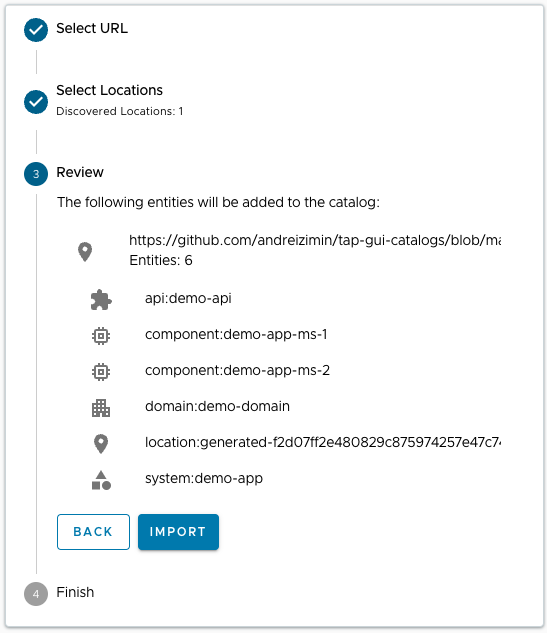
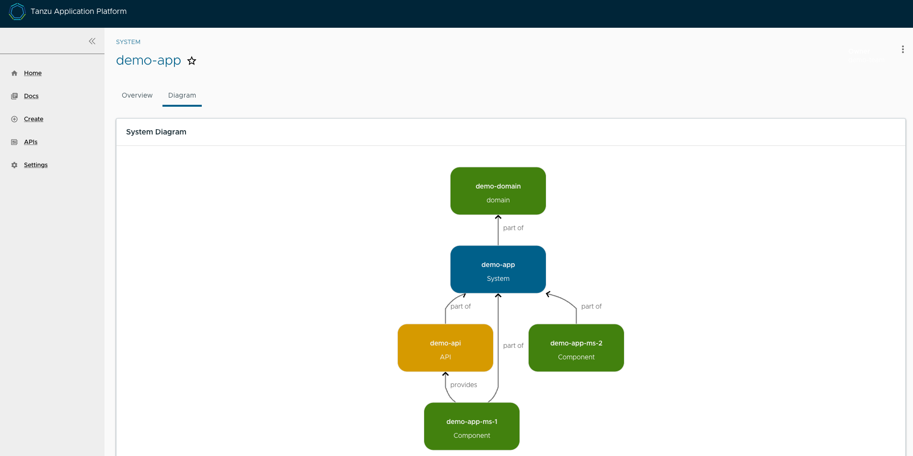
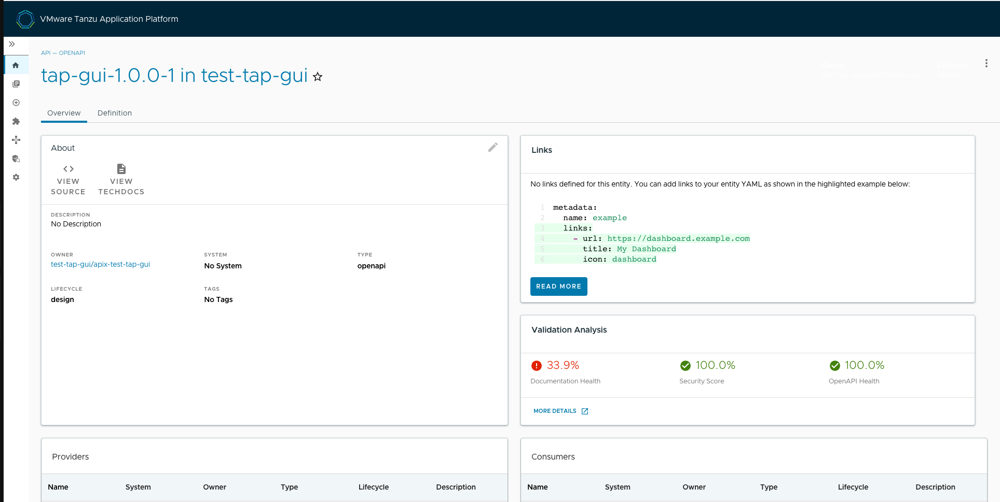

# Get started with the API documentation plug-in

This topic tells you how to get started with the API documentation plug-in in
Tanzu Developer Portal (formerly called Tanzu Application Platform GUI).

## <a id="dev-first-app"></a> API entries

This section describes API entities, how to add them, and how to update them.

### <a id="about-app-accs"></a> About API entities

The list of API entities is visible on the left side navigation pane of Tanzu Developer Portal.
It is also visible on the Overview page of specific components on the home page.
APIs are a definition of the interface between components.

Their definition is provided in raw machine-readable and human-readable formats.
For more information, see the [API plug-in documentation](api-docs.hbs.md).

### <a id="deploy-your-app"></a> Add a demo API entity to the Tanzu Developer Portal software catalog

To add a demo API entity and its related Catalog objects, follow the steps used for registering any
other software catalog entity:

1. Go to the Home page of Tanzu Developer Portal by clicking **Home** on the left-side
   navigation pane.

1. Click **REGISTER ENTITY**.

    

1. In the repository URL text box, type the link to the `catalog-info.yaml` file of your choice or use
   the following sample definition.

1. Save this code block as `catalog-info.yaml`.

1. Upload it to the Git repository of your choice and copy the link to `catalog-info.yaml`.
   This demo setup includes a domain named `demo-domain` with a single system named `demo-system`.
   This systems consists of two microservices (`demo-app-ms-1` and `demo-app-ms-1`) and one API
   named `demo-api` that `demo-app-ms-1` provides and that `demo-app-ms-2` consumes.

    ```yaml
    apiVersion: backstage.io/v1alpha1
    kind: Domain
    metadata:
      name: demo-domain
      description: Demo Domain for Tanzu Application Platform
      annotations:
        'backstage.io/techdocs-ref': dir:.
    spec:
      owner: demo-team

    ---

    apiVersion: backstage.io/v1alpha1
    kind: Component
    metadata:
      name: demo-app-ms-1
      description: Demo Application's Microservice-1
      tags:
        - microservice
      annotations:
        'backstage.io/kubernetes-label-selector': 'app.kubernetes.io/part-of=demo-app-ms-1'
        'backstage.io/techdocs-ref': dir:.
    spec:
      type: service
      providesApis:
       - demo-api
      lifecycle: alpha
      owner: demo-team
      system: demo-app

    ---

    apiVersion: backstage.io/v1alpha1
    kind: Component
    metadata:
      name: demo-app-ms-2
      description: Demo Application's Microservice-2
      tags:
        - microservice
      annotations:
        'backstage.io/kubernetes-label-selector': 'app.kubernetes.io/part-of=demo-app-ms-2'
        'backstage.io/techdocs-ref': dir:.
    spec:
      type: service
      consumesApis:
       - demo-api
      lifecycle: alpha
      owner: demo-team
      system: demo-app

    ---

    apiVersion: backstage.io/v1alpha1
    kind: System
    metadata:
      name: demo-app
      description: Demo Application for Tanzu Application Platform
      annotations:
        'backstage.io/techdocs-ref': dir:.
    spec:
      owner: demo-team
      domain: demo-domain

    ---

    apiVersion: backstage.io/v1alpha1
    kind: API
    metadata:
      name: demo-api
      description: The demo API for Tanzu Developer Portal
      links:
        - url: https://api.agify.io
          title: API Definition
          icon: docs
    spec:
      type: openapi
      lifecycle: experimental
      owner: demo-team
      system: demo-app # Or specify system name of your choice
      definition: |
        openapi: 3.0.1
        info:
          title: Demo API
          description: defaultDescription
          version: '0.1'
        servers:
          - url: https://api.agify.io
        paths:
          /:
            get:
              description: Auto generated using Swagger Inspector
              parameters:
                - name: name
                  in: query
                  schema:
                    type: string
                  example: type_any_name
              responses:
                '200':
                  description: Auto generated using Swagger Inspector
                  content:
                    application/json; charset=utf-8:
                      schema:
                        type: string
                      examples: {}
    ```

1. Paste the link to `catalog-info.yaml` and click **ANALYZE**.

1. Review the catalog entities and click **IMPORT**.

    

1. Go to the **API** page by clicking **APIs** on the left side navigation pane.
   The catalog changes and entries are visible for further inspection.
   If you select the system **demo-app**, the diagram appears as follows:

    

### <a id="deploy-your-app"></a> Update your demo API entry

To update your demo API entry:

1. To update your demo API entity, click on **demo-api** from the list of available APIs in your
   software catalog and click the **Edit** icon on the Overview page.

   It opens the source `catalog-info.yaml` file that you can edit. For example, you can change the
   `spec.paths.parameters.example` from `type_any_name` to `Tanzu` and then save your changes.

   After making any edits, Tanzu Developer Portal re-renders the API entry with the next
   refresh cycle.

## <a id="validation-api"></a> Validation Analysis of API specifications

This section describes the Validation Analysis card, the data format needed to populate the card, and
how to get automatic scores for your OpenAPI entities.

### <a id="about-validation"></a> About Validation Analysis card

When viewing entities of the kind `API` on the Overview tab, you see the Validation Analysis card
that displays the health of an API through various scoring parameters.



To display the health scores, an API entity must contain the following metadata structure:

```yaml
apiVersion: backstage.io/v1alpha1
kind: API
metadata:
  name: NAME
  description: DESCRIPTION
  apiscores:
    scores:
    - id: documentationReport
      label: "Documentation Health"
      value: 34.375
      valueType: percentage
      status: failed
    - id: securityReport
      label: "Security Score"
      value: 70.0
      valueType: percentage
      status: warning
    - id: openApiHealthReport
      label: "OpenAPI Health"
      value: 89.0625
      valueType: percentage
      status: passed
    scoreDetailsURL:  VALIDATION-REPORT-URL-FOR-MORE-DETAILS
# Other API Entity parameters
```

If an API entity follows this schema, the Validation Analysis card displays helpful information
about the API.

```yaml
    - id:        # Unique ID
      label:     # Descriptive label displayed as a title over the numerical value
      value:     # Any number value
      valueType: # One of the types (percentage or other). Displays the % symbol or displays nothing.
      status:    # One of the statuses (passed, warning, or failed). Displays the number in green, yellow, or red.
```

### <a id="automatic-validation"></a> Automatic OpenAPI specification validation

To receive automatic validation analysis for OpenAPI specifications by using API Validation Scoring:

1. [Install API Validation and Scoring](../../api-validation-scoring/install.hbs.md).
2. Use [API Auto Registration](../../api-auto-registration/about.hbs.md) or
   API Validation Scoring Design GitOps to automatically generate the API entities in
   Tanzu Developer Portal.

The automatic scoring cannot score or replace API entities created through other methods, such as
regular GitOps or manual registration.
You might see the following message signaling that the OpenAPI specification was registered with
regular GitOps methods or manual registration.

```console
Validation analysis is currently unavailable for APIs registered via TAP GUI without being attached \
to a workload.
```
