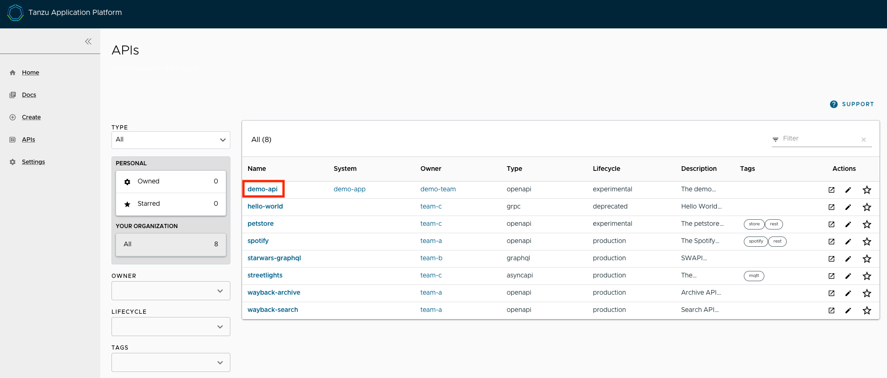
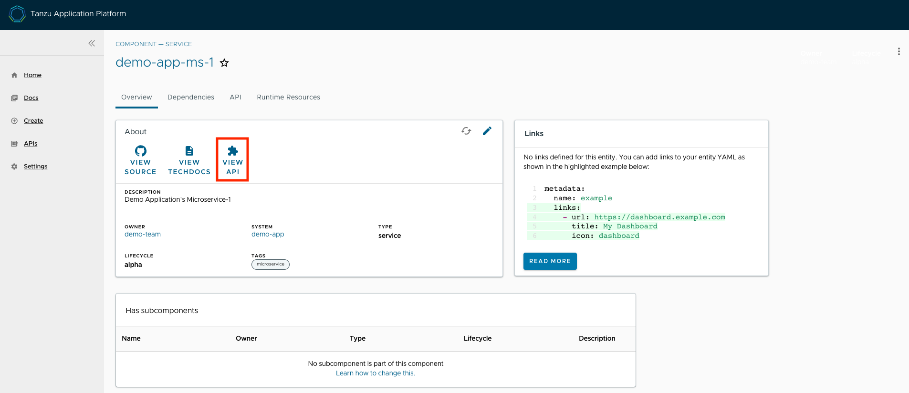
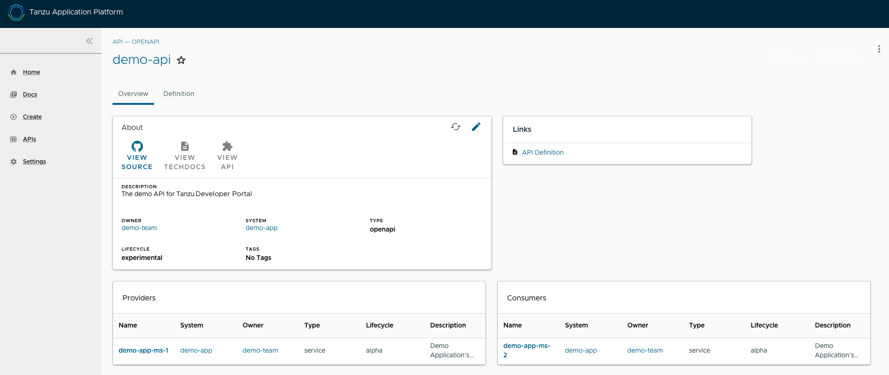
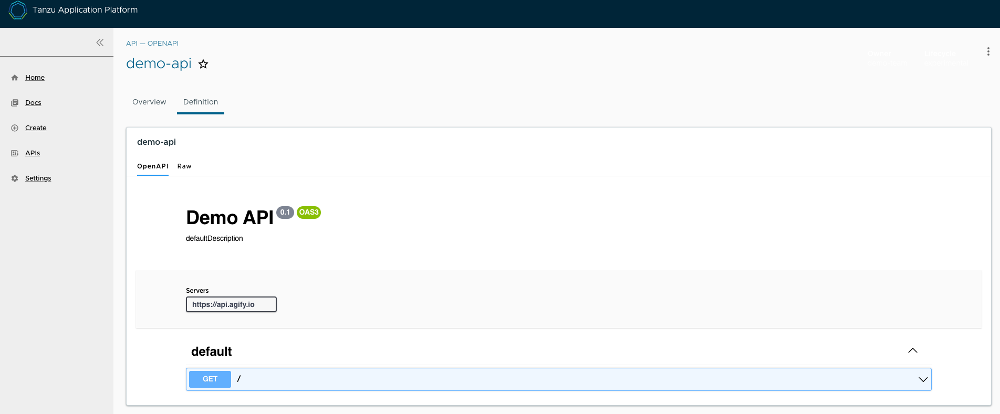
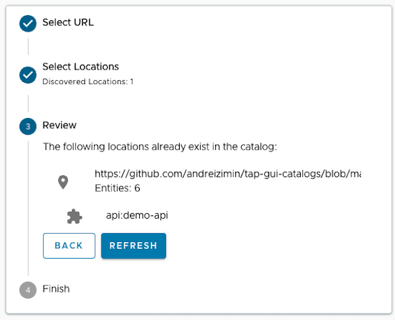

# API documentation plug-in in Tanzu Developer Portal

This topic gives you an overview of the API documentation plug-in of Tanzu Developer Portal.
For more information, see
[Get started with the API documentation plug-in](api-docs-getting-started.hbs.md).

## <a id="overview"></a> Overview

The API documentation plug-in provides a standalone list of APIs that can be connected to
components and systems of the Tanzu Developer Portal software catalog.

Each API entity can reflect the components that provide that API and the list of components
that are consumers of that API.
Also, an API entity can be associated with systems and show up on the system diagram.
To show this dependency, make the `spec.providesApis:` and `spec.consumesApis:` sections of the
component definition files reference the name of the API entity.

Here's a sample of how you can add `providesApis` and `consumesApis` to an existing component's
catalog definition, linking them together.

```yaml
apiVersion: backstage.io/v1alpha1
kind: Component
metadata:
  name: example-component
  description: Example Component
spec:
  type: service
  lifecycle: experimental
  owner: team-a
  system: example-system
  providesApis: # list of APIs provided by the Component
    - example-api-1
  consumesApis: # list of APIs consumed by the Component
    - example-api-2
```

For more information about the structure of the definition file for an API entity, see the
[Backstage Kind: API documentation](https://backstage.io/docs/features/software-catalog/descriptor-format#kind-api).
For more information about the API documentation plug-in, see the
[Backstage API documentation](https://github.com/backstage/backstage/blob/master/plugins/api-docs/README.md)
in GitHub.

## <a id='use-api-docs-plug-in'></a> Use the API documentation plug-in

The API documentation plug-in is part of Tanzu Developer Portal.

The first way to use the API documentation plug-in is API-first.
Click **APIs** in the left navigation pane of Tanzu Developer Portal.
This opens the **API catalog page**.



On that page, you can view all the APIs already registered in the catalog regardless of whether they
are associated with components or systems.

The second way to use the API documentation plug-in is to use components and systems of the
software catalog, listed on the home page of Tanzu Developer Portal.
If there is an API entity associated with the selected component or system, the **VIEW API** icon
is active.



The **VIEW API** tab displays which APIs are being consumed by a component and which APIs are
being provided by the component.


Clicking on the API itself takes you to the catalog entry for the API, which the Kind
type listed in the upper-left corner denotes.
Every API entity has a title and short description, including a reference to the team that owns the
definition of that API and the software catalog objects that are connected to it.



Select the **Definition** tab on the top of the API page to see the definition of that API in
human-readable and machine-readable format.



The API documentation plug-in supports the following API formats:

- OpenAPI 2 & 3
- AsyncAPI
- GraphQL
- Plain (to support any other format)

## <a id='create-project'></a> Create a new API entry

You can create a new API entry manually or automatically.

### <a id='manually-create'></a> Manually create a new API entry

Manually creating a new API entity is similar to registering any other software catalog entity.
To manually create a new API entity:

1. Click the **Home** button on the left navigation pane to access the home page of
   Tanzu Developer Portal.

2. Click **REGISTER ENTITY**.

   

3. **Register an existing component** prompts you to type a repository URL.
   Paste the link to the `catalog-info.yaml` file of your choice that contains the definition of your
   API entity.
   For example, you can copy the following YAML content and save it as `catalog-info.yaml` on a Git
   repository of your choice.

    ```yaml
    apiVersion: backstage.io/v1alpha1
    kind: API
    metadata:
    name: demo-api
    description: The demo API for Tanzu Developer Portal
    links:
      - url: https://api.agify.io
        title: API Definition
        icon: docs
    spec:
    type: openapi
    lifecycle: experimental
    owner: demo-team
    system: demo-app # Or specify system name of your choice
    definition: |
      openapi: 3.0.1
      info:
        title: defaultTitle
        description: defaultDescription
        version: '0.1'
      servers:
        - url: https://api.agify.io
      paths:
        /:
          get:
            description: Auto generated using Swagger Inspector
            parameters:
              - name: name
                in: query
                schema:
                  type: string
                example: type_any_name
            responses:
              '200':
                description: Auto generated using Swagger Inspector
                content:
                  application/json; charset=utf-8:
                    schema:
                      type: string
                    examples: {}
    ```

4. Click **ANALYZE** and then review the catalog entities to be added.

   

5. Click **IMPORT**.

6. Click **APIs** on the left navigation pane to view entries on the **API** page.

### <a id='auto-create'></a> Automatically create a new API entry

Tanzu Application Platform v1.3 introduced a feature called **API Auto Registration** that can
automatically register your APIs.
For more information, see [API Auto Registration](../../api-auto-registration/about.hbs.md).
