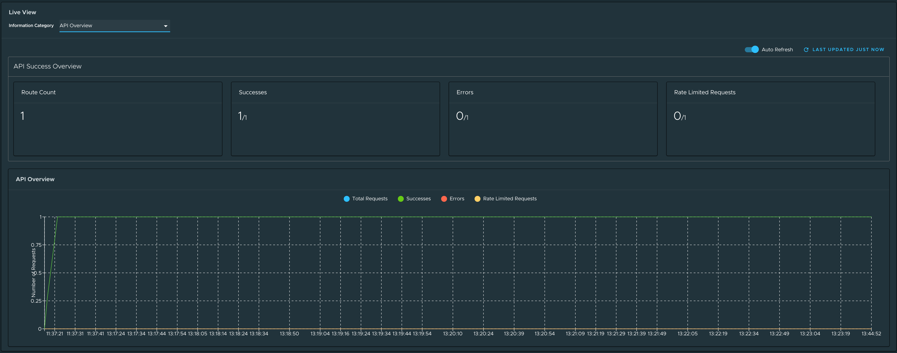

# Application Live View for Spring Cloud Gateway Applications in Tanzu Developer Portal

This topic tells you about the Application Live View pages for Spring Cloud Gateway Applications in
Tanzu Developer Portal (commonly called TAP GUI).

##  API Success Rate page

To access to the API Success Rate page, select the **API Success Rate** option from the
**Information Category** drop-down menu.

The API success rate page displays the total successes, average response time, and maximum response
time for the gateway routes.
It also displays the details of each successful route path.

##  API Overview page

To access the API Overview page, select the **API Overview** option from the
**Information Category** drop-down menu.

The API Overview page provides route count, number of successes, errors, and the rate-limited
requests.
It also provides an **auto refresh** feature to get the updated results.
These metrics are depicted in a line graph.

##  API Authentications By Path page

To access the API Authentications By Path page, select the **API Authentications By Path**
option from the **Information Category** drop-down menu.

The API Authentications By Path page displays the total requests, number of successes, and forbidden
and unsuccessful authentications grouped by the HTTP method and gateway route path.
The page also displays the success rate for each of the routes.

> **Note** In addition to the preceding three pages, the Spring Boot actuator pages are
> also displayed.

##  Troubleshooting

You might run into cases where a workload running on your cluster does not show up in the
Application Live View overview, or the detail pages do not load any information while running,
or other similar issues.
For more information, see [Troubleshooting](../../app-live-view/troubleshooting.md) in the
Application Live View documentation.
