# Application Live View in Tanzu Application Platform GUI

## What is Application Live View?

The Application Live View features of the Tanzu Application Platform include sophisticated components to give developers and operators a view into their running workloads on Kubernetes.

Application Live View will show an individual running process, for example a Spring Boot application deployed as a workload resulting in a JVM process running inside of a pod.
This is an important concept of Application Live View: only running processes are recognized by Application Live View.
If there is not a running process inside of a running pod, Application Live View does not show anything.

Under the hood, Application Live View uses the concept of Spring Boot Actuators to gather data from those running processes.
It visualizes them in a semantically meaningful way and allows users to interact with the inner workings of the running processes (within limited boundaries).

The actuator data serves as the source of truth. Application Live View provides a live view of the data from inside of the running processes only.
Application Live View does not store any of that data for further analysis or historical views.
This easy-to-use interface provides ways to troubleshoot, learn, and maintain an overview of certain aspects of the running processes.
It gives a level of control to the users to change some parameters, such as environment properties, without a restart (where the Spring Boot application, for example, supports that).

## Entry point to Application Live View plug-in

The Application Live View UI plug-in is part of Tanzu Application Platform GUI. To use the Application Live View plug-in:

+ Select the relevant component under the `Organization Catalog` in TAP GUI
+ Select the desired service under `Runtime Resources` tab
+ Select the desired pod from the `Pods` section under `Runtime Resources` tab
+ The user will be able to see all the details, do some lightweight troubleshooting and interact with the application in certain boundaries under the `Live View` section

## Application Live View pages

## Details page

This is the default page loaded in the `Live View` section. This page gives a tabular overview containing the application name, instance id, location, actuator location, health endpoint, direct actuator access, framework , version, new patch version, new major version, build version. The user can navigate between `Information Categories` by selecting from the drop-down menu on the top right corner of the page.

### Health page

To navigate to the health page, the user should select the `Health` option from the `Information Category` drop-down menu.
The health page provides detailed information about the health of the application.
It lists all the components that make up the health of the application like readiness, liveness and disk space.
It displays the status, details associated with each of the components. 

### Environment page

To navigate to the Environment page, the user should select the `Environment` option from the `Information Category` drop-down menu.
The Environment page contains details of the applications' environment.
It contains properties including, but not limited to, system properties, environment variables, and configuration properties (like application.properties) in a Spring Boot application.
  
The page includes the below features:
  
  * The UI has search feature that enables the user to search for a property or values
  * Each property has a search icon at the right corner which helps the user quickly see all the occurrences of a specific property key without manually typing in the search field. Clicking on this button trims down the page to that property name
  * The _Refresh Scope_ button on the top right corner of the page is used to probe the application to refresh all the environment properties
  * The user can modify existing property by clicking on the override button in the row and editing the value. Once the value is saved, the user can see the updated property in the Applied overrides section at the top of the page
  * The _Reset_ button is used to reset the environment property to the original state
  * The overridden environment variables in the _Applied Overrides_ section can be edited or removed
  * The _Applied Overrides_ section also enables the user to add new environment properties to the application

> **_NOTE:_** The `management.endpoint.env.post.enabled=true` has to be set in the application config properties of the application as well as a corresponding, editable Environment has to be present in the (here Spring Boot) application.

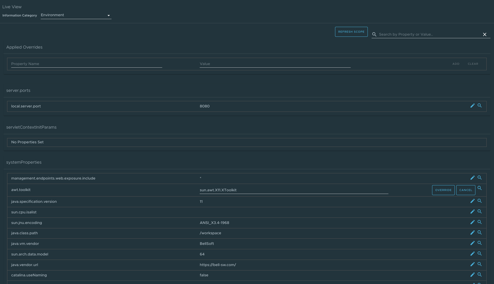

### Log Levels page

To navigate to the Log Levels page, the user should select the `Log Levels` option from the `Information Category` drop-down menu.
The log levels page provides access to the application’s loggers and the configuration of their levels. The log levels such as INFO, DEBUG, TRACE can be configured real-time by the user from the UI. The user can search for a package and modify its respective log level. The user has the ability to configure the log levels at a specific class and package. They can turn off all the log levels by modifying the log level of root logger to OFF.
The toggle `Changes Only` displays the changed log levels. 
The search feature enables the user to search by logger name.
The _Reset_ button resets the log levels to the original state. 
The _Reset All_ button on top right corner of the page resets all the loggers to default state.

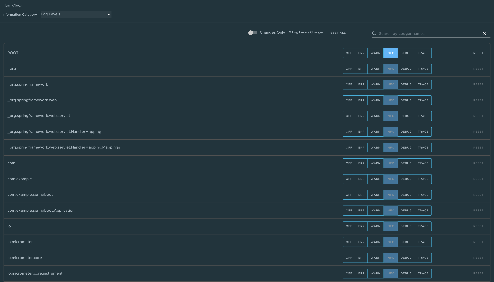

### Threads page

To navigate to the Threads page, the user should select the `Threads` option from the `Information Category` drop-down menu.
This page displays all details related to JVM threads and running processes of the application.
This tracks live threads and daemon threads real-time. It is a snapshot of different thread states.
Navigating to a thread state displays all the information about a particular thread and its stack trace.
The search feature enables the user to search for threads by thread ID or state.
The refresh icon refreshes to the latest state of the threads.
The user can view more thread details by clicking on the Thread ID.
The page also has a feature to download thread dump for analysis purposes.

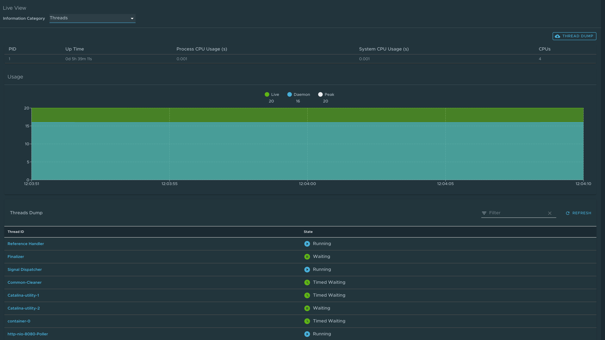

### Memory page

To navigate to the Memory page, the user should select the `Memory` option from the `Information Category` drop-down menu.
* The memory page highlights the memory usage inside of the JVM. It displays a graphical representation of the different memory regions within heap and non-heap memory. Please note that this visualizes data from inside of the JVM (in case of Spring Boot apps running on a JVM) and therefore provides memory insights into the application in contrast to "outside" information on the k8s pod level.
* The real-time graphs displays a stacked overview of the different spaces in memory along with the total memory used and total memory size. The page contains graphs to display the GC pauses and GC events. The Heap Dump button on top right corner allows the user to download heap dump data.

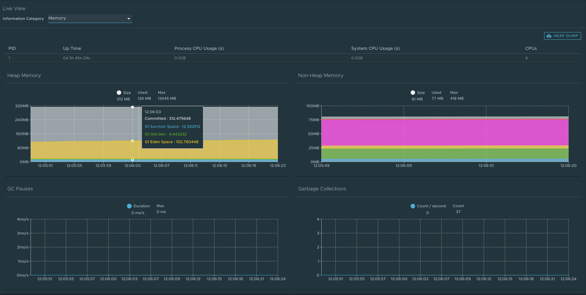

_Please keep in mind that this graphical visualization happens in real-time and shows real-time data only. As mentioned at the top, the Application Live View features do not store any information. That means the graphs visualize the data over time only for as long as you stay on that page._

### Request Mappings page

To navigate to the Request Mappings page, the user should select the `Request Mappings` option from the `Information Category` drop-down menu.
This page provides information about the application’s request mappings. For each of the mapping, it displays the request handler method. The user can view more details of the request mapping such as header metadata of the application, i.e produces, consumes and HTTP method by clicking on the mapping. The search feature enables the user to search on the request mapping or the method. The toggle `/actuator/** Request Mappings` displays the actuator related mappings of the application. 

> **_NOTE:_** When application actuator endpoint is exposed on management.server.port, the application does not return any actuator request mappings data in the context. The application displays a message when the actuator toggle is enabled.

### HTTP Requests page

To navigate to the HTTP Requests page, the user should select the `HTTP Requests` option from the `Information Category` drop-down menu.
The HTTP Requests page provides information about HTTP request-response exchanges to the application.
The graph visualizes the requests per second indicating the response status of all the requests.
The user can filter on the response statuses which include info, success, redirects, client-errors, server-errors.
The trace data is captured in detail in a tabular format with metrics such as timestamp, method, path, status, content-type, length, time. 
The search feature on the table filters the traces based on the search field value.
The user can view more details of the request such as method, headers, response of the application by clicking on the timestamp.
The refresh icon above the graph loads the latest traces of the application.
The toggle '/actuator/**' on the top right corner of the page displays the actuator related traces of the application.

> **_NOTE:_** When application actuator endpoint is exposed on management.server.port, no actuator HTTP Traces data is returned for the application. In this case, a message is displayed when the actuator toggle is enabled.

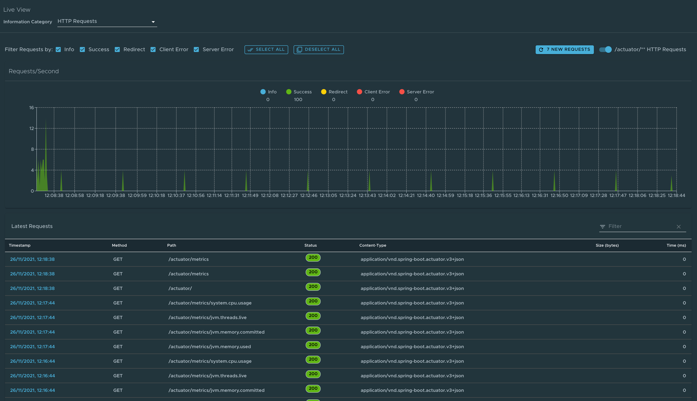

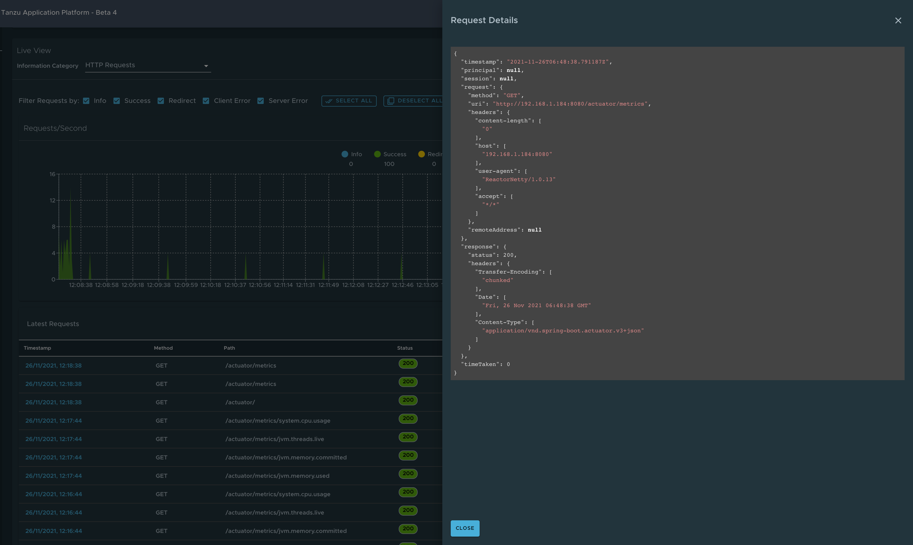

### Caches page

To navigate to the Caches page, the user should select the `Caches` option from the `Information Category` drop-down menu.
The Caches page provides access to the application’s caches. It gives the details of the cache managers associated with the application including the fully qualified name of the native cache. The search feature in the Caches Page enables the user to search for a specific cache/cache manager. The user has the ability to evict individual caches by clicking on the _Evict_ button which results in clearing of cache. All the caches can be evicted completely by clicking on _Evict All_ button.
If there are no cache managers for the application, a message is displayed `No cache managers available for the application`.

### Configuration Properties page

To navigate to the Configuration Properties page, the user should select the `Configuration Properties` option from the `Information Category` drop-down menu.
The configuration properties page provides information about the configuration properties of the application. In case of Spring Boot, it displays application's @ConfigurationProperties beans. It gives a snapshot of all the beans and their associated configuration properties. The search feature allows the user to look up for property's key/value or the bean name.

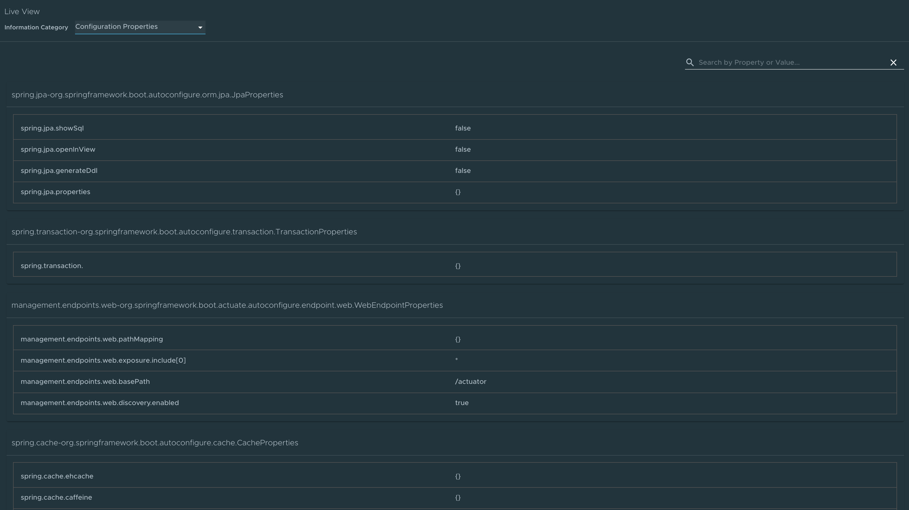

### Conditions page

To navigate to the Conditions page, the user should select the `Conditions` option from the `Information Category` drop-down menu.
The conditions evaluation report provides information about the evaluation of conditions on configuration and auto-configuration classes. In case of Spring Boot, this gives the user a clear view of all the beans configured in the application. When the user clicks on the bean name, the conditions and the reason for the conditional match is displayed. In case of not configured beans, it shows both the matched and unmatched conditions of the bean if any. In addition to this, it also displays names of unconditional auto configuration classes if any. The user can filter out on the beans and the conditions using the search feature.

### Scheduled Tasks page

To navigate to the Scheduled Tasks page, the user should select the `Scheduled Tasks` option from the `Information Category` drop-down menu.
The scheduled tasks page provides information about the application's scheduled tasks. It includes cron tasks, fixed delay tasks and fixed rate tasks, custom tasks and the properties associated with them. The user can search for a particular property or a task in the search bar to retrieve the task or property details.

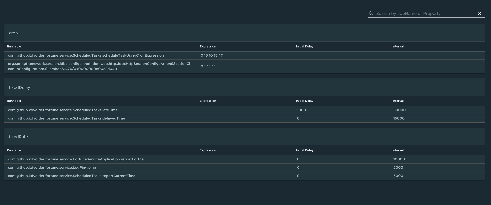

### Beans page

To navigate to the Beans page, the user should select the `Beans` option from the `Information Category` drop-down menu.
The beans page provides information about a list of all application beans and its dependencies. It displays the information about the bean type, dependencies and its resource. The user can search by the bean name or its corresponding fields.

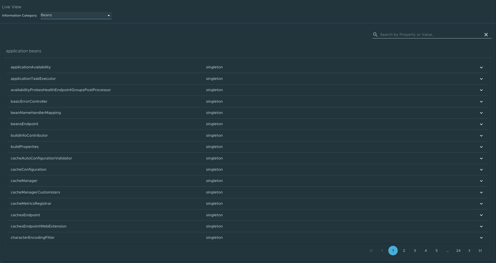

### Metrics page

To navigate to the Metrics page, the user should select the `Metrics` option from the `Information Category` drop-down menu.
The metrics page provides access to application metrics information. The user can choose from the list of various metrics available for the application such as jvm.memory.used, jvm.memory.max, http.server.request, etc. Once the metric is chosen, the user can view the associated tags. The user can choose the value of each of the tags based on filtering criteria. On clicking _Add Metric_ button, the metric is added to the page which is refreshed every 5 seconds by default. The user can pause the auto refresh feature by disabling the `Auto Refresh` toggle. The user can also refresh the metrics manually by clicking on _Refresh All_ button. The format of the metric value can be changed according to the user's needs. They can delete a particular metric by clicking on the minus symbol in the same row.

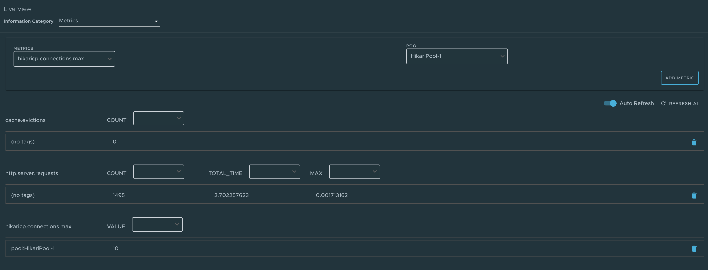

### Actuator page

To navigate to the Actuator page, the user should select the `Actuator` option from the `Information Category` drop-down menu.
The actuator page provides a tree view of the actuator data. The user can choose from a list of actuator endpoints and parse through the raw actuator data.

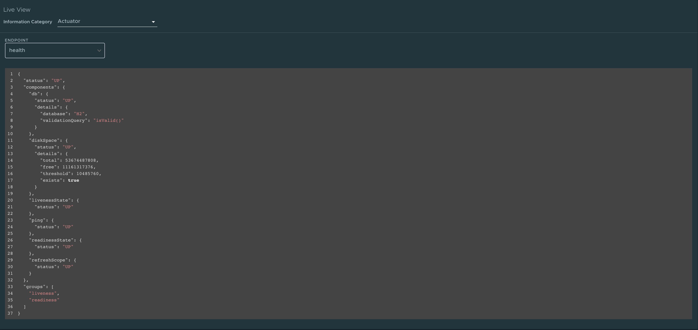

## Troubleshoot

You might run into cases where a workload running on your cluster does not show up in the Application Live View overview, the detail pages do not load any information from the running process, or similar issues.
See [Troubleshooting](https://docs.vmware.com/en/Application-Live-View-for-VMware-Tanzu/1.0/docs/GUID-troubleshooting.html) in the Application Live View documentation. 