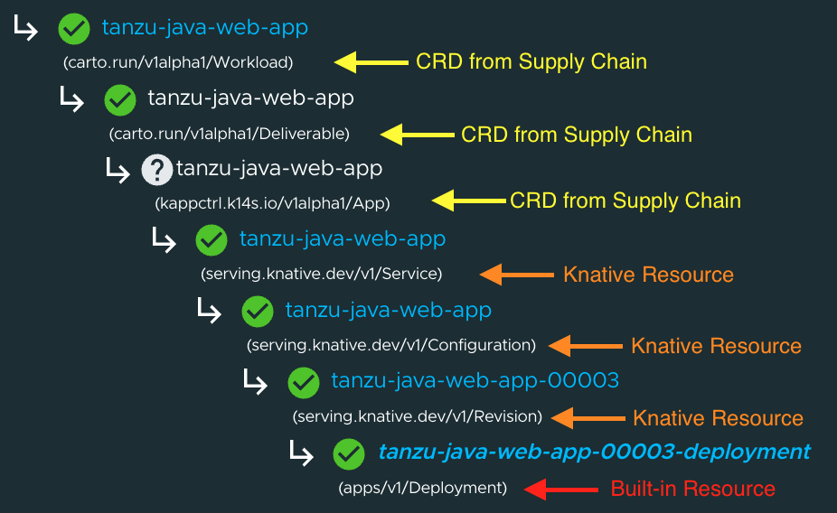
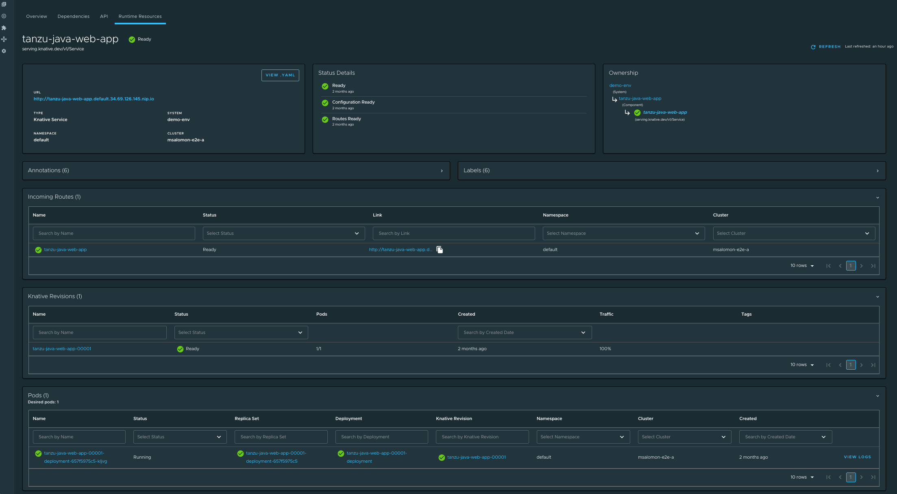
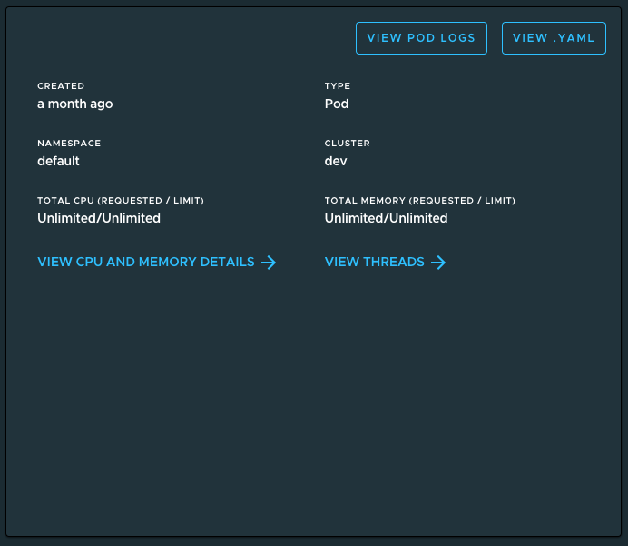
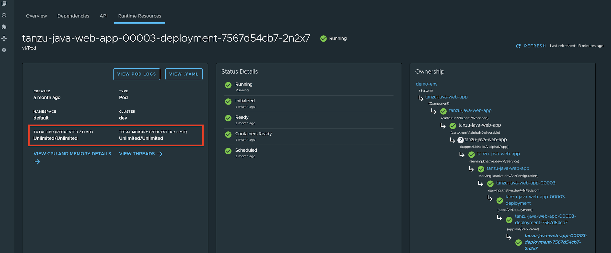
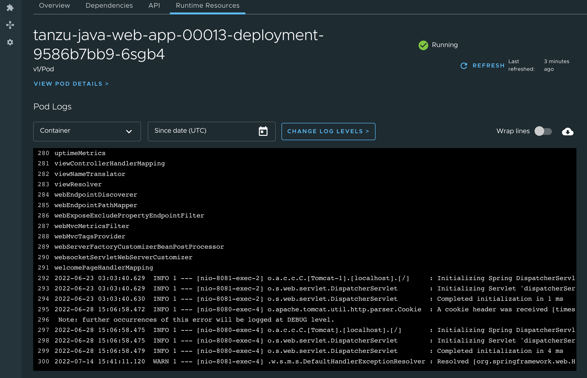

# Runtime resources visibility

This topic describes runtime resources visibility.

The Runtime Resources Visibility plug-in enables users to visualize their Kubernetes resources
associated with their workloads.

## <a id="prerequisite"></a> Prerequisite

Do one of the following actions to access the Runtime Resources Visibility plug-in:

- [Install the Tanzu Application Platform Full or View profile](../../install-intro.md)
- [Install Tanzu Application Platform without using a profile](../../install-intro.md) and then
  install [Tanzu Application Platform GUI separately](../install-tap-gui.md)
- Review the section [If you have a metrics server](#metrics-server)

## <a id="metrics-server"></a> If you have a metrics server

By default, the Kubernetes API does not attempt to use any metrics servers on your clusters.
To access metrics information for a cluster, set `skipMetricsLookup` to `false` for that
cluster in the `kubernetes` section of `app-config.yaml`. Example:

```yaml
tap_gui:
  # ... existing configuration
  app_config:
    # ... existing configuration
    kubernetes:
      clusterLocatorMethods:
        - type: 'config'
          clusters:
            - url: https://KUBERNETES-SERVICE-HOST:KUBERNETES-SERVICE-PORT
              name: host
              authProvider: serviceAccount
              serviceAccountToken: KUBERNETES-SERVICE-ACCOUNT-TOKEN
              skipTLSVerify: true
              skipMetricsLookup: false
```

Where:

- `KUBERNETES-SERVICE-HOST` and `KUBERNETES-SERVICE-PORT` are the URL and ports of your Kubernetes
  cluster. You can gather these through `kubectl cluster-info`.
- `KUBERNETES-SERVICE-ACCOUNT-TOKEN` is the token from your `tap-gui-token-id`.

You can retrieve this secret's ID by running:

```kubectl
kubectl get secrets -n tap-gui
```

and then running

```kubectl
kubectl describe secret tap-gui-token-ID
```

Where ID is the secret name from the first step.

> **Caution** If you enable metrics for a cluster but do not have a metrics server running on it,
> Tanzu Application Platform web interface users see an error notifying them that there is a
> problem connecting to the back end.

## <a id="Visualize-app"></a> Visualize Workloads on Tanzu Application Platform GUI

In order to view your applications on Tanzu Application Platform GUI, use the following steps:

1. [Deploy your first application on the Tanzu Application Platform](../../getting-started/deploy-first-app.md)
1. [Add your application to Tanzu Application Platform GUI Software Catalog](../../getting-started/deploy-first-app.md#add-app-to-gui-cat)

## <a id="nav-rr-vis-screen"></a> Navigate to the **Runtime Resources Visibility** screen

You can view the list of running resources and the details of their status, type, namespace, cluster,
and public URL if applicable for the resource type.

To view the list of your running resources:

1. Select your component from the Catalog index page.

   

1. Select the **Runtime Resources** tab.

   

### <a id="resources-included"></a> Resources

Built-in Kubernetes resources in this view are:

- Services
- Deployments
- ReplicaSets
- Pods
- Jobs
- Cronjobs
- DaemonSets
- ReplicaSets

The Runtime Resource Visibility plug-in also displays CRDs created with the
Supply Chain, including:

- Cartographer Workloads
- Knative Services, Configurations, Revisions, and Routes

For more information, see
[Supply Chain Choreographer in Tanzu Application Platform GUI](scc-tap-gui.md).

CRDs from Supply Chain are associated with Knative Resources, further down the chain, and built-in
resources even further down the chain.



## <a id="resource-details"></a> Resources details page

To get more information about a particular workload, select it from the table on
the main **Runtime Resources** page to visit a page that provides details about the workload.
These details include the workload status, ownership, and resource-specific information.



### <a id="overview-card"></a> Overview card

All detail pages provide an overview card with information related to the selected resource.
Most of the information feeds from the `metadata` attribute in each object.
The following are some attributes that are displayed in the overview card:

- **View Pod Logs** button
- **View .YAML** button
- URL, which is for Knative and Kubernetes service detail pages
- Type
- System
- Namespace
- Cluster



>**Note** The **VIEW CPU AND MEMORY DETAILS** and **VIEW THREADS** sections are only available for
applications supporting Application Live View.

### <a id="status-card"></a>Status card

The status section displays all of the conditions in the resource's attribute `status.conditions`.
Not all resources have conditions, and they can vary from one resource to the other.

For more information about object `spec` and `status`, see the
[Kubernetes documentation](https://kubernetes.io/docs/concepts/_print/#object-spec-and-status).


### <a id="ownership-card"></a>Ownership card

Depending on the resource that you are viewing, the ownership section displays all the resources
specified in `metadata.ownerReferences`. You can use this section to navigate between resources.

For more information about owners and dependents, see the
[Kubernetes documentation](https://kubernetes.io/docs/concepts/overview/working-with-objects/owners-dependents/).


### <a id="annotations"></a>Annotations and Labels

The Annotations and Labels card displays information about `metadata.annotations` and `metadata.labels`.


## <a id="select-supply-chain-pods"></a>Selecting completed supply chain pods

Completed supply chain pods (build pods and ConfigWriter pods) are hidden by default in the index table.
Users can choose to display them from the **Show Additional Resources** drop-down menu above the
Resources index table.
This drop-down menu is only visible if the resources include Build or ConfigWriter pods.


## <a id="navigating-to-pods"></a>Navigating to the pod Details page

Users can see the pod table in each resource details page.


### <a id="pod-details-metrics"></a> Overview of pod metrics

If you have a metrics server running on your cluster, the overview card displays realtime metrics
for pods.

If you do not have a metrics server, the overview card displays the
user-configured resource limits on the pod, defined in accordance with the
[Kubernetes documentation](https://kubernetes.io/docs/concepts/configuration/manage-resources-containers/).

For applications built using Spring Boot, you can also monitor the actual
real-time resource use using
[Screenshot of Application Live View for Spring Boot Applications in Tanzu Application Platform GUI.](app-live-view-springboot.md).

Metrics and limits are also displayed for each container on a pod details page.
If a particular container's current limit conflicts with a namespace-level
LimitRange, a small warning indicator is displayed next to the container limit.
Most conflicts are due to creating a container before applying a LimitRange.


Pods display the sum of the limits of all their containers.
If a limit is not specified for a container, both the container and its pod are deemed to require
unlimited resources.



Namespace-level resource limits, such as default memory limits and default CPU limits, are not
considered as part of these calculations.

For more information about
[default memory limits](https://kubernetes.io/docs/tasks/administer-cluster/manage-resources/memory-default-namespace/)
and [default CPU limits](https://kubernetes.io/docs/tasks/administer-cluster/manage-resources/cpu-default-namespace/)
see the Kubernetes documentation.

These limits apply only for Memory and CPU that a pod or container can use.
Kubernetes manages these resource units by using a binary base, which is explained in the
[Kubernetes documentation](https://kubernetes.io/docs/reference/kubernetes-api/common-definitions/quantity/).

## <a id="pod-details"></a>Navigating to Application Live View

To view additional information about your running applications, see the
[Application Live View](app-live-view-springboot.md) section in the **Pod Details** page.


## <a id="viewing-pod-logs"></a>Viewing pod logs

To view logs for a pod, click **View Pod Logs** from the **Pod Details** page.
By default, logs for the pod's first container are displayed, dating back to when the pod was created.



### <a id="pause-resume-logs"></a>Pausing and resuming logs

Log entries are streamed in real time. New entries appear at the bottom of the log content area.
Click or scroll the log content area to pause the log stream.
Pausing the log stream enables you to focus on specific entries.

To resume the stream, click the **Follow Latest** button that appears after pausing.

### <a id="filter-by-container"></a>Filtering by container

To display logs for a different container, select the container that you want from the **Container**
drop-down menu.

### <a id="filter-by-date-and-time"></a>Filtering by date and time

To see logs since a specific date and time, select or type the UTC timestamp in the
**Since date** field.
If no logs are displayed, adjust the timestamp to an earlier time.
If you do not select a timestamp, all logs produced since the pod was created are displayed.

For optimal performance, the pod logs page limits the total log entries displayed to the last
10,000, at most.

### <a id="changing-log-levels"></a>Changing log levels

If the pod is associated with an application that supports [Application Live View](app-live-view.md),
you can change the application's log levels by clicking the **Change Log Levels** button.
You then see a panel that enables you to select levels for each logger associated with your application.


To change the levels for your application, select the desired level for each logger presented, and
then click **X** in the upper-right corner of the panel, or press the Escape key, to close the
panel.

Because adjusting log levels makes a real-time configuration change to your application, log-level
adjustments are only reflected in log entries that your application produces after the change.

If no log entries for the expected levels appear, ensure that:

1. You adjusted the correct application loggers
2. You are viewing logs for the correct container and time frame
3. Your application is currently producing logs at the expected levels

### <a id="line-wrapping"></a>Line wrapping

By default, log entries are not wrapped. To activate or deactivate line wrapping, click the **Wrap lines**
toggle.

### <a id="downloading"></a>Downloading logs

To download current log content, click the **Download logs** button.

For optimal performance, the pod logs page limits the total log entries downloaded to the last
10,000, at most.

### <a id="connect-interrupt"></a>Connection interruptions

If the log stream connection is interrupted for any reason, such as a network error, a notification
appears after the most recent log entry, and the page attempts to reconnect to the log stream.
If reconnection fails, an error message displays at the top of the page, and you can click the
**Refresh** button at the upper-right of the page to attempt to reconnect.

If you notice frequent disconnections at regular intervals, contact your administrator.
Your administrator might need to update the back-end configuration for your installation to allow
long-lived HTTP connections to log endpoints (endpoints starting with `BACKEND-HOST/api/k8s-logging/`).
