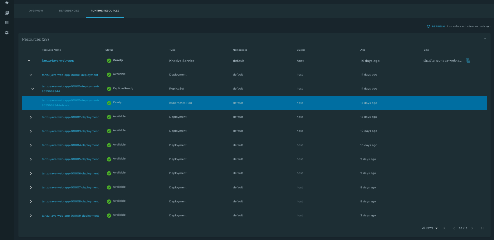
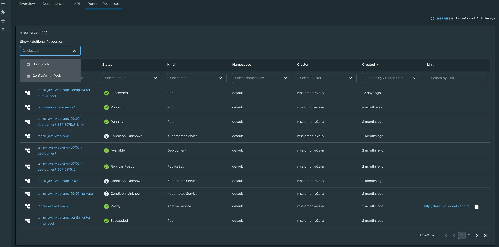
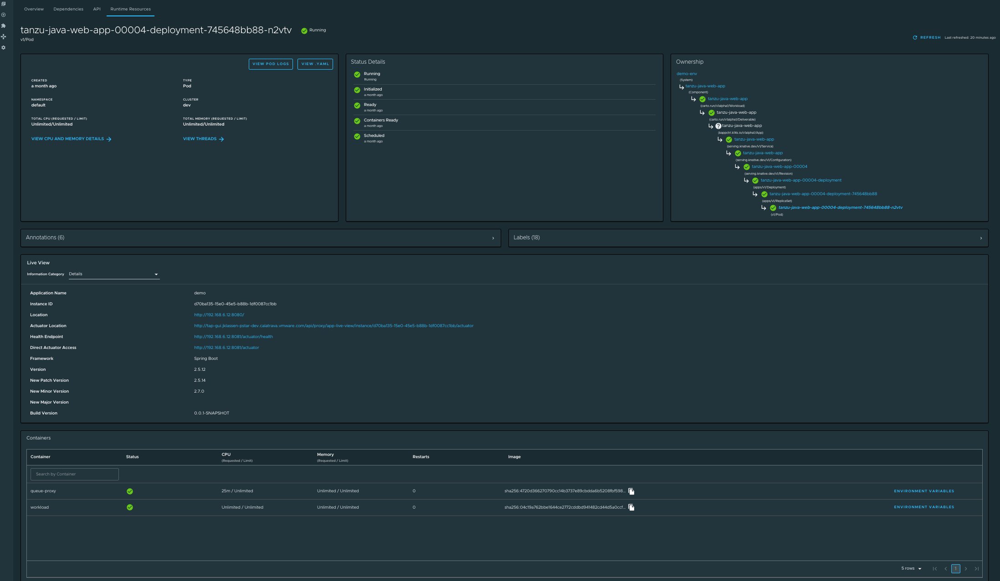
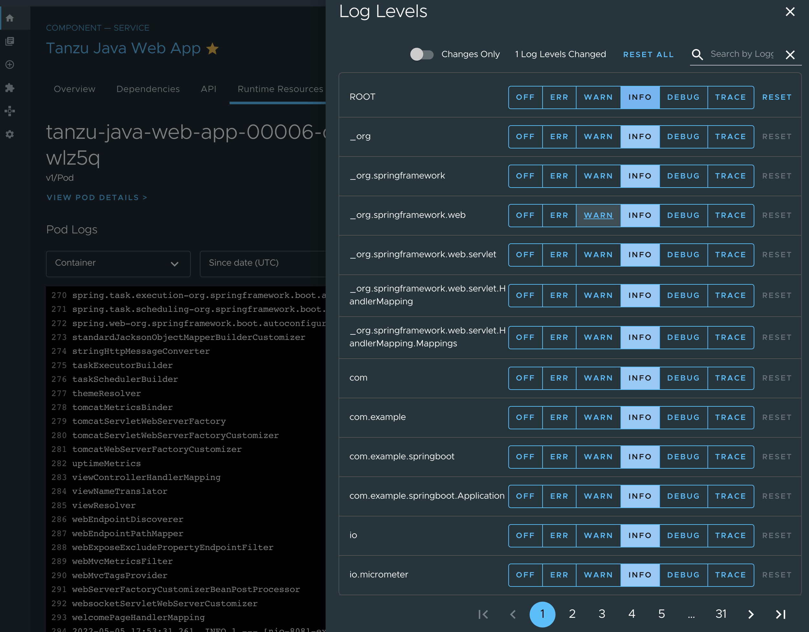

# Runtime resources visibility

This topic describes runtime resources visibility.

##  Introduction

Runtime Resources Visibility plug-in part of Tanzu Application Platform GUI allows users to
visualize their Kubernetes resources associated with their Workloads.

##  Prerequisite

In order to access the Runtime Resources Visibility plug-in, you must first have successfully
[installed Tanzu Application Platform](../../install-intro.md), which includes
Tanzu Application Platform GUI.

##  Visualize Workloads on Tanzu Application Platform GUI

In order to view your applications on Tanzu Application Platform GUI, use the following steps:

1. [Develop your application on the Tanzu Application Platform via Application Accelerators](../../getting-started.html#dev-first-app)
2. [Add your application to Tanzu Application Platform GUI Software Catalog](../../getting-started.html#add-app-to-gui-cat)

##  Navigate to the **Runtime Resources Visibility** screen

You can view the list of running resources and the details of their status, type, namespace, cluster,
and public URL if applicable for the resource type.

To view the list of your running resources:

1. Select your component from the Catalog index page.

   

2. Select the **Runtime Resources** tab.

   

##  Knative service details page

To view details about your Knative services, select any resource that has a Knative Service type.
In this page, additional information is available for Knative resources, including:

- status
- an ownership hierarchy
- incoming routes
- revisions
- pod details

   

##  View details for a specific resource

The Resources index table shows Knative Services, Deployments, pods, ReplicaSets and
Kubernetes Services that match the label indicated in the component's definition.

You can see a hierarchical structure showing the owner-dependent relationship between the objects.
Resources without an owner are listed in the table as independent elements.

For information about owners and dependents, see the
[Kubernetes documentation](https://kubernetes.io/docs/concepts/overview/working-with-objects/owners-dependents/).

See the following example of an expanded index table showing one of the owner resources and its dependents.

##  Detail pages

The Runtime Resources Visibility plug-in provides additional details of the Kubernetes resources in
the Detail pages.

###  Overview card

All detail pages provide an overview card with information related to the selected resource.
Most of the information feeds from the `metadata` attribute in each object.
The following are some attributes that are displayed in the overview card:

- **View Pod Logs** button
- **.YAML** button
- URL, which is for Knative and Kubernetes service detail pages
- Type
- System
- Namespace
- Cluster

### Status card

The status section displays all of the conditions in the resource's attribute `status.conditions`.
Not all resources have conditions, and they can vary from one resource to the other.

For more information about object `spec` and `status`, see the
[Kubernetes documentation](https://kubernetes.io/docs/concepts/_print/#object-spec-and-status).

### Ownership card

Depending on the resource that you are viewing, the ownership section displays all the resources
specified in `metadata.ownerReferences`. You can use this section to navigate between resources.

For more information about owners and dependents, see the
[Kubernetes documentation](https://kubernetes.io/docs/concepts/overview/working-with-objects/owners-dependents/).

### Annotations and Labels

The Annotations and Labels card displays information about `metadata.annotations` and `metadata.labels`.

## Selecting Completed Supply Chain Pods

The completed Supply Chain Pods (Build and ConfigWriter Pods) are not shown by default in the index table as they
are additional resources. Users can select to show them or not via the **Show Additional Resources** dropdown, 
which is above the Resources index table. This dropdown is visible if the resources include Build and/or 
ConfigWriter Pods. Otherwise, the dropdown will not be visible.

## Navigating to Pod Details Page

You can go directly to the Pod Details page from the Resources index table.

Alternatively, you can see the pod table in each resource details page, as shown in the following screenshot.

## Navigating to Application Live View

To view additional information about your running applications, see the
[Application Live View](app-live-view.md) section in the Pod Details page.

## Viewing pod logs

To view logs for a pod, click **View Pod Logs** from the Pod Details page.
By default, you see all the logs for the pod since its creation for all the pod's containers.

> **Note:** The logs displayed are not streamed in real time. To fetch new log entries, click
> **Refresh** in the upper right corner of the page.

### Filtering by container

To display logs for a specific container only, select the desired container from the **Container**
drop-down menu. Clearing this drop-down menu causes logs for all containers within the pod to appear.

### Filtering by date and time

To see all logs since a specific date and time, select or type the UTC timestamp in the
**Since date** field.
If no logs are displayed, try adjusting the timestamp to an earlier time.
Clear this field to see all logs created since the pod was created.

### Changing log levels

If the pod is associated with an application that supports [Application Live View](app-live-view.html),
you can change the application's log levels by clicking the **Change Log Levels** button.
You then see a panel that allows you to select levels for each logger associated with your application.

To change the levels for your application, select the desired level for each logger presented and then
close the panel by clicking **X** in the upper right corner of the panel or by pressing
the Escape key on your keyboard.

Because adjusting log levels makes a real-time configuration change to your application, log-level
adjustments are only reflected in log entries that your application produces after the change.
Click **Refresh** in the upper right corner of the page to fetch new messages after changing log levels.

After refreshing, if no log entries for the expected levels appear, ensure that:

1. You adjusted the correct application loggers
1. You are viewing logs for the correct container and time frame
1. Your application is producing logs at the expected levels. Your application might be
idling or otherwise not running a code path that invokes the desired logger.
