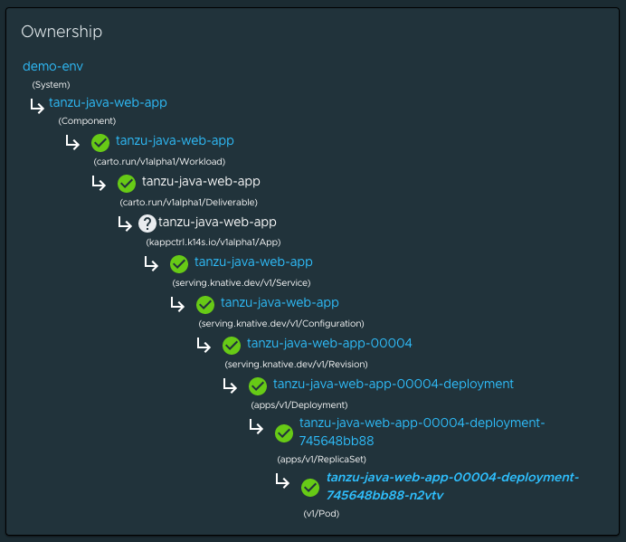

# Runtime Resources Visibility

The Runtime Resources Visibility screen lets developers view the details and status of their Kubernetes
resources to understand their structure, and debug issues.


## Before you begin

Developers must perform the following actions to see their resources on the dashboard:

1. Define a Backstage Component with a `backstage.io/kubernetes-label-selector` annotation. See
  [Components](../catalog/catalog-operations.md#components) in the Catalog Operations documentation.

    ```
    apiVersion: backstage.io/v1alpha1
    kind: Component
    metadata:
      name: petclinic
      description: Spring PetClinic
      annotations:
        'backstage.io/kubernetes-label-selector': 'app.kubernetes.io/part-of=petclinic-server'
    spec:
      type: service
      lifecycle: demo
      owner: default-team
      system:
    ```

2. Commit and push the Component definition to a Git repository that is registered as a Catalog Location. See [Adding
  Catalog Entities](../catalog/catalog-operations.md#adding-catalog-entities) in the Catalog Operations documentation.
3. Create a Kubernetes resource with a label matching the Component's selector, in a cluster available to the Tanzu Application Platform GUI. A resource is one of the following:

    - `v1/Service`
    - `apps/v1/Deployment`
    - `serving.knative.dev/v1/Service`

    For example:

      ```
      $ cat <<EOF | kubectl apply -f -
      ---
      apiVersion: serving.knative.dev/v1
      kind: Service
      metadata:
        name: petclinic
        namespace: default
        labels:
          'app.kubernetes.io/part-of': petclinic-server
      spec:
        template:
          metadata:
            labels:
              'app.kubernetes.io/part-of': petclinic-server
          spec:
            containers:
              - image: springcommunity/spring-framework-petclinic
      EOF
      ```

## Navigate to the Runtime Resources Visibility screen

You can view the list of running resources and details about their status, type, namespace, cluster, and public URL if
applicable for the resource type.

To view the list of your running resources:

1. Select the Component from the Catalog index page.
2. Select the Runtime Resources tab.


### Seeing details for a specific resource

The index table shows Deployments, Pods, ReplicaSets, and Services that match the label indicated in the component's definition. You can view a master-detail structure for all the objects using the owners and dependents relationships established between them. Resources without an owner are listed in the table as independent elements.

For information about owners and dependents, see [the official documentation](https://kubernetes.io/docs/concepts/overview/working-with-objects/owners-dependents/).

The following image is an example of an expanded view for the index table.


## Detail pages

The Runtime Runtime Resources Visibility plugin provides pages for many resources to allow users to view the most relevant characteristics of each one, including direct links to other resources.

These following sections explain the sections included on all pages:

### Overview section

The overview section is the first card in every details page. Wost of the information included in it comes from the `metadata` attribute in each object. 
Some attributes displayed here include:

  1. **.YAML** button: Show the current object's definition in yaml; you can copy the full content using the icon in the top-right corner.
  2. Name
  3. Namespace
  4. Age or Creation date
  5. Cluster: The value displayed corresponds to the name used in the cluster's configuration.
  6. URL: URL is available for Knative services and Kubernetes services.


### Status section

The status section displays all of the conditions included in the resource's attribute `status.conditions`. Not all resources have conditions, and they could be different for each resource.

See [Concepts - Object Spec and Status](https://kubernetes.io/docs/concepts/_print/#object-spec-and-status) in the Kubernetes documentation.


### Ownership section

Depending on the resource that you are viewing, the ownership section presents all the resources specified in the `metadata.ownerReferences`.

See [Owners and Dependents](https://kubernetes.io/docs/concepts/overview/working-with-objects/owners-dependents/) in the Kubernetes documentation.



### Annotations & Labels

Shows information on `metadata.annotations` and`metadata.labels`


## Navigating to pods

On the pod's details page, you can view a pod in the index table available in the first view by opening each of the resources there.


You can use the table listing Pods in each detail page for components with a higher level in the Ownership hierarchy. Columns can be different on each detail page.


## Knative Service Details page

To view the Knative services details of your resources, select the resource with 'Knative Service' type.
In this page, additional information is available for Knative resources including status, an ownership hierarchy, 
incoming routes, revisions, and pod details.


