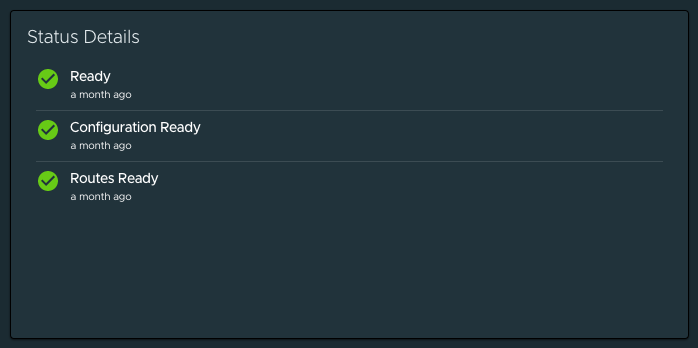

# Runtime Resources Visibility

The Runtime Resources Visibility tab shows developers the details and status of their component's Kubernetes resources to understand their structure and debug issues.


## Before you begin

To ensure that your component and its resources are displayed, you need:

1. A YAML file describing your component.
2. All resources created for your application must specify a label `'app.kubernetes.io/part-of'` with your application's name.

### Automated options

We offer two options to speed up the process of displaying your application's resources:

1. [Tanzu Developer Tools for Visual Studio Code](../../vscode-extension/about.md) can be used to automate the creation of the component's YAML and its resources. For information about the YAML files, see [Get set up with snippets](../../vscode-extension/usage-getting-started.md).
2. Use [Application Accelerator](application-accelerator.md). You can use **TAP Initializer** to generate the required files. You can access it through the Tanzu Application Platform GUI by using `<TAP-GUI-URL>/create/templates/tap-initialize`.

### Manual process

Developers must perform the following actions to see their resources on the dashboard:

1. Define a Backstage Component with a `backstage.io/kubernetes-label-selector` annotation. See
  [Components](../catalog/catalog-operations.md#components) in the Catalog Operations documentation.

    ```
    apiVersion: backstage.io/v1alpha1
    kind: Component
    metadata:
      name: petclinic
      description: Spring PetClinic
      annotations:
        'backstage.io/kubernetes-label-selector': 'app.kubernetes.io/part-of=petclinic-server'
    spec:
      type: service
      lifecycle: demo
      owner: default-team
      system:
    ```

2. Commit and push the Component definition, created in the previous steps, to a Git repository that is registered as a Catalog Location. See [Adding
  Catalog Entities](../catalog/catalog-operations.md#adding-catalog-entities) in the Catalog Operations documentation.
3. Create a Kubernetes resource with a label matching the Component's selector in a cluster available to Tanzu Application Platform GUI. A resource is one of the following:

    - `v1/Service`
    - `apps/v1/Deployment`
    - `serving.knative.dev/v1/Service`

    For example:

      ```
      $ cat <<EOF | kubectl apply -f -
      ---
      apiVersion: serving.knative.dev/v1
      kind: Service
      metadata:
        name: petclinic
        namespace: default
        labels:
          'app.kubernetes.io/part-of': petclinic-server
      spec:
        template:
          metadata:
            labels:
              'app.kubernetes.io/part-of': petclinic-server
          spec:
            containers:
              - image: springcommunity/spring-framework-petclinic
      EOF
      ```
   


## Navigate to the Runtime Resources Visibility screen

You can view the list of running resources and details about their status, type, namespace, cluster, and public URL if
applicable for the resource type.

To view the list of your running resources:

1. Select your component from the Catalog index page.

   

2. Select the Runtime Resources tab.

   

### Seeing details for a specific resource

The Resources index table will show Deployments, Pods, ReplicaSets and Services that match with the label indicated in the component's definition; you will see a hierarchical structure showing the owner-dependent relationship between the objects. Resources without an owner will be listed in the table as independent elements.

For information about owners and dependents, see [Kubernetes documentation](https://kubernetes.io/docs/concepts/overview/working-with-objects/owners-dependents/).

Here is an example of the expanded index table showing one of the owner resources and its dependents.


## Detail pages

The Runtime Runtime Resources Visibility plugin provides detail pages with the most relevant characteristics of many resources, including direct links to other ones.

These following sections explain the boxes included on all detail pages:

### Overview section

The overview section is the first card in every detail page. Most of the information in it comes from the `metadata` attribute in each object. 
Some attributes displayed here include:

  1. **.YAML** button: When you click on the **.YAML** button, a side panel opens showing the current object's definition in yaml. You can copy the full content of the **.YAML** file by using the icon in the top-right corner of the side panel..
  2. Name
  3. Namespace
  4. Age or Creation date
  5. Cluster: The value displayed corresponds to the name used in the cluster's configuration.
  6. URL: URL is available for Knative services and Kubernetes services.


### Status section

The status section displays all of the conditions included in the resource's attribute `status.conditions`. Not all resources have conditions, and they could be different for each resource.

See [Concepts - Object Spec and Status](https://kubernetes.io/docs/concepts/_print/#object-spec-and-status) in the Kubernetes documentation.



### Ownership section

Depending on the resource that you are viewing, the ownership section presents all the resources specified in the `metadata.ownerReferences`. You can use this section to navigate between resources.

See [Owners and Dependents](https://kubernetes.io/docs/concepts/overview/working-with-objects/owners-dependents/) in the Kubernetes documentation.


### Annotations & Labels

Shows information on `metadata.annotations` and`metadata.labels`


## Navigating to pods

You can navigate directly to the pod's detail page from the Resources index table


You can use the table listing Pods in each owner object's detail page. Columns can be different on each detail page.


## Knative Service Details page

To view details about your Knative services, select any resource that has the "Knative Service" type.
In this page, additional information is available for Knative resources including status, an ownership hierarchy, 
incoming routes, revisions, and pod details.


## Pod Details Page

This page shows you most relevant information for a specific Pod including its containers and the [Application Live View information](./app-live-view.md) information.


