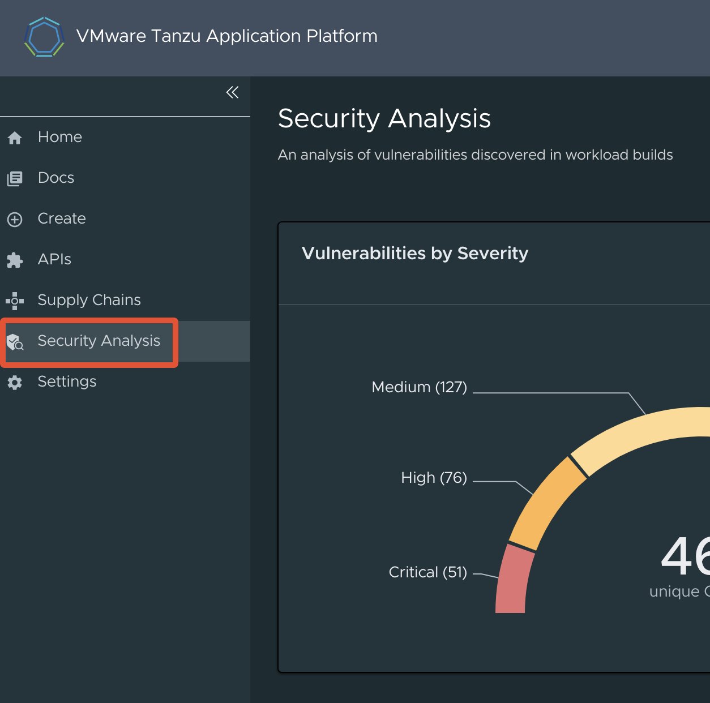
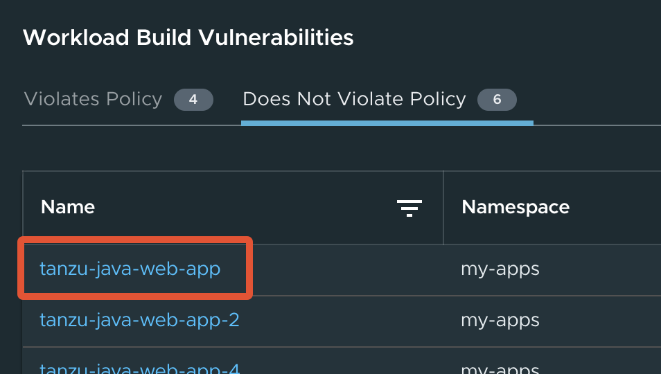
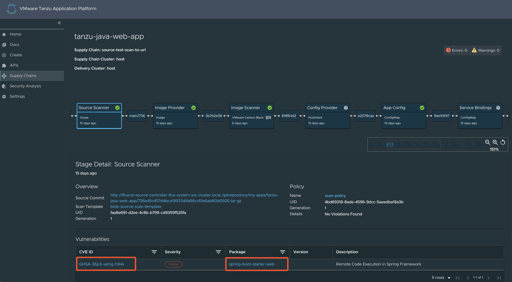

# Security Analysis in Tanzu Application Platform GUI

##  Overview

The Security Analysis GUI plug-in summarizes vulnerability data across all workloads running in Tanzu Application Platform, enabling faster identification and remediation of CVEs.  

##  Installation & configuration

The Security Analysis plug-in will be installed by default.  It is tightly coupled with the [Supply Chain Choregrapher plug-in](./scc-tap-gui.hbs.md).  After installing and configuring the Supply Chain Choreographer GUI plug-in, there is no additional configuration needed for the Security Analysis GUI plug-in.

The Security Analysis plug-in is part of the Tanzu Application's View profile.

##  Accessing the plug-in

The Security Analysis GUI plug-in is always accessible from the left navigation.  Clicking will open the Security Analysis dashboard.

##  Viewing vulnerability data

The Security Analysis dashboard provides a summary of all vulnerabilities across all clusters for single and multi-cluster deployments.  

The **Vulnerabilities by Severity** widget is a quickly counts the number of critical, high, medium, low, and unknown severity CVEs, based on that CVE's CVSS severity rating.  

It includes a sum of all workloads' source and image scan vulnerabilities.  For example, if CVE-123 exists in Workload ABC's and Workload DEF's latest source scans and image scans, it will be counted four times.  

>**Note:** The sum includes any CVEs on the allowlist (ignoreCVEs).

The **Workload Build Vulnerabilities** tables with the **Violates Policy** and **Does Not Violate** tabs, separate workloads based on the [scan policy](../../scst-scan/policies.hbs.md).  The Unique CVEs column uses the same sum logic as above, but for individual workloads.

>**Note:** The sum of given workload's CVEs may not match the [Supply Chain Choreographer's Vulnerability Scan Results](./scc-tap-gui.hbs.md#sc-view-scan-results).  The data on this dashboard is based on individual scan results' totals.  The data on the Supply Chain Choreographer's Vulnerability Scan Results is based on vulnerabilities across all of the Metadata Store.

##  Viewing CVE and Package details

The Security Analysis GUI plug-in has a **CVE details** and **Package details** page.  These are accessed by clicking on a workload name, which opens the Supply Chain Choregrapher plug-in.  Clicking on the CVE or Package name will open the CVE and Package details page, respectively.

The CVE Details page contains basic information about the vulnerability and includes a table with all affected packages and versions.

The Package Details page contains basic information about a package and includes a table with all CVEs and the affected package versions.

<!-- Nothing to see here right now. -->
