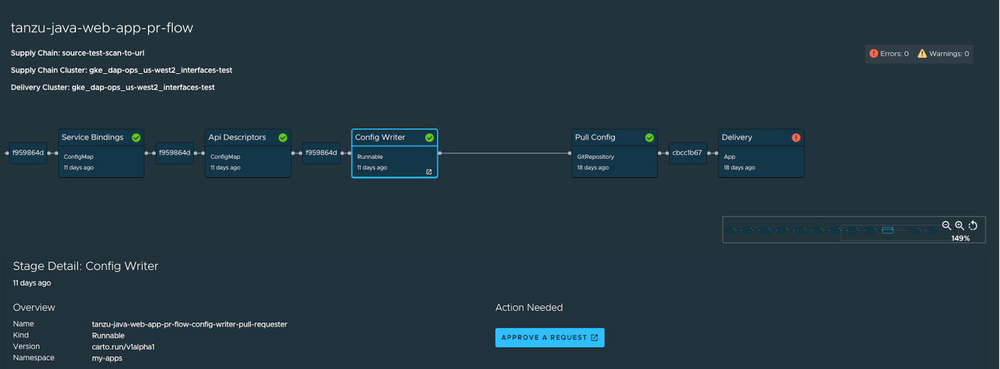
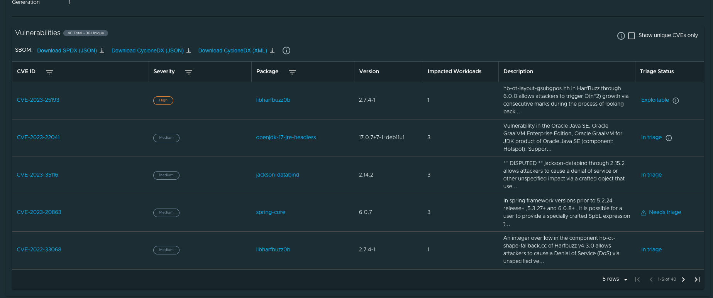
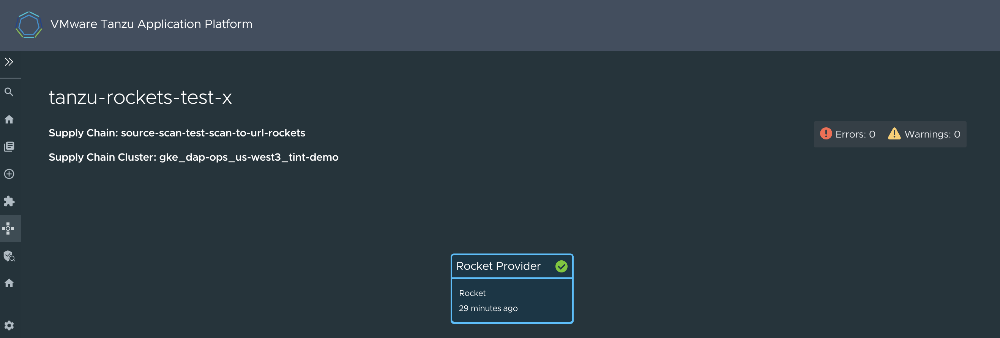
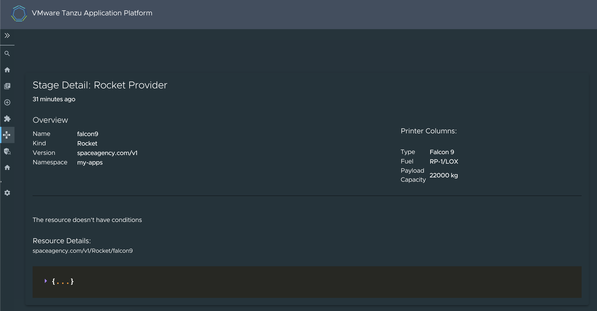
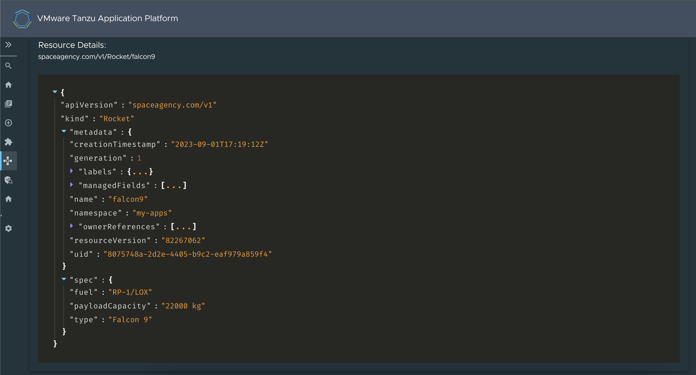

# Supply Chain Choreographer in Tanzu Developer Portal

This topic tells you about Supply Chain Choreographer in Tanzu Developer Portal.

## <a id="overview"></a> Overview

The Supply Chain Choreographer (SCC) plug-in enables you to visualize the execution of a workload by
using any of the installed Out-of-the-Box supply chains.
For more information about the Out-of-the-Box (OOTB) supply chains that are available in
Tanzu Application Platform, see [Supply Chain Choreographer for Tanzu](../../scc/about.hbs.md).

## <a id="prerequisites"></a> Prerequisites

To use Supply Chain Choreographer in Tanzu Developer Portal you must have:

- One of the following installed on your cluster:
  - [Tanzu Application Platform Full profile](../../install-online/profile.hbs.md#install-profile)
  - [Tanzu Application Platform View profile](../../install-online/profile.hbs.md#install-profile)
  - [Tanzu Developer Portal package](../install-tap-gui.hbs.md) and a metadata store package
- One of the following installed on the target cluster where you want to deploy your workload:
  - [Tanzu Application Platform Run profile](../../install-online/profile.hbs.md#install-profile)
  - [Tanzu Application Platform Full profile](../../install-online/profile.hbs.md#install-profile)

For more information, see [Overview of multicluster Tanzu Application Platform](../../multicluster/about.hbs.md)

## <a id="scan"></a> Enable CVE scan results

To see CVE scan results within Tanzu Developer Portal, connect Tanzu Developer Portal
to the Tanzu Application Platform component Supply Chain Security Tools - Store (SCST - Store).

### <a id="scan-auto"></a> Automatically connect Tanzu Developer Portal to SCST - Store

Tanzu Developer Portal has automation for enabling connection between Tanzu Developer Portal and
[SCST - Store](../../scst-store/overview.hbs.md). This automation is active by default and requires
no configuration.

> **Important** There is a known issue with the automatic configuration breaking the SBOM download
> feature introduced in Tanzu Application Platform v1.6. Please update `tap-values.yaml` as described
> in [Troubleshooting](../../tap-gui/troubleshooting.hbs.md#sbom-not-working).

To deactivate this automation, add the following block to the Tanzu Developer Portal section within
`tap-values.yaml`:

```yaml
# ...
tap_gui:
  # ...
  metadataStoreAutoconfiguration: false
```

This file change creates a service account for the connection with privileges scoped only to
Metadata Store.
In addition, it mounts the token of the service account into the Tanzu Developer Portal
pod and produces for you the `app_config` section necessary for Tanzu Developer Portal to
communicate with SCST - Store.

#### <a id="troubleshooting"></a> Troubleshooting

For debugging the automation, or for verifying that the automation is active, you must know
which resources are created. The following commands display the different Kubernetes resources that
are created when `tap_gui.metadataStoreAutoconfiguration` is set to `true`:

```console
$ kubectl -n tap-gui get serviceaccount metadata-store
NAME             SECRETS   AGE
metadata-store   1         AGE-VALUE
```

```console
$ kubectl -n tap-gui get secret metadata-store-access-token
NAME                          TYPE                                  DATA   AGE
metadata-store-access-token   kubernetes.io/service-account-token   3      AGE-VALUE
```

```console
$ kubectl -n tap-gui get clusterrole metadata-store-reader
NAME                    CREATED AT
metadata-store-reader   CREATED-AT-TIME
```

```console
$ kubectl -n tap-gui get clusterrolebinding read-metadata-store
NAME                  ROLE                                AGE
read-metadata-store   ClusterRole/metadata-store-reader   AGE-VALUE
```

There is another condition that impacts whether the automation creates the necessary service account.
If your configuration includes a `/metadata-store` block, the automation doesn't create the
Kubernetes resources for use in `autoconfiguration` and the automation doesn't overwrite the proxy
block that you provide. To use the automation, you must delete the block at
`tap_gui.app_config.proxy["/metadata-store"]`.

For example, a `tap-values.yaml` file with the following content does not create additional Kubernetes
resources as described earlier:

```yaml
# ...
tap_gui:
  # ...
  app_config:
    # ...
    proxy:
      '/metadata-store':
        target: SOMETHING
```

### <a id="scan-manual"></a> Manually connect Tanzu Developer Portal to Metadata Store

To manually enable CVE scan results:

1. [Obtain the read-write token](../../scst-store/retrieve-access-tokens.hbs.md),
   which is created by default when installing Tanzu Application Platform. Alternatively,
   [create an additional read-write service account](../../scst-store/create-service-account.hbs.md#rw-serv-accts).
2. Add this proxy configuration to the `tap-gui:` section of `tap-values.yaml`:

    ```yaml
    tap_gui:
      app_config:
        proxy:
          /metadata-store:
            target: https://metadata-store-app.metadata-store:8443/api/v1
            changeOrigin: true
            secure: false
            allowedHeaders: ['Accept', 'Report-Type-Format']
            headers:
              Authorization: "Bearer ACCESS-TOKEN"
              X-Custom-Source: project-star
    ```

    Where `ACCESS-TOKEN` is the token you obtained after creating a read-write service account.

> **Important** The `Authorization` value must start with the word `Bearer`.

## <a id="view-approvals"></a> Enable GitOps Pull Request Flow

Set up for GitOps and pull requests to enable the supply chain box-and-line diagram to show
**Approve a Request** in the **Config Writer** stage details view when the **Config Writer** stage is
clicked.
For more information, see [GitOps vs. RegistryOps](../../scc/gitops-vs-regops.hbs.md).

## <a id="sc-visibility"></a> Supply Chain Visibility

Before using the SCC plug-in to visualize a workload, you must create a workload.

The workload must have the `app.kubernetes.io/part-of` label specified, whether you manually create
the workload or use one supplied with the OOTB supply chains.

Use the left sidebar navigation to access your workload and visualize it in the supply chain that is
installed on your cluster.

The example workload described in this topic is named `tanzu-java-web-app`.


Click **tanzu-java-web-app** in the **WORKLOADS** table to navigate to the visualization of the
supply chain.

There are two sections within this view:

- The box-and-line diagram at the top shows all the configured CRDs that this supply chain uses, and
  any artifacts that the supply chain's execution outputs
- The **Stage Detail** section at the bottom shows source data for each part of the supply chain that
  you select in the diagram view


When a workload is deployed to a cluster that has the `deliverable` package installed, a new section
appears in the supply chain that shows **Pull Config** boxes and **Delivery** boxes.

When you have a `Pull Request` configured in your environment, access the merge request from the
supply chain by clicking **APPROVE A REQUEST**. This button is displayed after you click
**Config Writer** in the supply chain diagram.



## <a id="sc-view-scan-results"></a> View Vulnerability Scan Results

Click the **Source Scan** stage or **Image Scan** stage to view vulnerability source scans and
image scans for workload builds. The data is from
[Supply Chain Security Tools - Store](../../scst-store/overview.hbs.md).

CVE issues represent any vulnerabilities associated with a package or version found in the
source code or image, including vulnerabilities from past scans.

> **Note** For example, the `log4shell` package is found in image ABC on 1 January without any CVEs.
> On 15 January, the log4j CVE issue is found while scanning image DEF. If a user returns to the
> **Image Scan** stage for image ABC, the log4j CVE issue appears and is associated with the
> `log4shell` package.

### <a id="triage-vul"></a> Triage vulnerabilities

This feature enables you to store analysis data for each of the vulnerabilities found in the scan.

The feature is turned off by default in Tanzu Developer Portal. To enable the feature, add the
following YAML to your configuration section within the `tap-values.yaml` file:

```yaml
# tap-values.yaml

tap_gui:
  app_config:
    customize:
      features:
        supplyChain:
          enableTriageUI: true
```

When you select a scan stage, the system shows a table with vulnerabilities and a **Triage Status**
column where you can see the latest status stored for each vulnerability.



The triage panel enables you to select a status, justification, and resolutions from a set of
options, and has a text box to add extra details for the analysis. After you submit this information,
the status is updated on the table and the latest analysis is visible the next time you open the
panel.

**Needs triage** is the default status for all vulnerabilities. After you submit an analysis, the
status changes and the information button next to the status shows you the stored vulnerability
analysis.

## <a id="sc-crds"></a> Support for CRDs

On 1.7.0 we introduced support for customer-baked CRDs. The following example ilustrates the creation of a basic CRD, its use as part of a supply-chain and its visualization in workload:

In order to define and use a CRD in a supply chain the following steps must be taken:

1. Defining the CRD
2. Setting CRD Permissions
3. Defining the ClusterTemplate and the Supply Chain.
4. Creating and Visualizing the Workload.

Let's review each of them.

### <a id="sc-crd-definition"></a> Defining the CRD

Official Documentation: [link](https://kubernetes.io/docs/tasks/extend-kubernetes/custom-resources/custom-resource-definitions/)

To define a CRD we should start with a YAML file.
At its most basic structure a CRD must have “`apiVersion`”, “`kind`”, “`metadata`” and “`spec`”.  

Note that the “`apiVersion`” for a CRD will always need to be “`apiextensions.k8s.io/v1`” and the “`kind`” will be “`CustomResourceDefinition`”

A basic structure may look like the following:

```
apiVersion: apiextensions.k8s.io/v1
kind: CustomResourceDefinition
metadata:
 name: ...
spec: ...
```

In order to fill up this structure you'll need to compe up with two values: `group` and `name`. 
The value for `group` is usually expressed in a domain url format (e.g. `company.com`), and the `name` value may be any arbitrary value. For the following example we are going to use `spaceagency.com` for the `group` and the `name` will be `rockets`.

```
apiVersion: apiextensions.k8s.io/v1
kind: CustomResourceDefinition
metadata:
  name: rockets.spaceagency.com
spec:
  group: spaceagency.com
  scope: Namespaced
  names:
    plural: rockets
    singular: rocket
    kind: Rocket
    shortNames:
      - roc
```
It is important that the name used in `metadata.name` follows the format `<pluralname>.<group>`, which in this case is `rockets.spaceagency.com`

In order to start adding properties to our CRD we must specify them in the “`spec`” section under a list called “`versions`”, and each version should be an object specifying a “`name`” (for the version) and a “`schema`”.

For this example our “`schema`” will be an “`openAPIV3Schema`” object. Please refer to the [openAPIV3 Schema documentation](https://github.com/OAI/OpenAPI-Specification/blob/main/versions/3.0.0.md#schema) for in-depth information about this.

Our updated CRD looks like this:

```
apiVersion: apiextensions.k8s.io/v1
kind: CustomResourceDefinition
metadata: ...
spec:
  ...
  versions:
  - name: v1
    served: true
    storage: true
    schema:
      openAPIV3Schema:
        type: object
        properties:
          spec:
            type: object
            properties:
              type:
                type: string
              fuel:
                type: string
              payloadCapacity:
                type: string
```

Let’s analyze it:

We added a “`versions`” property under “`spec`” and defined an entry for it that has “`name`”, “`schema`”, “`served`” and “`storage`”. 
Please refer to the [official CRD documentation](https://kubernetes.io/docs/tasks/extend-kubernetes/custom-resources/custom-resource-definitions/) for in-depth information about `served` and `storage` property. For now just know that they're required.

Under the “`schema`” property we defined an “`openAPIV3Schema`” object which lists the attributes that our instances will have and their types. For this example we have added 3 attributes: “`type`”, “`fuel`” and “`payloadCapacity`”, all of them strings.

And with this we now have a valid Custom Resource Definition that we could apply to our cluster. The full definition is as follows:

```
apiVersion: apiextensions.k8s.io/v1
kind: CustomResourceDefinition
metadata:
  name: rockets.spaceagency.com
spec:
  group: spaceagency.com
  scope: Namespaced
  names:
    plural: rockets
    singular: rocket
    kind: Rocket
    shortNames:
      - roc
  versions:
  - name: v1
    served: true
    storage: true
    schema:
      openAPIV3Schema:
        type: object
        properties:
          spec:
            type: object
            properties:
              type:
                type: string
              fuel:
                type: string
              payloadCapacity:
                type: string
```
#### <a id="sc-crd-printer-columns"></a> Adding Printer Columns to the CRD

There is another set of information that we could add to this CRD in order to enhance the way these resources will be rendered by the CLI tools and the Supply Chain plugin: **Printer Columns**.

The supply chain plugin added support for Printer Columns in version 1.7.0

Official Documentation: [link](https://kubernetes.io/docs/tasks/extend-kubernetes/custom-resources/custom-resource-definitions/#additional-printer-columns)

Printer Columns (their official name being “`additionalPrinterColumns`”) is a characteristic that can be added to CRDs to allow them to specify which of their properties should be shown when rendering the resource.

They are a list that must be specified as part of a “`version`” object; each of the list items specifies a name for the “column” to be printed along with the type of the value and a json path that indicates where to get the value from, relative to the CRD itself.

Let’s add 3 “`additionalPrinterColumns`” to our CRD to display the “`.spec.type`”, “`.spec.fuel`” and “`.spec.payloadCapacity`” attributes to see them in action:

```
apiVersion: apiextensions.k8s.io/v1
kind: CustomResourceDefinition
metadata:
  name: rockets.spaceagency.com
spec:
  group: spaceagency.com
  scope: Namespaced
  names:
    plural: rockets
    singular: rocket
    kind: Rocket
    shortNames:
      - roc
  versions:
  - name: v1
    served: true
    storage: true
    schema:
      openAPIV3Schema:
        type: object
        properties:
          spec:
            type: object
            properties:
              type:
                type: string
              fuel:
                type: string
              payloadCapacity:
                type: string
    additionalPrinterColumns:
    - name: Type
      type: string
      jsonPath: .spec.type
    - name: Fuel
      type: string
      jsonPath: .spec.fuel
    - name: Payload Capacity
      type: string
      jsonPath: .spec.payloadCapacity
```

And with that we now have a CRD with printer columns. We will call this CRD file `rockets-crd.yaml`

### <a id="sc-crd-permissions"></a> Setting Resource Permissions

In order to use these `Rocket` resources in a supply chain we need to create a `Role` to define what actions are allowed on this resource, and a `RoleBinding` to bind this new `Role` into the `serviceAccount` that we usually use.

First let's tackle the `Role` resource:

```
apiVersion: rbac.authorization.k8s.io/v1
kind: Role
metadata:
  namespace: my-apps
  name: rocket-reader
rules:
- apiGroups: ["spaceagency.com"]
  resources: ["rockets"]
  verbs:
  - get
  - list
  - watch
  - create
  - patch
  - update
  - delete
  - deletecollection
```

Of note here is the “`metadata.namespace`” and “`metadata.name`” values. The namespace indicates in which namespace are the rules valid, and the name is simply how we’re calling this Role. Then the rules simply list a set of verbs (actions) that are available for the specified “`apiGroups`” and “`resources`”.

Let’s move onto the `RoleBinding.`

```
apiVersion: rbac.authorization.k8s.io/v1
kind: RoleBinding
metadata:
  name: rocket-reader-binding
  namespace: my-apps
subjects:
- kind: ServiceAccount
  name: default
  namespace: my-apps
roleRef:
  kind: Role
  name: rocket-reader
  apiGroup: rbac.authorization.k8s.io
```

In this binding we’re associating the `default` service account that we use with the `rocket-reader` role we created earlier.

We will put these two definitions together in a single file that we’ll call `permissions.yaml`
The resulting file looks like this:

```
apiVersion: rbac.authorization.k8s.io/v1
kind: Role
metadata:
  namespace: my-apps
  name: rocket-reader
rules:
- apiGroups: ["spaceagency.com"]
  resources: ["rockets"]
  verbs:
  - get
  - list
  - watch
  - create
  - patch
  - update
  - delete
  - deletecollection
---
apiVersion: rbac.authorization.k8s.io/v1
kind: RoleBinding
metadata:
  name: rocket-reader-binding
  namespace: my-apps
subjects:
- kind: ServiceAccount
  name: default
  namespace: my-apps
roleRef:
  kind: Role
  name: rocket-reader
  apiGroup: rbac.authorization.k8s.io
```

### <a id="sc-crd-resources"></a> Defining the ClusterTemplate and the Supply Chain

Now that there exists a CRD and the permissions for them, we could start defining a Supply Chain that uses this CRD as one of its resources.

For the following example we’ll be defining a very simple Supply Chain that has only one stage that uses an instance of our CRD.

We will be creating our supply chain by downloading an already existing supply chain and editing it.

To list the existing supply chains in a cluster you can do:

```
 kubectl get ClusterSupplyChain -n <<namespace>
```

To download one of them to file:

```
 kubectl get ClusterSupplyChain source-test-scan-to-url -n my-apps -oyaml >> ~/supply-chain.yaml
```

Once the Supply Chain definition is on file, open and edit it until it
looks similar to the following:

```
apiVersion: carto.run/v1alpha1
kind: ClusterSupplyChain
metadata:
  name: source-scan-test-scan-to-url-rockets
spec:
  resources:
  selector:
    apps.tanzu.vmware.com/has-rockets: "true"
  selectorMatchExpressions:
  - key: apps.tanzu.vmware.com/workload-type
    operator: In
    values:
    - web
    - server
    - worker
```

The “`apiVersion`” and  “`kind`” stay the same. The `metadata.name` is one we just created for this new supply chain — `source-scan-test-scan-to-url-rockets`

The `spec.selector` field indicates which label selector will be used to pick this as the supply chain when creating a workload. For this example we’ve chosen “`apps.tanzu.vmware.com/has-rockets:` `"true"`”. This means that when creating the workload it **must** have the label `“`apps.tanzu.vmware.com/has-rockets:` `"true"`”` in order to use this supply chain.

Now, let’s define something for the `resources` field: a single resource that uses an instance of our CRD:

In this supply chain we’re going to have just a single resource (stage) which will be named `rocket-provider` and it will use a “`templateRef"` of kind “`ClusterTemplate`” called “`rocket-source-template`” that we will create in the next step.
For now it is only important to know that at its most basic a supply chain’s resource is an object consisting of a `name` and a `templateRef` pointing to an existing `ClusterTemplate.`

We will call this supply chain file `rocket-supply-chain.yaml`.

Now let’s define this new `ClusterTemplate`:
Just like with the SupplyChain, we have downloaded an existing `ClusterTemplate` and then heavily edited it.

To list existing `ClusterTemplates:`
```
kubectl get ClusterTemplates -n <<namespace>
```

And to download one to file:
```
kubectl get ClusterTemplates config-writer-template -n my-apps -oyaml >> ~/cluster-template.yaml
```

The edited/cleaned up file may end up looking like this:
```
apiVersion: carto.run/v1alpha1
kind: ClusterTemplate
metadata:
  name: rocket-source-template
spec:
  lifecycle: mutable
  ytt: |
    #@ load("@ytt:data", "data")

    #@ def merge_labels(fixed_values):
    #@   labels = {}
    #@   if hasattr(data.values.workload.metadata, "labels"):
    #@     exclusions = ["kapp.k14s.io/app", "kapp.k14s.io/association"]
    #@     for k,v in dict(data.values.workload.metadata.labels).items():
    #@       if k not in exclusions:
    #@         labels[k] = v
    #@       end
    #@     end
    #@   end
    #@   labels.update(fixed_values)
    #@   return labels
    #@ end

    ---
    apiVersion: spaceagency.com/v1
    kind: Rocket
    metadata:
      name: falcon9
      labels: #@ merge_labels({ "app.kubernetes.io/component": "rocket" })
    spec:
      type: Falcon 9
      fuel: RP-1/LOX
      payloadCapacity: 22000 kg
```

Note that the `metadata.name` we assigned here —`rocket-source-template`— matches the name we specified in the supply chain resource.

It’s in the `spec` of this resource where we actually use an instance of the Rockets CRD. We do so using a field called `ytt` which is a templating language that can output resource instances.
Note that we have left in a function that takes in labels from the workload and propagates them to the resource, this is not needed but is usually done to propagate important labels from the workload down to the individual resources.

We will call this file `rocket-cluster-template.yaml` and with this we have completed all the necessary definitions to create a Workload that uses this new supply chain and our Rockets CRD.

### <a id="sc-crd-usage"></a> Creating and Visualizing the Workload

Now that we have all of the resources we just have to apply them to a cluster and then create a workload.

Let’s start by applying the CRD of our Rockets:
```
kubectl apply -f rockets-crd.yaml
```

Then we apply the resource permissions:
```
kubectl apply -f permissions.yaml
```

Then we apply the cluster template:
```
kubectl apply -f rocket-cluster-template.yaml
```

And finally the supply chain:
```
kubectl apply -f rocket-supply-chain.yaml
```

And now the cluster has all the necessary resource definitions to create a workload using the `source-scan-test-scan-to-url-rockets` supply chain, which, in turns, uses an instance of the `rockets.spaceagency.com` resource.

To create the workload:

```
tanzu apps workload create tanzu-rockets-test-x \
--type web \
--label app.kubernetes.io/part-of=tanzu-rockets \
--label apps.tanzu.vmware.com/has-rockets=true \
--yes \
--namespace my-apps
```
Notice how we are explicitly setting the label `apps.tanzu.vmware.com/has-rockets=true`. Remember the `selector` property that we specified when defining the `source-scan-test-scan-to-url-rockets` Supply Chain? That's what ties together that supply chain with this particular workload.

Now that our workload is created, let's take a look at how it is rendered by the Supply Chain plugin.

First we navigate to the supply chain plugin section in TAP-GUI and locate our Workload amongst the listed ones:


Of note here is that our workload `tanzu-rockets-x` is "Healthy" and under the "Supply Chain" column shows that it is using the `source-scan-test-scan-to-url-rockets` supply chain.

Once we click on it to see its details we are presented with the Workload graph.
Given that our Supply Chain `source-scan-test-scan-to-url-rockets` only specified one `resource`, the result we get is a very simple single-stage graph:



Scrolling down the screen we are presented with the details associated with the stage:



Notice how the Printer Columns that were defined on the CRD are now rendered in the overview section. This will hold true for *any* CRD that you define that includes the `additionalPrinterColumns` definition.

Finally, at the end of the section the full resource is presented in JSON format.

