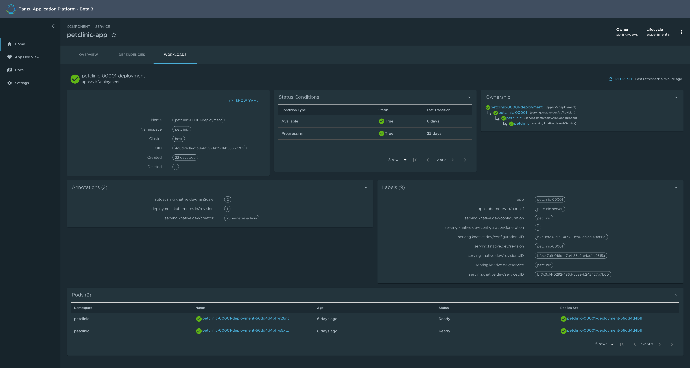

# Workload Visibility User Guide

The Workload Visibility screen enables developers to view the details and status of their running Kubernetes
workloads, to understand their structure, and debug any issues affecting them.

## Before you begin

The developer needs to perform the below actions in order to see their running workloads on the dashboard:

* Define a [Backstage System](../catalog/catalog-operations.md#systems).
* Define a [Backstage Component](../catalog/catalog-operations.md#components) that:
  * Refers to the System from the previous step (at `.spec.system`).
  * Specifies a `backstage.io/kubernetes-label-selector` annotation (at `.metadata.annotations`).
* Commit and push the System and Component definitions to a Git repository that's been [registered
  as a Catalog Location](../catalog/catalog-operations.md#adding-catalog-entities).
* Create a Kubernetes Workload:
  * In a cluster available to the TAP GUI.
  * With labels that satisfy the new Component's label selector.

## Navigate to the Workload Visibility screen

To view the list of your running workloads:

* Select the Component from the Catalog index page.
* Select the Workloads tab.

You can view the list of running workloads and details about their status, type, namespace/cluster, and public URL
(if applicable for that workload type).

## Resource Details

Each resource has a dedicated page showing its detailed status, metadata, ownership, related resources, etc.

