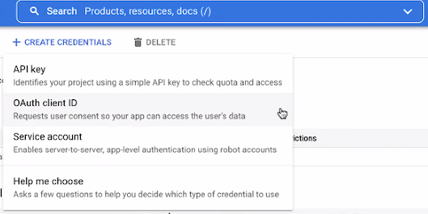
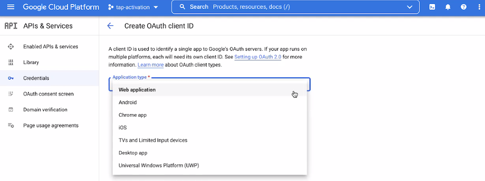
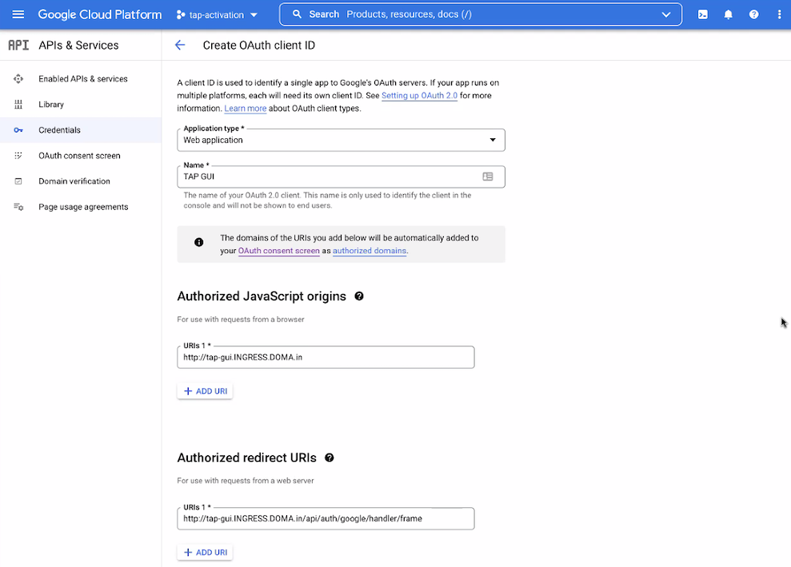
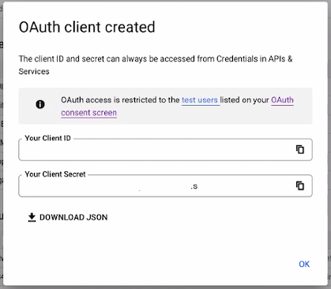

# Enable Authorization on Remote GKE Clusters in Tanzu Application Platform GUI using Google Auth

<!-- Temporary topic that exists until EKS RBAC is sorted out. -->

This section describes how to leverage Google Auth to add access-controlled visibility for a remote GKE cluster.

Once the Authorization is enabled, you can view your runtime resources on a remote cluster in Tanzu Application Platform GUI. For more detail, please refer to [View Runtime Resources on Remote Clusters in Tanzu Application Platform GUI](./view-resouces-rbac.md).


## <a id="googles-oidc-provider"></a> Leveraging Google Auth

When levearging Google's OIDC provider, the process of enabling Authorization requires the following steps:

1. Create OAuth credentials in Google
2. Configure the Tanzu Application Platform GUI to view the remote GKE cluster
3. Upgrade the Tanzu Application GUI package

### <a id="create-oauth-credentials"></a> Create OAuth credentials in Google

1. Log in to the [Google Console](https://console.cloud.google.com)
2. From the dropdown menu on the top bar, select the project to which your GKE cluster belongs.
3. Navigate to
   [APIs & Services > OAuth consent screen](https://console.cloud.google.com/apis/credentials/consent), if a consent screen has not already been configured for this
   project.
   - Add the top domain of your TAP GUI server as an Authorized domain
   - For scopes, select `openid`, `auth/userinfo.email` and
     `auth/userinfo.profile`


4. Navigate to
   [APIs & Services > Credentials](https://console.cloud.google.com/apis/credentials)
5. Click **Create Credentials** and choose `OAuth client ID`



6. Select **Application Type** as `Web Application` 



7. Populate the following dialog boxes with these settings:
   - Name: TAP GUI (or your custom app name)
   - Authorized JavaScript origins: `http://tap-gui.INGRESS-DOMAIN`
   - Authorized Redirect URIs:
     `http://tap-gui.INGRESS-DOMAIN/api/auth/google/handler/frame`

Where:

   - `INGRESS-DOMAIN` is the ingress domain you specified during the installation of Tanzu Application Platform GUI  




1. Click `Create` and store your credentials. 



### <a id="configure-tap-gui"></a> Configure the Tanzu Application Platform GUI to view the remote GKE cluster

The next step is to configure visibility of the remote GKE cluster in Tanzu Application Platform GUI. 

1. Make sure you added an `auth` section to the `app_config` stanza that Tanzu Application Platform GUI uses. In the example for Auth0, copy this YAML content into `tap-values.yml`:


```yaml
auth:
  environment: development
  providers:
    google:
      development:
        clientId: "CLIENT-ID"
        clientSecret: "CLIENT-SECRET"
```
Where:

   - `CLIENT-ID` is the Client ID you obtained while setting up the OIDC provider
   - `CLIENT-SECRET` is the Client Secret you obtained while setting up the OIDC provider


1. You must also add a `kubernetes` section to the `app_config` stanza that Tanzu Application Platform GUI uses. This section must have an entry for each cluster that has resources to view.

To do so, copy this YAML content into `tap-values.yml`:

```yaml
kubernetes:
  clusterLocatorMethods:
    - type: 'config'
      clusters:
        - name: "CLUSTER-NAME-UNCONSTRAINED"
          url: "CLUSTER-URL"
          authProvider: google
          caData: "CA-DATA"
```
Where:

   - `CLUSTER-NAME-UNCONSTRAINED` is the cluster name of your choice for your GKE cluster
   - `CLUSTER_URL` is the URL for the remote cluster you are connecting to Tanzu Application Platform GUI. To obtain your cluster's URL, execute the following command:

```console
CLUSTER_URL=$(kubectl config view --minify -o jsonpath='{.clusters[0].cluster.server}')

echo CLUSTER-URL: $CLUSTER_URL
```

- `CA-DATA` is the CA certificate data.

Execute the following command to obtain the value:

```console
CA_DATA=$(kubectl config view --minify -o jsonpath='{.clusters[0].cluster.certificate-authority-data}' --raw)

echo CA-DATA: $CA_DATA
```

If there are any other clusters that you would like to make visible through Tanzu Application Platform GUI, add their entries to `clusters` as well.

### <a id="upgrade-tap-gui"></a> Upgrade the Tanzu Application Platform GUI package

Once the new configuration file is ready, update the `tap-gui` package by running this command:

```console
tanzu package installed update tap-gui --values-file tap-gui-values.yaml
```    

Or, if you were updating the `tap-values.yml` file, run the following command: 

```console
tanzu package installed update tap --values-file tap-values.yml
```

Wait a moment for the `tap-gui` package to update and then verify that `STATUS` is
`Reconcile succeeded` by running:

```console
tanzu package installed get tap-gui -n tap-install
```
