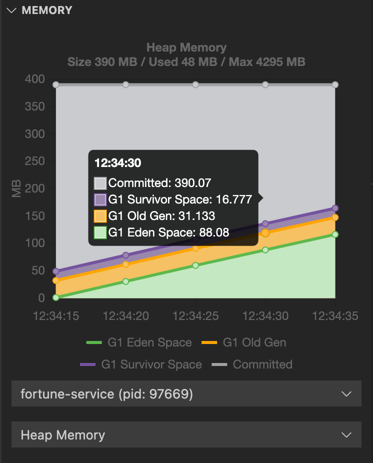
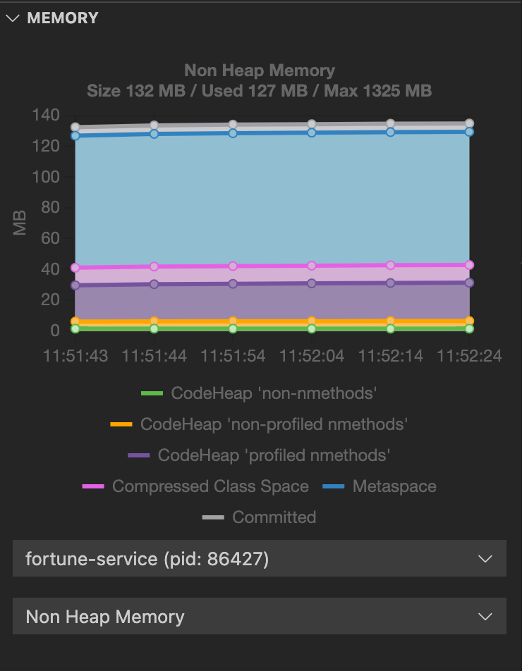
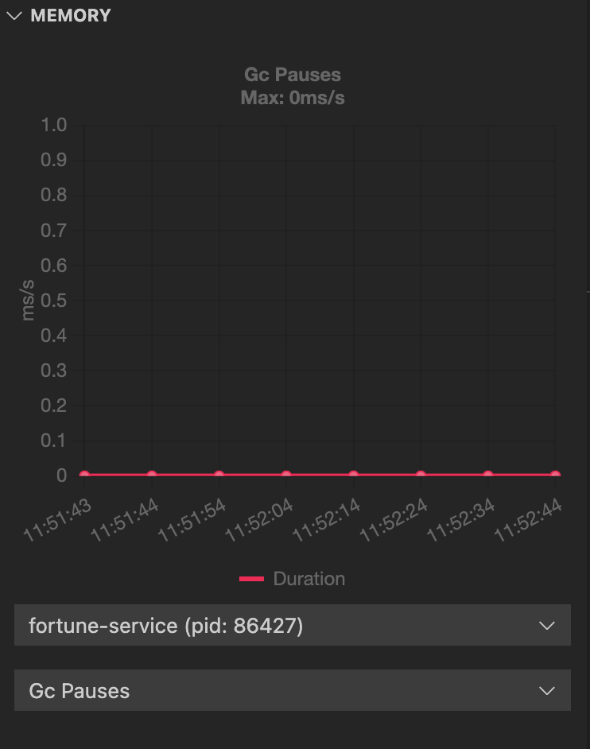
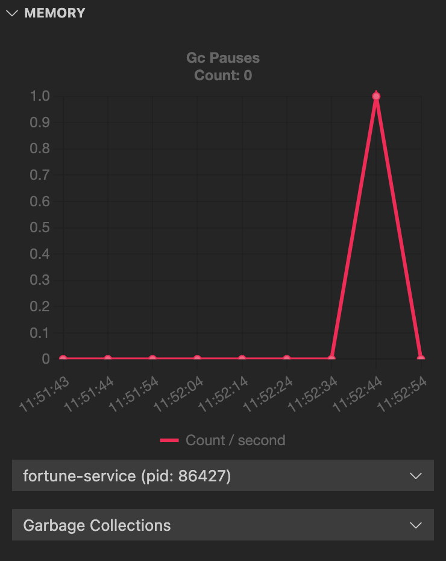

# Memory View in Spring Boot Dashboard

For more information on Spring Boot Dashboard, see
[Spring Boot Dashboard](https://marketplace.visualstudio.com/items?itemName=vscjava.vscode-spring-boot-dashboard).

##  Prerequisites

To see the Memory View in Spring Boot Dashboard you need:

- A Tanzu Spring Boot application, such as
[tanzu-java-web-app](https://github.com/vmware-tanzu/application-accelerator-samples/tree/main/tanzu-java-web-app)
- Spring Boot Extension Pack (includes Spring Boot Dashboard)
[extension](https://marketplace.visualstudio.com/items?itemName=Pivotal.vscode-boot-dev-pack)

##  Deploy a Workload

To deploy the workload for an app to a cluster, see the **Deploy a Workload to the Cluster** section of [Integrating Live Hover by using Spring Boot Tools](https://docs-staging.vmware.com/en/draft/VMware-Tanzu-Application-Platform/1.4/tap/GUID-vscode-extension-live-hover.html#deploy-a-workload-to-the-cluster-2)

1. To view the Spring Boot Dashboard, run `View: Show Spring Boot Dashboard` from the Command Palette.

1. When the app is running, the  `Memory View` section is displayed in Spring Boot Dashboard. The graphical representation in the memory view highlights the memory use   inside of the JVM. The drop downs below the graph allows you to switch between different running processes and graphical views.

    The heap and non-heap memeory regions provides memory insights into the application. The real-time graphs displays a stacked overview of the different spaces in memory relative to the total memory used and total memory size.

    The memory view also contains graphs to display the GC pauses and GC events. Long and frequent GC pauses are a good indicator that the app is having a memory problem that needs further investigation.

    

    

    

    

The graphs show only real-time data and you can configure the number of data points to view and interval by enabling it in 
**Code** > **Preferences** > **Settings** > **Extensions** > **Spring Boot Dashboard** > **Memory View Settings**. 

   