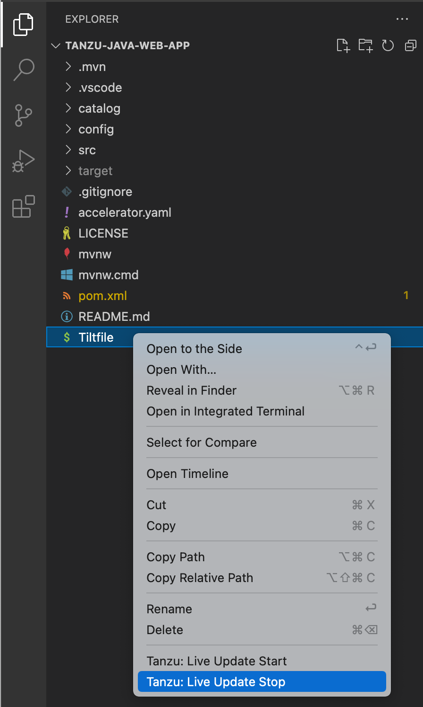
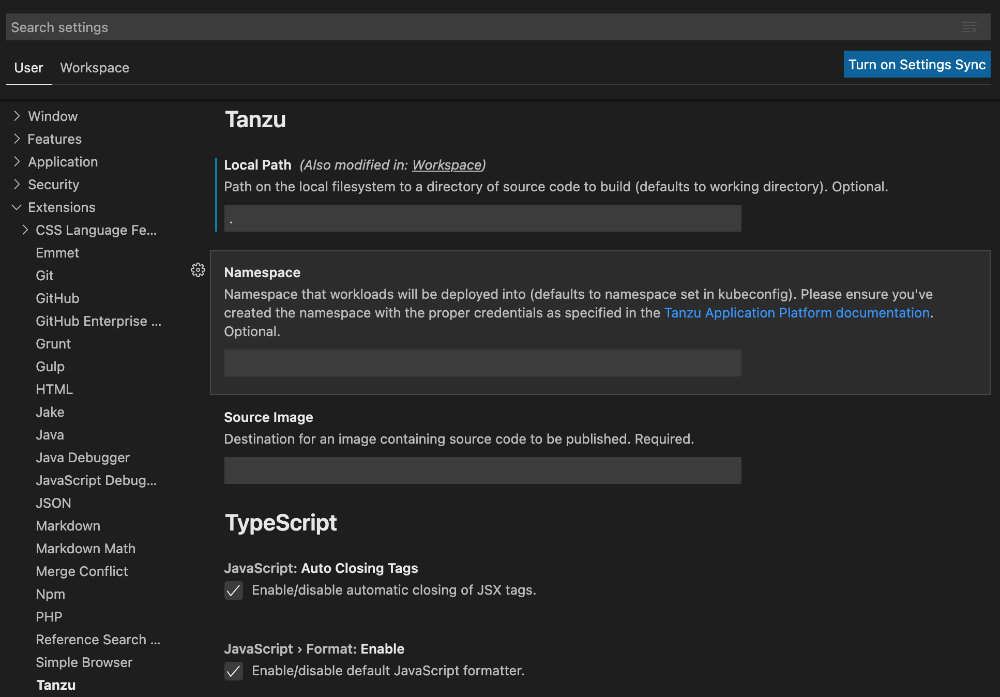

# Using the Tanzu Dev Tools Extension

##  On this page

- [Before Beginning](#before-beginning)
- [Multiple Projects in Workspace](#multiple-projects-in-workspace)
- [Debugging on the Cluster](#debugging-on-the-cluster)
  - [Start Debugging on the Cluster](#start-debugging-on-the-cluster)
  - [Stop Debugging on the Cluster](#stop-debugging-on-the-cluster)
- [Live Update](#live-update)
  - [Start Live Update](#start-live-update)
  - [Stop Live Update](#stop-live-update)
  - [Disable Live Update](#disable-live-update)
  - [Live Update Status](#live-update-status)
- [Switch Namespace](#switch-namespace)

##  Before Beginning

Ensure the project to use the extension with has the required files specified in the [Getting Started page](../vscode-extension/getting-started.md). 

>**Note:** The Tanzu Developer Tools extension requires only one **Tiltfile** and one **workload.yaml** per project. The **workload.yaml** must be a single-document YAML file, not a multi-document YAML files.

##  Multiple Projects in Workspace

When working with multiple projects in a single workspace, you can configure the Tanzu Dev Tools Extension settings on a per-project basis by using the dropdown selector in the `Settings` page.

##  Debugging on the Cluster

The Tanzu Developer Tools extension enables you to debug your application on your TAP-enabled Kubernetes cluster .

Debugging requires a **workload.yaml** file in your project. For information about creating a **workload.yaml** file, see the [Set Up section](../vscode-extension/getting-started.md#set-up-tanzu-dev-tools).

>**Note:** Debugging on the cluster and Live Update can not be used simultaneously. If you have used Live Update for the current project, you must ensure you have stopped live update before attempting to debug on the cluster. See [Stop Live Update](#stop-live-update) for more information.

###  Start Debugging on the Cluster

To start debugging on the cluster:

1. Add a [breakpoint](https://code.visualstudio.com/docs/editor/debugging#_breakpoints) in your code.
1. Right-click the **workload.yaml** file in your project.
1. Select `Tanzu: Java Debug Start` in the right-click menu.

###  Stop Debugging on the Cluster

To stop debugging on the cluster:

- Select the stop button in the Debug overlay.

    

- Or select the trash can icon for the debug task running in the Panel (`View -> Appearance -> Show Panel`, or hotkey `⌘+J`).

    

##  Live Update

By using [Live Update](../glossary.md#live-update) facilitated by [Tilt](https://docs.tilt.dev/), the Tanzu Developer Tools extension enables you to deploy your workload once, save changes to the code and see those changes reflected in the workload running on the cluster within seconds.

Live update requires a **workload.yaml** file and a **Tiltfile** in your project. For information about how to create a **workload.yaml** and a **Tiltfile**, see the [Set Up section](../vscode-extension/getting-started.md#set-up-tanzu-dev-tools) on the Getting Started page.

>**Note:** Live Update and Debugging on the cluster can not be used simultaneously. If you are currently debugging on the cluster, you must stop the debugging process before attempting to use Live Update.

###  Start Live Update

There are two ways to start live update:

- Right-click your project’s `Tiltfile` and select `Tanzu: Live Update Start`.

    

- Start the Command Palette (`⇧⌘P`) and run the `Tanzu: Live Update Start` command.

    

###  Stop Live Update

When Live Update stops, your application continues to run on the cluster, but the changes you made and saved in your editor will not be present in your running application unless you redeploy your application to the cluster.

There are two ways to stop live update:

- Right-click your project’s `Tiltfile` and select `Tanzu: Live Update Stop`.

    

- Start the Command Palette (`⇧⌘P`) and run the `Tanzu: Live Update Stop` command.

    

###  Disable Live Update

You can remove the Live Update capability from your application entirely. This functionality can be useful in a troubleshooting scenario, or when you decide not to use Live Update.

>**Note:** Disabling Live Update redeploys your workload to the cluster and removes the Live Update capability.

To disable Live Update:

1. Start the Command Palette (`⇧⌘P`).

1. Run the `Tanzu: Live Update Disable` command.

    

1. Enter the name of the workload you want to deactivate live update for.

###  Live Update Status

The current status of Live Update is visible on the right side of the Status Bar at the bottom of the VS Code window.

The Live Update status bar entry reflects the following states:

- Live Update Stopped
- Live Update Starting…
- Live Update Running

The Live Update status bar entry can be hidden by right-clicking on it and selecting `Hide ‘Tanzu Developer Tools (Extension)’`.

##  Switch Namespace

To switch the namespace where you created the workload:

1. Navigate to settings (`Code -> Preferences -> Settings`).
1. Expand the **Extensions** section of the Settings and select **Tanzu**.
1. In the Namespace option, add the namespace you want to deploy to. This defaults to the default namespace.

