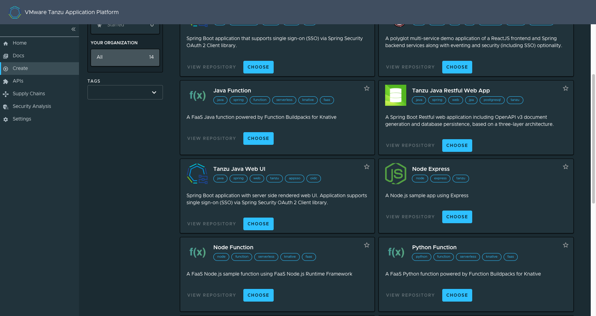

# Using functions (Beta)

This topic describes how to create and deploy an HTTP or CloudEvent function from an
Application Accelerator starter template in an online or air-gapped environment.

## <a id="overview"></a> Overview

The function experience on Tanzu Application Platform enables you to deploy functions, use
starter templates to bootstrap your function, and write only the code that matters to your business.
You can run a single CLI command to deploy your functions to an auto-scaled cluster.

Functions provide a quick way to get started writing an application.
Compared with a traditional application:

- Functions have a single entry-point and perform a single task. This means that functions can be
  easier to understand and monitor.

- The function buildpack manages the webserver. This means that you can focus on your business
  logic.

- A traditional webserver application might be a better fit if you want to implement an entire
  website or API in a single container

> **Important** Beta features have been tested for functionality, but not performance.
> Features enter the beta stage so that customers can gain early access, and give
> feedback on the design and behavior.
> Beta features might undergo changes based on this feedback before the end of the beta stage.
> VMware discourages running beta features in production.
> VMware cannot guarantee that you can upgrade any beta feature in the future.

### <a id="supportedlangs"></a> Supported languages and frameworks

For HTTP and CloudEvents:

| Language/framework     | HTTP     | CloudEvents |
|------------------------|----------|-------------|
| Java                   | &check;  | &check;     |
| Python                 | &check;  | &check;     |
| NodeJS                 | &check;  | N/A         |

For REST API:

| Language/framework     | GET      | POST    |
|------------------------|----------|---------|
| Java                   | N/A      | &check; |
| Python                 | &check;  | &check; |
| NodeJS                 | &check;  | &check; |

## <a id="prereqs"></a> Prerequisites

Before using function workloads on Tanzu Application Platform, complete the following prerequisites:

- Follow all instructions to install Tanzu Application Platform:
  - [Installing Tanzu Application Platform online](../install-intro.md#install-online)
  - [Installing Tanzu Application Platform in an air-gapped environment](../install-intro.md#install-air-gap)

- Follow all instructions in [Set up developer namespaces to use installed packages](../set-up-namespaces.md).

## <a id="create-function-proj-acc"></a> Create a function project from an accelerator

To create a function project from an accelerator:

1. From the Tanzu Application Platform GUI portal, click **Create** on the left navigation bar to see
   the list of available accelerators.

   

1. Locate the function accelerator in the language or framework of your choice and click **CHOOSE**.

1. Provide a name for your function project and your function.

1. If you are creating a Java function, select a project type.

1. Provide a Git repository to store the files for the accelerator.

1. Click **NEXT STEP**, verify the
   provided information, and then click **CREATE**.

    

1. After the Task Activity processes complete, click **DOWNLOAD ZIP FILE**.

1. After downloading the ZIP file, expand it in a workspace directory and follow your preferred
   procedure for uploading the generated project files to a Git repository for your new project.

## <a id="create-function-proj-cli"></a> Create a function project using the Tanzu CLI

From the CLI, to generate a function project using an accelerator template and then download the
project artifacts as a ZIP file:

1. Verify that you have added the function accelerator template to the application accelerator
   server by running:

    ```console
    tanzu accelerator list
    ```

1. Get the `server-url` for the Application Accelerator server.
   The URL depends on the configuration settings for Application Accelerator:

   - For installations configured with a shared ingress, use `https://accelerator.DOMAIN`
     where `DOMAIN` is provided in the values file for the accelerator configuration.

   - For installations using a LoadBalancer, look up the External IP address by running:

     ```console
     kubectl get -n accelerator-system service/acc-server
     ```

     Use `http://EXTERNAL-IP` as the URL.

   - For any other configuration, you can use port forwarding by running:

     ```console
     kubectl port-forward service/acc-server -n accelerator-system 8877:80
     ```

     Use `http://localhost:8877` as the URL.

1. Generate a function project from an accelerator template by running:

    ```console
    tanzu accelerator generate ACCELERATOR-NAME \
    --options '{"projectName": "FUNCTION-NAME", "interfaceType": "TYPE"}' \
    --server-url APPLICATION-ACCELERATOR-URL
    ```

    Where:

    - `ACCELERATOR-NAME` is the name of the function accelerator template you want to use.
    - `FUNCTION-NAME` is the name of your function project.
    - `TYPE` is the interface you want to use for your function.
      Available options are `http` or `cloudevents`. CloudEvents is experimental.
    - `APPLICATION-ACCELERATOR-URL` is the URL for the Application Accelerator server that you
      retrieved in the previous step.

    For example:

    ```console
    tanzu accelerator generate java-function \
    --options '{"projectName": "my-func", "interfaceType": "http"}' \
    --server-url http://localhost:8877
    ```

1. After generating the ZIP file, expand it in your directory and follow your preferred procedure for
   uploading the generated project files to a Git repository for your new project.

## <a id="deploy-function"></a> Deploy your function

To deploy and verify your function:

1. Deploy the function accelerator by running the `tanzu apps workload` create command:

    ```console
    tanzu apps workload create functions-accelerator-python \
    --local-path . \
    --source-image SOURCE-IMAGE \
    --type web \
    --yes
    --namespace YOUR-DEVELOPER-NAMESPACE
    ```

    Where:

    - `SOURCE-IMAGE` is a writable repository in your registry in the form `REGISTRY/IMAGE:TAG`.
      - Harbor has the form: "my-harbor.io/my-project/functions-accelerator-python".
      - Docker Hub has the form: "my-dockerhub-user/functions-accelerator-python".
      - Google Cloud Registry has the form: "gcr.io/my-project/functions-accelerator-python".
    - `YOUR-DEVELOPER-NAMESPACE` is the namespace you configured earlier.

1. View the build and runtime logs for your application by running the `tail` command:

    ```console
    tanzu apps workload tail functions-accelerator-python --since 10m --timestamp --namespace YOUR-DEVELOPER-NAMESPACE
    ```

   Where `YOUR-DEVELOPER-NAMESPACE` is the namespace configured earlier.

1. After the workload is built and running, you can view the web application in your browser.
   To view the URL of the web application, run the following command and then **ctrl-click** the
   Workload Knative Services URL at the bottom of the command output.

    ```console
    tanzu apps workload get functions-accelerator-python --namespace YOUR-DEVELOPER-NAMESPACE
    ```

    Where `YOUR-DEVELOPER-NAMESPACE` is the namespace configured earlier.

1. (Optional) You can test your function using a curl command. To do so, you must have curl
installed on your computer. Java function POST example:

   ```console
   curl -w'\n' URL-FROM-YOUR-WORKLOAD-KNATIVE-SERVICES-SECTION \
   -H "Content-Type: application/json" \
   -d '{"firstName":"John", "lastName":"Doe"}'
   ```

   For language support for the REST API, see [Supported languages and frameworks](#supportedlangs)
   earlier in this topic.
